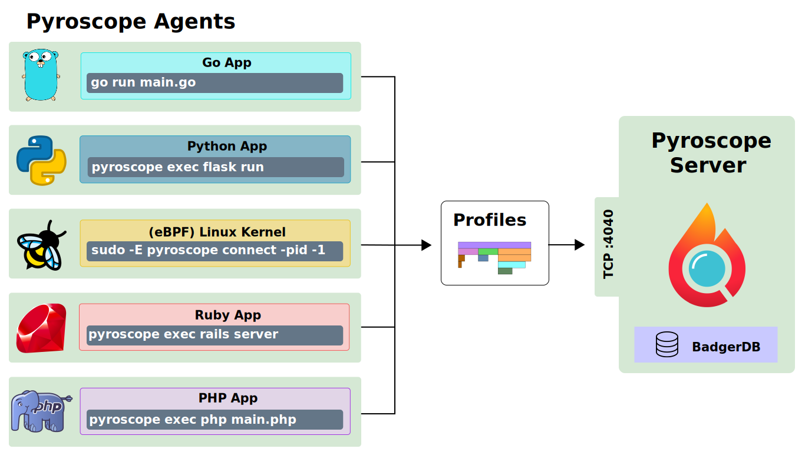

<p align="center"></p>


[](https://github.com/pyroscope-io/pyroscope/actions?query=workflow%3AGo%20Tests)
[](https://github.com/pyroscope-io/pyroscope/actions?query=workflow%3AJS%20Tests)
[](https://goreportcard.com/report/github.com/pyroscope-io/pyroscope)
[](LICENSE)
[](https://github.com/pyroscope-io/pyroscope/releases)
[](https://hub.docker.com/r/pyroscope/pyroscope)
[](https://godoc.org/github.com/pyroscope-io/pyroscope)

<h2>
  <a href="https://pyroscope.io/">Website</a>
  <span> • </span>
  <a href="https://pyroscope.io/docs">Docs</a>
  <span> • </span>
  <a href="https://demo.pyroscope.io/">Demo</a>
  <span> • </span>
  <a href="/examples">Examples</a>
  <span> • </span>
  <a href="https://pyroscope.io/slack">Slack</a>
</h2>

#### _Read this in other languages._
<kbd>[](translations/README.ch.md)</kbd>


Pyroscope is an open source continuous profiling platform. It will help you:
* Find performance issues in your code
* Resolve issues with high CPU utilization
* Understand the call tree of your application
* Track changes over time


## 🔥 [Pyroscope Live Demo](https://demo.pyroscope.io/?name=hotrod.python.frontend%7B%7D) 🔥

[](https://demo.pyroscope.io/)


## Features

* Can store years of profiling data from multiple applications
* You can look at years of data at a time or zoom in on specific events
* Low CPU overhead
* Efficient compression, low disk space requirements
* Snappy UI
* Support for Go, Ruby and Python

## Try Pyroscope locally in 3 steps:

```shell
# install pyroscope
brew install pyroscope-io/brew/pyroscope

# start pyroscope server:
pyroscope server

# in a separate tab, start profiling your app:
pyroscope exec python manage.py runserver # If using Python
pyroscope exec rails server               # If using Ruby

# If using Pyroscope cloud add flags for server address and auth token
# pyroscope exec -server-address "https://your_company.pyroscope.cloud" -auth-token "ps-key-1234567890" python manage.py runserver
```

## Documentation

For more information on how to use Pyroscope with other programming languages, install it on Linux, or use it in production environment, check out our documentation:

* [Public Roadmap](https://github.com/pyroscope-io/pyroscope/projects/1)
* [Getting Started](https://pyroscope.io/docs/)
* [Deployment Guide](https://pyroscope.io/docs/deployment)
* [Developer Guide](https://pyroscope.io/docs/developer-guide)


## Deployment Diagram



## Downloads

You can download the latest version of pyroscope for macOS, linux and Docker from our [Downloads page](https://pyroscope.io/downloads/).

## Supported Integrations

* [x] Ruby (via `rbspy`)
* [x] Python (via `py-spy`)
* [x] Go (via `pprof`)
* [x] Linux eBPF (via `profile.py` from `bcc-tools`)
* [x] PHP (via `phpspy`)
* [x] .NET (via `dotnet trace`)
* [ ] Java (coming soon)

Let us know what other integrations you want to see in [our issues](https://github.com/pyroscope-io/pyroscope/issues?q=is%3Aissue+is%3Aopen+label%3Anew-profilers) or in [our slack](https://pyroscope.io/slack).

## Credits

Pyroscope is possible thanks to the excellent work of many people, including but not limited to:

* Brendan Gregg — inventor of Flame Graphs
* Julia Evans — creator of rbspy — sampling profiler for Ruby
* Vladimir Agafonkin — creator of flamebearer — fast flamegraph renderer
* Ben Frederickson — creator of py-spy — sampling profiler for Python
* Adam Saponara — creator of phpspy — sampling profiler for PHP
* Alexei Starovoitov, Brendan Gregg, and many others who made BPF based profiling in Linux kernel possible


## Contributing

To start contributing, check out our [Contributing Guide](CONTRIBUTING.md)


### Thanks to the contributors of Pyroscope!

[//]: contributor-faces
<a href="https://github.com/petethepig"></a>
<a href="https://github.com/Rperry2174"></a>
<a href="https://github.com/kolesnikovae"></a>
<a href="https://github.com/LouisInFlow"></a>
<a href="https://github.com/abaali"></a>
<a href="https://github.com/olvrng"></a>
<a href="https://github.com/alonlong"></a>
<a href="https://github.com/AdrK"></a>
<a href="https://github.com/cjsampson"></a>
<a href="https://github.com/Loggy"></a>
<a href="https://github.com/ekpatrice"></a>
<a href="https://github.com/cmonez"></a>
<a href="https://github.com/rajat2004"></a>
<a href="https://github.com/Pranay0302"></a>
<a href="https://github.com/geoah"></a>
<a href="https://github.com/s4kibs4mi"></a>
<a href="https://github.com/SusyQinqinYang"></a>
<a href="https://github.com/eh-am"></a>
<a href="https://github.com/wusphinx"></a>
<a href="https://github.com/Skemba"></a>
<a href="https://github.com/ayeniblessing101"></a>
<a href="https://github.com/appleboy"></a>
<a href="https://github.com/highb"></a>
<a href="https://github.com/cwalv"></a>
<a href="https://github.com/Faria-Ejaz"></a>
<a href="https://github.com/yveshield"></a>
<a href="https://github.com/czeslavo"></a>
<a href="https://github.com/johnduhart"></a>
<a href="https://github.com/radixdev"></a>
<a href="https://github.com/NSObjects"></a>
<a href="https://github.com/vbehar"></a>
<a href="https://github.com/yashrsharma44"></a>
<a href="https://github.com/hiyanxu"></a>
<a href="https://github.com/miravtmehta"></a>
<a href="https://github.com/lzh2nix"></a>
<a href="https://github.com/cnych"></a>

[//]: contributor-faces
