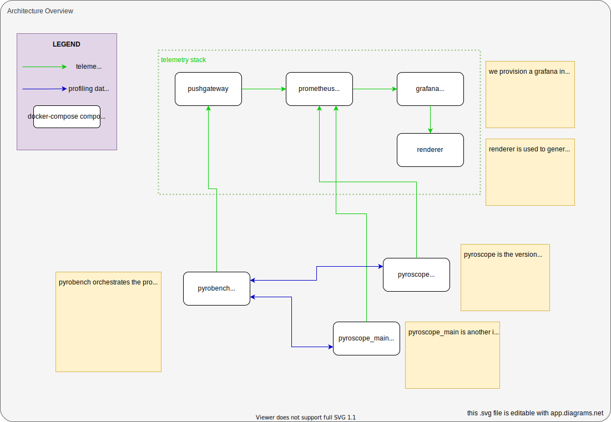

## What is this?

This is a benchmark suite. It is used to benchmark pyroscope server against various workloads, particularly data ingestion from clients in push mode and data retrieval from clients in pull mode.

You can use it locally to test hypothetical scenarios, or you can use it to compare the performance of different versions of pyroscope.

It uses a docker-compose file to run the whole benchmark suite. It uses multiple `docker-compose.yml` files (`*.dev.yml`, `*.ci.yml`) to augment the suite for development or ci environments.

Here's an overview diagram of the whole system:
[](./architecture.svg)

## Prerequisites
* You'll need `docker-compose` installed.
* Ideally you want to be running this on a large enough machine (> 4 cores, 16 GB of RAM), otherwise services might run out of memory. See Troubleshooting guide below for more info.

## Usage

To start benchmark locally run:
```
./start.sh
```

## Configuration

All of configuration is done with `config.env` file.

To configure the benchmarking parameters, edit `config.env` file. It contains variables that are used by pyroscope and pyrobench.

For example, the following config can be used to only test pull mode:
```
PYROBENCH_APPS=0
PYROBENCH_NO_EXIT_WHEN_DONE=true
```

You can find documentation for all of the possible flags [here](https://github.com/pyroscope-io/pyroscope/blob/3fab8a8949b3538e98af051598edf514b14eaafe/benchmark/internal/config/config.go#L14-L39)

## Browsing results
To view results open http://localhost:8080/d/tsWRL6ReZQkirFirmyvnWX1akHXJeHT8I8emjGJo/main?orgId=1.

## Configuration
Edit `run-parameters.env` file to change the parameters of the benchmark run.

### Use cases

#### Running indefinitely
Maybe you want to leave the load generator running for an indefine amount of time.

For that, just pick a big enough value for `PYROBENCH_REQUESTS`, like `100000` (the default)


## Troubleshooting

Make sure you have enough memory allocated for docker, e.g on a mac:


## Design Goals

This benchmark suite attempts to be as flexible as possible, meaning you can use it to test different scenarios with minimum changes to the benchmark suite. We attempt to achieve this by keeping the codebase as small as possible and thus easily editable.

## PR Benchmark

This benchmark is also used to benchmark each pull request against the `main` branch.

* it runs 2 instances of pyroscope (the one in the PR and the main one) in docker-compose.
* generates test load against both instances
* takes a screenshot of the dashboard panes
* posts a PR comment using [dangerjs](https://danger.systems/js/)

## Enhancing PR comment content

* To add more panes edit `monitoring/benchmark-pr.jsonnet` file
* To add more things to the report update the `queries.yml` file
