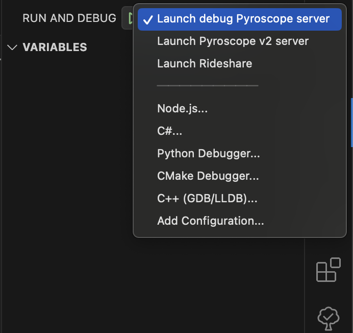
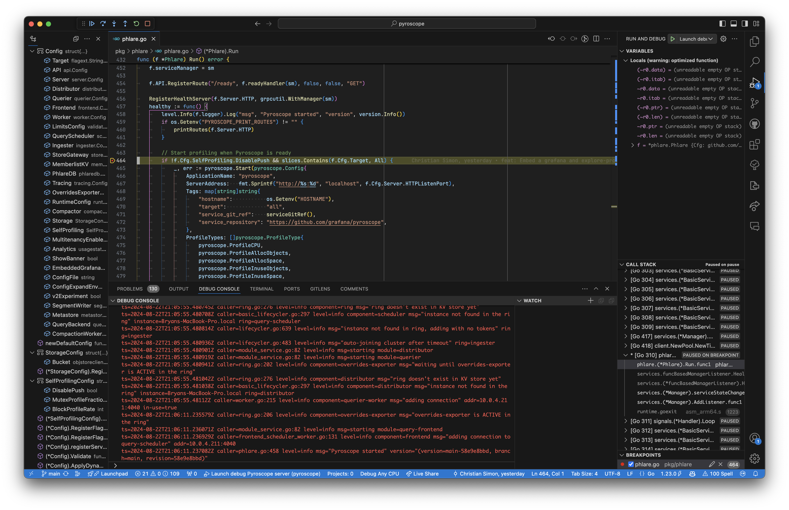

# Developing Grafana Pyroscope

This document contains helpful tips and tricks when developing Pyroscope.

## Run Pyroscope using a debugger

A debugger allows you to step through the code and inspect variables and understand control flow as the program is running.

### VSCode debugger

To attach a debugger to Pyroscope from VSCode, perform the following steps in the root of the Pyroscope project:

1. `mkdir .vscode`
1. `touch .vscode/tasks.json`
1. Add the following configuration. This creates a build task in VSCode which will build the Pyroscope binary with debug symbols.
    ```jsonc
    {
      "version": "2.0.0",
      "tasks": [
        {
          "type": "shell",
          // Name this whatever you like.
          "label": "pyroscope: build debug",
          "command": "make",
          "args": [
            "EMBEDASSETS=\"\"",
            "go/bin-pyroscope-debug"
          ],
          "group": "build",
          "detail": "Build debug Pyroscope server"
        }
      ]
    }
    ```
1. `touch .vscode/launch.json`
1. Add the following configuration. This will add a launch task which will launch the debug Pyroscope binary and attach a debugger.
    ```jsonc
    {
      "version": "0.2.0",
      "configurations": [
        {
          // Name this whatever you like.
          "name": "Launch debug Pyroscope server",
          "type": "go",
          "request": "launch",
          "mode": "exec",
          "program": "./pyroscope",
          "args": [
            "-config.file",
            // Point this to a Pyroscope configuration file.
            "./.vscode/config.yaml",
          ],
          "env": {
            // env vars go here. For example:
            // "GITHUB_CLIENT_ID": "my_client_id"
          },
          // This must match the name of the build task.
          "preLaunchTask": "pyroscope: build debug",
        }
      ]
    }
    ```
1. `touch .vscode/config.yaml`
1. Add the following configuration. These are the settings your Pyroscope instance will use.
    ```yaml
    server:
      http_listen_port: 4040

   # Not necessary, but this can help avoid some system limits when making
   # certain queries.
    limits:
      max_query_length: 0
      max_query_lookback: 0
    ```
1. You should be able to open the "Run and Debug" menu and select "Launch debug Pyroscope server" from the drop down.
    
1. Now when you set breakpoints in the gutter, the debugger will break appropriately and logs will be emitted in the "DEBUG CONSOLE" terminal tab.
    

## Run a local Pyroscope frontend

Pyroscope ships with an embedded UI. This is UI is stable and largely in maintenance mode. If you find a need to develop the UI, follow these steps to run it without embedding it into the Pyroscope binary.

You will need these tools:

- Node v18
- Yarn v1.22

The frontend code is all located in the `public/app` directory, although its `plugin.json`
file exists at the repository root.

To run the local frontend source code:
```sh
yarn
yarn dev
```

This will install/update the frontend dependencies and launch a process that will build the frontend code, launch a pyroscope web app service at `http://localhost:4041`, and keep that web app updated any time you save the frontend source code. The resulting web app will not initially be connected to a Pyroscope server,
so all attempts to fetch data will fail.

To launch a Pyroscope server for development purposes:
```sh
yarn backend:dev
```

This yarn script actually runs the following:
```sh
make build run 'PARAMS=--config.file ./cmd/pyroscope/pyroscope.yaml'
```

> ![NOTE]
> Alternatively, you can connect to any Pyroscope instance as long as it is running on `:4040`. If you need to connect to a Pyroscope instance running on a different port, please modify the [webpack config](https://github.com/grafana/pyroscope/blob/main/scripts/webpack/webpack.dev.js#L14-L15) accordingly.

It will take a while for this process to build and start serving pyroscope data, but
once it is fully active, the pyroscope web app service at `http://localhost:4041`
will be able to interact with it.
