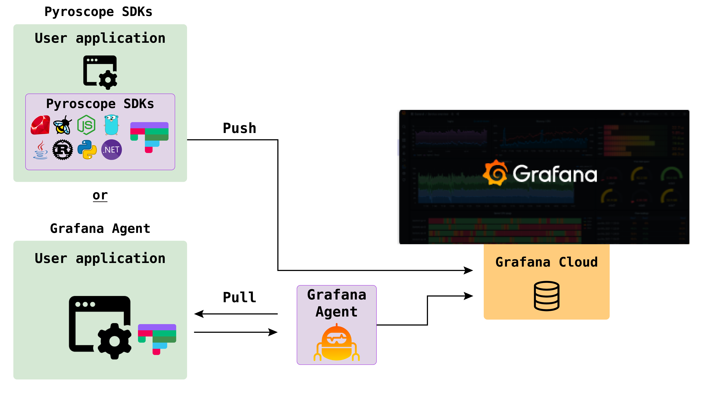

---
aliases:
  - /docs/phlare/latest/operators-guide/configure-agent/
title: "Sending profiles from your application"
menuTitle: "Configure the Client"
description: ""
weight: 30
---

# Sending profiles from your application

Phlare is a continuous profiling database that allows you to analyze the performance of your applications. When sending profiles to Phlare, you have two options: using the Grafana agent in pull mode or utilizing the Phlare SDKs in push mode. This document will provide an overview of these two methods and guide you on when to choose each option.

## Grafana Agent (Pull Mode)

The Grafana agent is a component that runs alongside your application and periodically pulls the profiles from it. This mode is suitable when you want to collect profiles from existing applications without modifying their source code. Here's how it works:

1. Install and configure the Grafana agent on the same machine or container where your application is running.
2. The agent will periodically query your application's performance profiling endpoints, such as pprof endpoints in Go applications.
3. The retrieved profiles are then sent to the Phlare server for storage and analysis.

Using the Grafana agent is a convenient option when you have multiple applications or microservices, as you can centralize the profiling process without making any changes to your application's codebase.

## Phlare SDKs (Push Mode)

Alternatively, you can use the Phlare SDKs to push profiles from your application directly to the Phlare server. This mode is suitable when you want to have more control over the profiling process or when the application you are profiling is written in a language supported by the SDKs (e.g., Ruby, Python, etc.). Follow these steps to use the Phlare SDKs:

1. Install the relevant Phlare SDK for your application's programming language (e.g., Ruby gem, pip package, etc.)
2. Instrument your application's code using the SDK to capture the necessary profiling data
3. Periodically push the captured profiles to the Phlare server for storage and analysis

By using the Phlare SDKs, you have the flexibility to customize the profiling process according to your application's specific requirements. You can selectively profile specific sections of code or send profiles at different intervals, depending on your needs.

## Choosing the Grafana agent or Phlare SDK to send profiles

The decision of which mode to use depends on your specific use case and requirements. Here are some factors to consider when making the choice:

- Ease of setup: If you want a quick and straightforward setup without modifying your application's code, the Grafana agent in pull mode is a good choice
- Language support: If your application is written in a language supported by the Phlare SDKs and you want more control over the profiling process, using the SDKs in push mode is recommended
- Flexibility: The Phlare SDKs provide more flexibility in terms of customizing the profiling process and capturing specific sections of code with labels. If you have specific profiling needs or want to fine-tune the data collection process, the SDKs offer greater flexibility

To get started choose one of the integrations below:
<table>
   <tr>
      <td align="center"><a href="https://grafana.com/docs/phlare/latest/configure-client/grafana-agent/"> 
        <b>Grafana Agent (Go Pull Mode)</b></a> 
          <a href="https://grafana.com/docs/phlare/latest/configure-client/grafana-agent/" title="Documentation">Documentation</a> 
          <a href="https://github.com/grafana/pyroscope/tree/main/examples/grafana-agent" title="examples">Examples</a>
      </td>
      <td align="center"><a href="https://grafana.com/docs/phlare/latest/configure-client/language-sdks/go_push/"> 
        <b>Golang</b></a> 
          <a href="https://grafana.com/docs/phlare/latest/configure-client/language-sdks/go_push/" title="Documentation">Documentation</a> 
          <a href="https://github.com/grafana/pyroscope/tree/main/examples/golang-push" title="golang-examples">Examples</a>
      </td>
      <td align="center"><a href="https://grafana.com/docs/phlare/latest/configure-client/language-sdks/java/"> 
        <b>Java</b></a> 
          <a href="https://grafana.com/docs/phlare/latest/configure-client/language-sdks/java/">Documentation</a> 
          <a href="https://github.com/grafana/pyroscope/tree/main/examples/java-jfr/rideshare" title="java-examples">Examples</a>
      </td>
      <td align="center"><a href="https://grafana.com/docs/phlare/latest/configure-client/language-sdks/ebpf/"> 
        <b>eBPF</b></a> 
          <a href="https://grafana.com/docs/phlare/latest/configure-client/language-sdks/ebpf/" title="Documentation">Documentation</a> 
          <a href="https://github.com/grafana/pyroscope/tree/main/examples/ebpf" title="examples">Examples</a>
      </td>
      <td align="center"><a href="https://grafana.com/docs/phlare/latest/configure-client/language-sdks/python/"> 
        <b>Python</b></a> 
          <a href="https://grafana.com/docs/phlare/latest/configure-client/language-sdks/python/" title="Documentation">Documentation</a> 
          <a href="https://github.com/grafana/pyroscope/tree/main/examples/python" title="python-examples">Examples</a>
      </td>
   </tr>
   <tr>
      <td align="center"><a href="https://grafana.com/docs/phlare/latest/configure-client/language-sdks/dotnet/"> 
        <b>Dotnet</b></a> 
          <a href="https://grafana.com/docs/phlare/latest/configure-client/language-sdks/dotnet/" title="Documentation">Documentation</a> 
          <a href="https://github.com/grafana/pyroscope/tree/main/examples/dotnet" title="examples">Examples</a>
      </td>
      <td align="center"><a href="https://grafana.com/docs/phlare/latest/configure-client/language-sdks/ruby/"> 
        <b>Ruby</b></a> 
          <a href="https://grafana.com/docs/phlare/latest/configure-client/language-sdks/ruby/" title="Documentation">Documentation</a> 
          <a href="https://github.com/grafana/pyroscope/tree/main/examples/ruby" title="ruby-examples">Examples</a>
      </td>
      <td align="center"><a href="https://grafana.com/docs/phlare/latest/configure-client/language-sdks/nodejs/"> 
        <b>NodeJS</b></a> 
          <a href="https://grafana.com/docs/phlare/latest/configure-client/language-sdks/nodejs/" title="Documentation">Documentation</a> 
          <a href="https://github.com/grafana/pyroscope/tree/main/examples/nodejs/express" title="examples">Examples</a>
      </td>
      <td align="center"><a href="https://grafana.com/docs/phlare/latest/configure-client/language-sdks/rust/"> 
        <b>Rust</b></a> 
          <a href="https://grafana.com/docs/phlare/latest/configure-client/language-sdks/rust/" title="Documentation">Documentation</a> 
          <a href="https://github.com/grafana/pyroscope/tree/main/examples/rust/rideshare" title="examples">Examples</a>
      </td>
   </tr>
</table>

If you have more questions feel free to reach out in our Slack channel or create an issue on github and the Phlare team will help!

