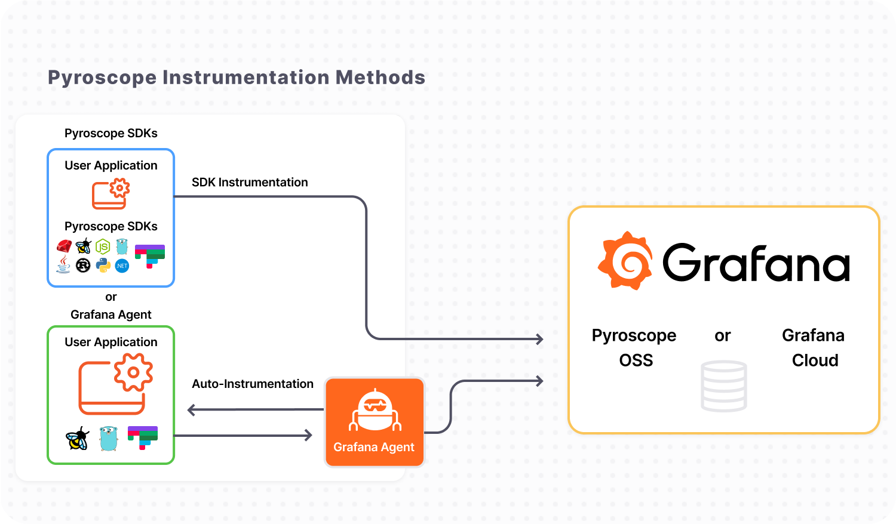

---
aliases:
  - /docs/phlare/latest/operators-guide/configure-agent/
  - /docs/phlare/latest/configure-client/
title: "Sending profiles from your application"
menuTitle: "Configure the Client"
description: ""
weight: 30
---

# Sending profiles from your application

Pyroscope is a continuous profiling database that allows you to analyze the performance of your applications. When sending profiles to Pyroscope, you can choose between two primary methods: SDK Instrumentation and Auto-Instrumentation using the Grafana agent. This document will explain these two techniques and guide you when to choose each one.

## Grafana Agent (Auto-Instrumentation)

The Grafana agent is a component that runs alongside your application and periodically gathers profiling data from it. This method is suitable when you want to collect profiles from existing applications without modifying their source code. This approach is made even simpler with the eBPF profiling option that doesn't necessitate pull or push mechanisms. Here's how it works:

1. Install and configure the Grafana agent on the same machine or container where your application is running
2. The agent will periodically retrieve your application's performance profiling data, regardless of the language or technology stack your application is using
3. The captured profiles are then sent to the Pyroscope server for storage and analysis

Using the Grafana agent provides a hassle-free option, especially when dealing with multiple applications or microservices, allowing you to centralize the profiling process without changing your application's codebase.

## Pyroscope SDKs (SDK Instrumentation)

Alternatively, Pyroscope SDKs offer you the ability to instrument your application directly for more precise profiling. This mode is suitable when you wish to have complete control over the profiling process or when the application you are profiling is written in a language supported by the SDKs (e.g. Java, Python, .NET, etc.). Here's how to use Pyroscope SDKs:

1. Install the relevant Pyroscope SDK for your application's programming language (e.g. pip package, npm package, Ruby gem, etc.)
2. Instrument your application's code using the SDK to capture the necessary profiling data
3. SDK will automatically periodically push the captured profiles to the Pyroscope server for storage and analysis

By using the Pyroscope SDKs, you have the flexibility to customize the profiling process according to your application's specific requirements. You can selectively profile specific sections of code or send profiles at different intervals, depending on your needs.

## Choosing the Grafana agent or Pyroscope SDK to send profiles

The choice between using Grafana Agent (Auto-Instrumentation) or Pyroscope SDKs (SDK Instrumentation) depends on your specific use case and requirements. Here are some factors to consider when making the choice:

- Ease of setup: The Grafana agent is an ideal choice for a quick and straightforward setup without modifying your application's code. Note that eBPF profiling supports some languages (i.e. Golang) better than others, but more robust support for Python, Java, and other languages is coming soon!
- Language support: If your application is written in a language supported by the Pyroscope SDKs, and you want more control over the profiling process, using the SDKs is recommended.
- Flexibility: The Pyroscope SDKs offer greater flexibility in terms of customizing the profiling process and capturing specific sections of code with labels. If you have particular profiling needs or want to fine-tune the data collection process, the SDKs would be your best bet.

To get started choose one of the integrations below:
<table>
   <tr>
      <td align="center"><a href="https://grafana.com/docs/pyroscope/latest/configure-client/grafana-agent/go_pull"> 
        <b>Grafana Agent</b></a> 
          <a href="https://grafana.com/docs/pyroscope/latest/configure-client/grafana-agent/go_pull/" title="Documentation">Documentation</a> 
          <a href="https://github.com/grafana/pyroscope/tree/main/examples/grafana-agent" title="examples">Examples</a>
      </td>
      <td align="center"><a href="https://grafana.com/docs/pyroscope/latest/configure-client/language-sdks/go_push/"> 
        <b>Golang</b></a> 
          <a href="https://grafana.com/docs/pyroscope/latest/configure-client/language-sdks/go_push/" title="Documentation">Documentation</a> 
          <a href="https://github.com/grafana/pyroscope/tree/main/examples/golang-push" title="golang-examples">Examples</a>
      </td>
      <td align="center"><a href="https://grafana.com/docs/pyroscope/latest/configure-client/language-sdks/java/"> 
        <b>Java</b></a> 
          <a href="https://grafana.com/docs/pyroscope/latest/configure-client/language-sdks/java/">Documentation</a> 
          <a href="https://github.com/grafana/pyroscope/tree/main/examples/java/rideshare" title="java-examples">Examples</a>
      </td>
      <td align="center"><a href="https://grafana.com/docs/pyroscope/latest/configure-client/grafana-agent/ebpf"> 
        <b>eBPF</b></a> 
          <a href="https://grafana.com/docs/pyroscope/latest/configure-client/grafana-agent/ebpf" title="Documentation">Documentation</a> 
          <a href="https://github.com/grafana/pyroscope/tree/main/examples/ebpf" title="examples">Examples</a>
      </td>
      <td align="center"><a href="https://grafana.com/docs/pyroscope/latest/configure-client/language-sdks/python/"> 
        <b>Python</b></a> 
          <a href="https://grafana.com/docs/pyroscope/latest/configure-client/language-sdks/python/" title="Documentation">Documentation</a> 
          <a href="https://github.com/grafana/pyroscope/tree/main/examples/python" title="python-examples">Examples</a>
      </td>
   </tr>
   <tr>
      <td align="center"><a href="https://grafana.com/docs/pyroscope/latest/configure-client/language-sdks/dotnet/"> 
        <b>Dotnet</b></a> 
          <a href="https://grafana.com/docs/pyroscope/latest/configure-client/language-sdks/dotnet/" title="Documentation">Documentation</a> 
          <a href="https://github.com/grafana/pyroscope/tree/main/examples/dotnet" title="examples">Examples</a>
      </td>
      <td align="center"><a href="https://grafana.com/docs/pyroscope/latest/configure-client/language-sdks/ruby/"> 
        <b>Ruby</b></a> 
          <a href="https://grafana.com/docs/pyroscope/latest/configure-client/language-sdks/ruby/" title="Documentation">Documentation</a> 
          <a href="https://github.com/grafana/pyroscope/tree/main/examples/ruby" title="ruby-examples">Examples</a>
      </td>
      <td align="center"><a href="https://grafana.com/docs/pyroscope/latest/configure-client/language-sdks/nodejs/"> 
        <b>NodeJS</b></a> 
          <a href="https://grafana.com/docs/pyroscope/latest/configure-client/language-sdks/nodejs/" title="Documentation">Documentation</a> 
          <a href="https://github.com/grafana/pyroscope/tree/main/examples/nodejs/express" title="examples">Examples</a>
      </td>
      <td align="center"><a href="https://grafana.com/docs/pyroscope/latest/configure-client/language-sdks/rust/"> 
        <b>Rust</b></a> 
          <a href="https://grafana.com/docs/pyroscope/latest/configure-client/language-sdks/rust/" title="Documentation">Documentation</a> 
          <a href="https://github.com/grafana/pyroscope/tree/main/examples/rust/rideshare" title="examples">Examples</a>
      </td>
   </tr>
</table>

If you have more questions feel free to reach out in our Slack channel or create an issue on GitHub and the Pyroscope team will help!
