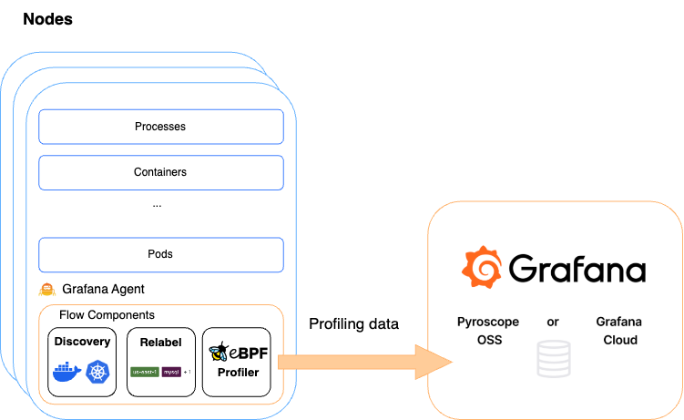

## Configuration reference

Grafana Alloy supports eBPF profiling.
The configuration file is written in the [River](https://grafana.com/docs/agent/latest/flow/concepts/config-language/) language and is composed of components that are used to collect, transform, and send data.

The `pyroscope.ebpf` component is used to collect application performance profiles via eBPF.



The `pyroscope.ebpf` runs on the host machine and collects stack traces associated with a process running on the current host.

Using the `targets` argument, you can specify which processes and containers to profile on the machine. The `targets` can be from discovery components such as `discovery.process`, [`discovery.kubernetes`](https://grafana.com/docs/alloy/<ALLOY_VERSION>/reference/components/discovery/discovery.kubernetes/), [`discovery.docker`](https://grafana.com/docs/alloy/<ALLOY_VERSION>/reference/components/discovery/discovery.docker/), and [`discovery.dockerswarm`](https://grafana.com/docs/alloy/<ALLOY_VERSION>/reference/components/discovery/discovery.dockerswarm/).

You can use the [`discovery.relabel`](https://grafana.com/docs/alloy/<ALLOY_VERSION>/reference/components/discovery/discovery.relabel/) component to relabel discovered targets and set your own labels.
For more information, refer to the [Components](https://grafana.com/docs/alloy/<ALLOY_VERSION>/reference/components/) documentation.

The `forward_to` parameter should point to a `pyroscope.write` component to send the collected profiles to your Pyroscope Server or [Grafana Cloud](/products/cloud/).

| Name                      | Type                     | Description                                                  | Default | Required |
|---------------------------|--------------------------|--------------------------------------------------------------|---------|----------|
| `targets`                 | `list(map(string))`      | List of targets to group profiles by container id            |         | yes      |
| `forward_to`              | `list(ProfilesReceiver)` | List of receivers to send collected profiles to.             |         | yes      |
| `collect_interval`        | `duration`               | How frequently to collect profiles                           | `15s`   | no       |
| `sample_rate`             | `int`                    | How many times per second to collect profile samples         | 97      | no       |
| `pid_cache_size`          | `int`                    | The size of the pid -> proc symbols table LRU cache          | 32      | no       |
| `build_id_cache_size`     | `int`                    | The size of the elf file build id -> symbols table LRU cache | 64      | no       |
| `same_file_cache_size`    | `int`                    | The size of the elf file -> symbols table LRU cache          | 8       | no       |
| `container_id_cache_size` | `int`                    | The size of the pid -> container ID table LRU cache          | 1024    | no       |
| `collect_user_profile`    | `bool`                   | A flag to enable/disable collection of userspace profiles    | true    | no       |
| `collect_kernel_profile`  | `bool`                   | A flag to enable/disable collection of kernelspace profiles  | true    | no       |
| `demangle`                | `string`                 | C++ demangle mode. Available options are: `none`, `simplified`, `templates`, `full` | `none` | no |

## Supported languages

The `pyroscope.ebpf` component supports the following languages:

- Go
- Rust
- C/C++ with frame pointers enabled
- Python

## Send data Grafana Cloud Profiles

When sending to Grafana Cloud Profiles, you can use the following `pyroscope.write` component configuration which makes uses of environment variables:

```alloy
pyroscope.write "endpoint" {
    endpoint {
        basic_auth {
            password = env("GC_PASSWORD")
            username = env("GC_USER")
        }
        url = env("GC_URL")
    }
}
```

Ensure that you have appropriately configured the `GC_URL`, `GC_USER`, and `GC_PASSWORD` environment variables.

## Profile collecting behavior

The `pyroscope.ebpf` component collects stack traces associated with a process running on the current host.
You can use the `sample_rate` argument to define the number of stack traces collected per second. The default is 97.

The following labels are automatically injected into the collected profiles if you have not defined them. These labels
can help you pin down a profiling target.

| Label              | Description                                                                                                                      |
|--------------------|----------------------------------------------------------------------------------------------------------------------------------|
| `service_name`     | Pyroscope service name. It's automatically selected from discovery meta labels, if possible. Otherwise, it defaults to `unspecified`. |
| `__name__`         | pyroscope metric name. Defaults to `process_cpu`.                                                                                |
| `__container_id__` | The container ID derived from target.                                                                                            |

### Privileges

You are required to run the agent as root and inside host pid namespace in order to `pyroscope.ebpf` component to work.

### Targets

One of the following special labels _must_ be included in each target of `targets` and the label must correspond to the container or process that is profiled:

* `__container_id__`: The container ID.
* `__meta_docker_container_id`: The ID of the Docker container.
* `__meta_kubernetes_pod_container_id`: The ID of the Kubernetes pod container.
* `__process_pid__` : The process ID.

Each process is then associated with a specified target from the targets list, determined by a container ID or process PID.

If a process's container ID matches a target's container ID label, the stack traces are aggregated per target based on the container ID.
If a process's PID matches a target's process PID label, the stack traces are aggregated per target based on the process PID.
Otherwise, the process is not profiled.

### Service name

The special label `service_name` is required and must always be present. If it's not specified, it is
attempted to be inferred from multiple sources:

- `__meta_kubernetes_pod_annotation_pyroscope_io_service_name` which is a `pyroscope.io/service_name` pod annotation.
- `__meta_kubernetes_namespace` and `__meta_kubernetes_pod_container_name`
- `__meta_docker_container_name`
- `__meta_dockerswarm_container_label_service_name` and `__meta_dockerswarm_service_name`

If `service_name` is not specified and could not be inferred, it is set to `unspecified`.

## Exposed Prometheus metrics

The `pyroscope.ebpf` component exposes the following Prometheus metrics:

- `pyroscope_fanout_latency` (histogram): Write latency for sending to direct and indirect components.
- `pyroscope_ebpf_active_targets` (gauge): Number of active targets the component tracks.
- `pyroscope_ebpf_profiling_sessions_total` (counter): Number of profiling sessions completed.
- `pyroscope_ebpf_profiling_sessions_failing_total` (counter): Number of profiling sessions failed.
- `pyroscope_ebpf_pprofs_total` (counter): Number of pprof profiles collected by the ebpf component.

## More information

Check out the following resources to learn more about eBPF profiling:

- [The pros and cons of eBPF profiling](https://pyroscope.io/blog/ebpf-profiling-pros-cons) blog post (for more context on flame graphs below)
- [Demo](https://play-pyroscope.grafana.org) showing breakdown of our examples cluster
- [Grafana Alloy](https://grafana.com/docs/alloy/<ALLOY_VERSION>/)
- [pyroscope.scrape](https://grafana.com/docs/alloy/<ALLOY_VERSION>/reference/components/pyroscope/pyroscope.scrape/)
- [pyroscope.write](https://grafana.com/docs/alloy/<ALLOY_VERSION>/reference/components/pyroscope/pyroscope.write/)
- [discovery.kubernetes](https://grafana.com/docs/alloy/<ALLOY_VERSION>/reference/components/discovery/discovery.kubernetes/)
- [discovery.docker](https://grafana.com/docs/alloy/<ALLOY_VERSION>/reference/components/discovery/discovery.docker/)
- [discovery.relabel](https://grafana.com/docs/alloy/<ALLOY_VERSION>/reference/components/discovery/discovery.relabel/)
