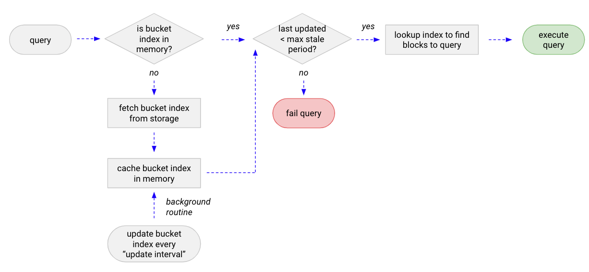

# Grafana Mimir bucket index

The bucket index is a per-tenant file that contains the list of blocks and block deletion marks in the storage. The bucket index is stored in the backend object storage, is periodically updated by the compactor, and used by queriers, store-gateways, and rulers (in [internal]() operational mode) to discover blocks in the storage.

The bucket index is enabled by default, but is optional. It can be disabled via `-blocks-storage.bucket-store.bucket-index.enabled=false` (or its respective YAML configuration option).
Disabling the bucket index is not recommended.

## Benefits

The [querier](), [store-gateway]() and [ruler]() must have an almost up-to-date view of the storage bucket, in order to find the right blocks to lookup at query time (querier) and load block's [index-header]() (store-gateway).
Because of this, they need to periodically scan the bucket to look for new blocks uploaded by ingester or compactor, and blocks deleted (or marked for deletion) by compactor.

When the bucket index is enabled, the querier, store-gateway, and ruler periodically look up the per-tenant bucket index instead of scanning the bucket via `list objects` operations.

This provides the following benefits:

1. Reduced number of API calls to the object storage by querier and store-gateway
1. No "list objects" storage API calls performed by querier and store-gateway
1. The [querier]() is up and running immediately after the startup, so there is no need to run an initial bucket scan

## Structure of the index

The `bucket-index.json.gz` contains:

- **`blocks`** 
  List of complete blocks of a tenant, including blocks marked for deletion. Partial blocks are excluded from the index.
- **`block_deletion_marks`** 
  List of block deletion marks.
- **`updated_at`** 
  A Unix timestamp, with precision measured in seconds, displays the last time index was updated and written to the storage.

## How it gets updated

The [compactor]() periodically scans the bucket and uploads an updated bucket index to the storage.
You can configure the frequency with which the bucket index is updated via `-compactor.cleanup-interval`.

The use of the bucket index is optional, but the index is built and updated by the compactor even if `-blocks-storage.bucket-store.bucket-index.enabled=false`.
This behavior ensures that the bucket index for any tenant exists and that query result consistency is guaranteed if a Grafana Mimir cluster operator enable the bucket index in a live cluster.
The overhead introduced by keeping the bucket index updated is not signifcant.

## How it's used by the querier

At query time the [querier]() and [ruler]() determine whether the bucket index for the tenant has already been loaded to memory.
If not, the querier and ruler download it from the storage and cache it.

Because the bucket index is a small file, lazy downloading it doesn't have a significant impact on first query performances, but it does allow a querier to get up and running without pre-downloading every tenant's bucket index.
In addition, if the [metadata cache]() is enabled, the bucket index is cached for a short time in a shared cache, which reduces the latency and number of API calls to the object storage in case multiple queriers and rulers fetch the same tenant's bucket index within a short time.

<!-- Diagram source at https://docs.google.com/presentation/d/1bHp8_zcoWCYoNU2AhO2lSagQyuIrghkCncViSqn14cU/edit -->

While in-memory, a background process keeps the bucket index updated periodically so that subsequent queries from the same tenant to the same querier instance uses the cached (and periodically updated) bucket index.

The following configuration options determine bucket index update intervals:

- `-blocks-storage.bucket-store.sync-interval` 
  This option configures how frequently a cached bucket index is refreshed.
- `-blocks-storage.bucket-store.bucket-index.update-on-error-interval` 
  If downloading a bucket index fails, the failure is cached for a short time so that the backend storage doesn't experience a large volume of storage requests.
  This option configures the frequency with which the bucket store attempts to load a failed bucket index.

If a bucket index is unused for the amount of time configured via `-blocks-storage.bucket-store.bucket-index.idle-timeout`, (for example, if a querier instance is not receiving any query from the tenant), the querier offload its, which stops the querier from updating it at regular intervals.
This is useful for tenants that are resharded to different queriers when [shuffle sharding]() is enabled.

At query time the querier and ruler determine how old a bucket index is based on its `updated_at`.
If the age is older than the period configured via `-blocks-storage.bucket-store.bucket-index.max-stale-period` a query fails.
This circuit breaker ensures queriers and rulers do not return any partial query results due to a stale view over the long-term storage.

## How it's used by the store-gateway

The [store-gateway](), at startup and periodically, fetches the bucket index for each tenant that belong to their shard, and uses it as the source of truth for the blocks and deletion marks in the storage. This removes the need to periodically scan the bucket to discover blocks belonging to their shard.
