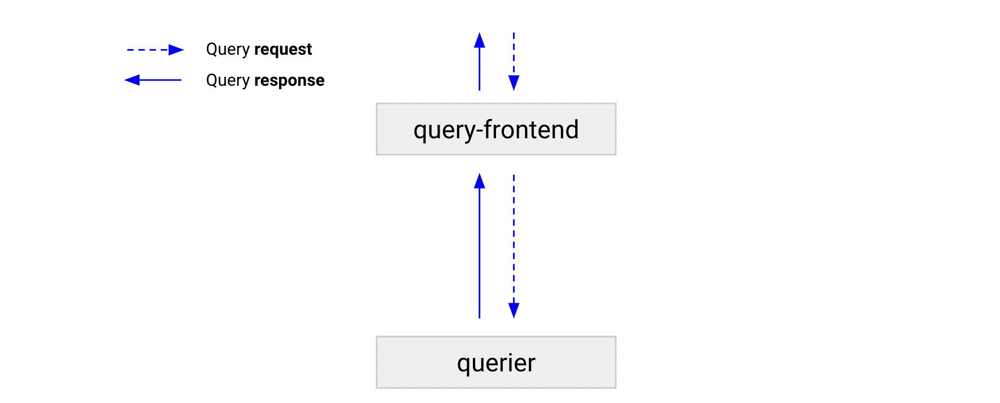

# Grafana Mimir query-frontend

The query-frontend is a stateless component that provides the same API as the [querier]() and can be used to accelerate the read path.
Although the query-frontend is not required, we recommend that you deploy it.
When you deploy the query-frontend, you should make query requests to the query-frontend instead of the queriers.
The queriers are required within the cluster to execute the queries.

The query-frontend internally holds queries in an internal queue.
In this situation, queriers act as workers that pull jobs from the queue, execute them, and return the results to the query-frontend for aggregation.
To connect the queriers with the query-frontends, configure queriers with the query-frontend address via the `-querier.frontend-address` flag.

We recommend that you run at least two query-frontend replicas for high-availability reasons.

[//]: # "Diagram source at https://docs.google.com/presentation/d/1bHp8_zcoWCYoNU2AhO2lSagQyuIrghkCncViSqn14cU/edit"

The following steps describe how a query moves through the query-frontend.

> **Note:** In this scenario, a query-scheduler is not deployed.

1. A query-frontend receives a query.
1. If the query is a range query, the query-frontend [splits it by time]() into multiple smaller queries that can be parallelized.
1. The query-frontend checks the results cache. If the query result is in the cache, the query-frontend returns the cached result. If not, query execution continues according to the steps below.
1. If [query-sharding]() is enabled, the query-frontend attempts to shard the query for further parallelization.
1. The query-frontend places the query (or _queries_ if splitting or sharding of the initial query occurred) in an in-memory queue, where it waits to be picked up by a querier.
1. A querier picks up the query from the queue and executes it. If the query was split or sharded into multiple subqueries, different queriers can pick up each of the individual queries.
1. A querier or queriers return the result to query-frontend, which then aggregates and forwards the results to the client.

## Functions

This section describes the functions of the query-frontend.

### Queueing

The query-frontend uses a queuing mechanism to:

- Ensure that large queries that might cause an out-of-memory (OOM) error in the querier are retried if a query fails.
  This enables administrators to under-provision memory for queries, or run more small queries in parallel, which helps to reduce the total cost of ownership.
- Prevent multiple, large requests from being convoyed on a single querier by distributing queries among all queriers using a first-in, first-out queue.
- Prevent a single tenant from denial-of-service-ing other tenants by fairly scheduling queries between tenants.

### Splitting

The query-frontend can split long-range queries into multiple queries.
By default, the split interval is 24 hours.
The query-frontend executes these queries in parallel in downstream queriers and combines the results together.
Splitting prevents large multi-day or multi-month queries from causing out-of-memory errors in a querier and accelerates query execution.

### Caching

The query-frontend caches query results and reuses them on subsequent queries.
If the cached results are incomplete, the query-frontend calculates the required partial queries and executes them in parallel on downstream queriers.
The query-frontend can optionally align queries with their step parameter to improve the cacheability of the query results.
The result cache is backed by Memcached.

Although aligning the step parameter to the query time range increases the performance of Grafana Mimir, it violates the [PromQL conformance](https://prometheus.io/blog/2021/05/03/introducing-prometheus-conformance-program/) of Grafana Mimir. If PromQL conformance is not a priority to you, you can enable step alignment by setting `-query-frontend.align-queries-with-step=true`.

### About query sharding

The query-frontend also provides [query sharding]().

## Why query-frontend scalability is limited

The query-frontend scalability is limited by the configured number of workers per querier.

When you don't use the [query-scheduler](), the query-frontend stores a queue of queries to execute.
A querier runs `-querier.max-concurrent` workers and each worker connects to one of the query-frontend replicas to pull queries to execute.
A querier worker executes one query at a time.

The connection between a querier worker and query-frontend is persistent.
After a connection is established, multiple queries are delivered through the connection, one by one.
To balance the number of workers connected to each query-frontend, the querier workers use a round-robin method to select the query-frontend replicas to connect to.

If you run more query-frontend replicas than the number of workers per querier, the querier increases the number of internal workers to match the query-frontend replicas.
This ensures that all query-frontends have some of the workers connected, but introduces a scalability limit because the more query-frontend replicas you run, the higher is the number of workers running for each querier, regardless of the configured `-querier.max-concurrent`.

The [query-scheduler]() is an optional component that you can deploy to overcome the query-frontend scalability limitations.

## DNS configuration and readiness

When a query-frontend starts up, it does not immediately have queriers attached to it.
The [`/ready` endpoint]() returns an HTTP 200 status code only when the query-frontend has at least one querier attached to it, and is then ready to serve queries.
Configure the `/ready` endpoint as a healthcheck in your load balancer; otherwise, a query-frontend scale-out event might result in failed queries or high latency until queriers connect to the query-frontend.

If you use query-frontend with query-scheduler, the `/ready` endpoint reports an HTTP 200 status code only after the query-frontend connects to at least one query-scheduler.
