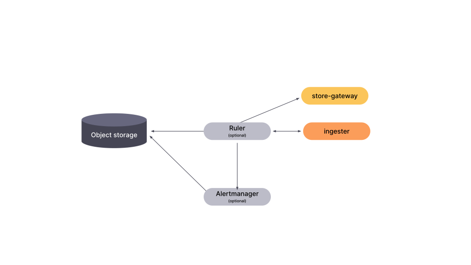
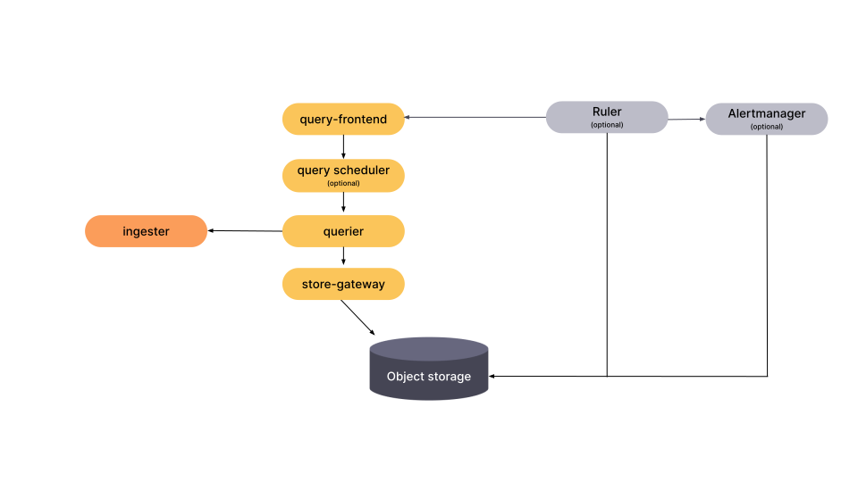

# (Optional) Grafana Mimir ruler

The ruler is an optional component that evaluates PromQL expressions defined in recording and alerting rules.
Each tenant has a set of recording and alerting rules and can group those rules into namespaces.

## Operational modes

The ruler supports two different rule evaluation modes:

### Internal

This is the default mode. The ruler internally runs a querier and distributor, and evaluates recording and alerting rules in the ruler process itself.
To evaluate rules, the ruler connects directly to ingesters and store-gateways, and writes any resulting series to the ingesters.

Configuration of the built-in querier and distributor uses their respective configuration parameters:

- [Querier]()
- [Distributor]()

> **Note**: When this mode is used, no query acceleration techniques are used and the evaluation of very high cardinality queries could take longer than the evaluation interval, eventually leading to missing data points in the evaluated recording rules.

[//]: # "Diagram source of ruler interactions https://docs.google.com/presentation/d/1LemaTVqa4Lf_tpql060vVoDGXrthp-Pie_SQL7qwHjc/edit#slide=id.g11658e7e4c6_0_938"



### Remote

In this mode the ruler delegates rules evaluation to the query-frontend. When enabled, the ruler leverages all the query acceleration techniques employed by the query-frontend, such as [query sharding]().
To enable the remote operational mode, set the `-ruler.query-frontend.address` CLI flag or its respective YAML configuration parameter for the ruler.
Communication between ruler and query-frontend is established over gRPC, so you can make use of client-side load balancing by prefixing the query-frontend address URL with `dns://`.



## Recording rules

The ruler evaluates the expressions in the [recording rules](https://prometheus.io/docs/prometheus/latest/configuration/recording_rules/#recording-rules) at regular intervals and writes the results back to the ingesters.

## Alerting rules

The ruler evaluates the expressions in [alerting rules](https://prometheus.io/docs/prometheus/latest/configuration/alerting_rules/#alerting-rules) at regular intervals and if the result includes any series, the alert becomes active.
If an alerting rule has a defined `for` duration, it enters the **PENDING** (`pending`) state.
After the alert has been active for the entire `for` duration, it enters the **FIRING** (`firing`) state.
The ruler then notifies Alertmanagers of any **FIRING** (`firing`) alerts.

Configure the addresses of Alertmanagers with the `-ruler.alertmanager-url` flag, which supports the DNS service discovery format.
For more information about DNS service discovery, refer to [Supported discovery modes]().

## Federated rule groups

A federated rule group is a rule group with a non-empty `source_tenants`.

The `source_tenants` field allows aggregating data from multiple tenants while evaluating a rule group. The expressions
of each rule in the group will be evaluated against the data of all tenants in `source_tenants`. If `source_tenants` is
empty or omitted, then the tenant under which the group is created will be treated as the `source_tenant`.

Below is an example of how a federated rule group would look like:

```yaml
name: MyGroupName
source_tenants: ["tenant-a", "tenant-b"]
rules:
  - record: sum:metric
    expr: sum(metric)
```

_In this example `MyGroupName` rules will be evaluated against `tenant-a` and `tenant-b` tenants._

Federated rule groups are skipped during evaluation by default. This feature depends on
the cross-tenant query federation feature. To enable federated rules
set `-ruler.tenant-federation.enabled=true` and `-tenant-federation.enabled=true` CLI flags (or their respective YAML
config options).

During evaluation query limits applied to single tenants are also applied to each query in the rule group. For example,
if `tenant-a` has a federated rule group with `source_tenants: [tenant-b, tenant-c]`, then query limits for `tenant-b`
and `tenant-c` will be applied. If any of these limits is exceeded, the whole evaluation will fail. No partial results
will be saved. The same "no partial results" guarantee applies to queries failing for other reasons (e.g. ingester
unavailability).

The time series used during evaluation of federated rules will have the `__tenant_id__` label, similar to how it is
present on series returned with cross-tenant query federation.

> **Note**: Federated rule groups allow data from multiple source tenants to be written into a single
> destination tenant. This makes the existing separation of tenants' data less clear. For example, `tenant-a` has a
> federated rule group that aggregates over `tenant-b`'s data (e.g. `sum(metric_b)`) and writes the result back
> into `tenant-a`'s storage (e.g. as metric `sum:metric_b`). Now part of `tenant-b`'s data is copied to `tenant-a` (albeit
> aggregated). Have this in mind when configuring the access control layer in front of mimir and when enabling federated
> rules via `-ruler.tenant-federation.enabled`.

## Sharding

The ruler supports multi-tenancy and horizontal scalability.
To achieve horizontal scalability, the ruler shards the execution of rules by rule groups.
Ruler replicas form their own [hash ring]() stored in the [KV store]() to divide the work of the executing rules.

To configure the rulers' hash ring, refer to [configuring hash rings]().

## HTTP configuration API

The ruler HTTP configuration API enables tenants to create, update, and delete rule groups.
For a complete list of endpoints and example requests, refer to [ruler]().

## State

The ruler uses the backend configured via `-ruler-storage.backend`.
The ruler supports the following backends:

- [Amazon S3](https://aws.amazon.com/s3): `-ruler-storage.backend=s3`
- [Google Cloud Storage](https://cloud.google.com/storage/): `-ruler-storage.backend=gcs`
- [Microsoft Azure Storage](https://azure.microsoft.com/en-us/services/storage/): `-ruler-storage.backend=azure`
- [OpenStack Swift](https://wiki.openstack.org/wiki/Swift): `-ruler-storage.backend=swift`
- [Local storage](): `-ruler-storage.backend=local`

### Local storage

The `local` storage backend reads [Prometheus recording rules](https://prometheus.io/docs/prometheus/latest/configuration/recording_rules/) from the local filesystem.

> **Note:** Local storage is a read-only backend that does not support the creation and deletion of rules through the [Configuration API]().

When all rulers have the same rule files, local storage supports ruler sharding.
To facilitate sharding in Kubernetes, mount a [Kubernetes ConfigMap](https://kubernetes.io/docs/concepts/configuration/configmap/) into every ruler pod.

The following example shows a local storage definition:

```
-ruler-storage.backend=local
-ruler-storage.local.directory=/tmp/rules
```

The ruler looks for tenant rules in the `/tmp/rules/<TENANT ID>` directory.
The ruler requires rule files to be in the [Prometheus format](https://prometheus.io/docs/prometheus/latest/configuration/recording_rules/#recording-rules).
