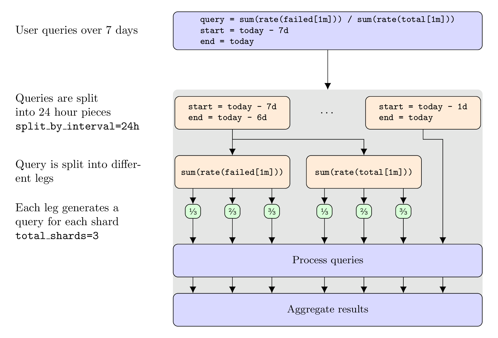

# Grafana Mimir query sharding

Mimir includes the ability to run a single query across multiple machines. This is
achieved by breaking the dataset into smaller pieces. These smaller pieces are
called shards. Each shard then gets queried in a partial query, and those
partial queries are distributed by the query-frontend to run on different
queriers in parallel. The results of those partial queries are aggregated by the
query-frontend to return the full query result.

## Query sharding at glance

Not all queries are shardable. While the full query is not shardable, the inner
parts of a query could still be shardable.

In particular associative aggregations (like `sum`, `min`, `max`, `count`,
`avg`) are shardable, while some query functions (like `absent`, `absent_over_time`,
`histogram_quantile`, `sort_desc`, `sort`) are not.

In the following examples we look at a concrete example with a shard count of
`3`. All the partial queries that include a label selector `__query_shard__`
are executed in parallel. The `concat()` annotation is used to show when partial
query results are concatenated/merged by the query-frontend.

### Example 1: Full query is shardable

```promql
sum(rate(metric[1m]))
```

Is executed as (assuming a shard count of 3):

```promql
sum(
  concat(
    sum(rate(metric{__query_shard__="1_of_3"}[1m]))
    sum(rate(metric{__query_shard__="2_of_3"}[1m]))
    sum(rate(metric{__query_shard__="3_of_3"}[1m]))
  )
)
```

### Example 2: Inner part is shardable

```promql
histogram_quantile(0.99, sum by(le) (rate(metric[1m])))
```

Is executed as (assuming a shard count of 3):

```promql
histogram_quantile(0.99, sum by(le) (
  concat(
    sum by(le) (rate(metric{__query_shard__="1_of_3"}[1m]))
    sum by(le) (rate(metric{__query_shard__="2_of_3"}[1m]))
    sum by(le) (rate(metric{__query_shard__="3_of_3"}[1m]))
  )
))
```

### Example 3: Query with two shardable portions

```promql
sum(rate(failed[1m])) / sum(rate(total[1m]))
```

Is executed as (assuming a shard count of 3):

```promql
sum(
  concat(
    sum (rate(failed{__query_shard__="1_of_3"}[1m]))
    sum (rate(failed{__query_shard__="2_of_3"}[1m]))
    sum (rate(failed{__query_shard__="3_of_3"}[1m]))
  )
)
/
sum(
  concat(
    sum (rate(total{__query_shard__="1_of_3"}[1m]))
    sum (rate(total{__query_shard__="2_of_3"}[1m]))
    sum (rate(total{__query_shard__="3_of_3"}[1m]))
  )
)
```



## How to enable query sharding

In order to enable query sharding you need to opt-in by setting
`-query-frontend.parallelize-shardable-queries` to `true`.

Each shardable portion of a query is split into
`-query-frontend.query-sharding-total-shards` partial queries. If a query has multiple
inner portions that can be sharded, each portion is sharded
`-query-frontend.query-sharding-total-shards` times. In some cases, this could lead to
an explosion of queries. For this reason, there is a parameter that allows to
modify the default hard limit of 128 queries on the total number of partial
queries a single input query can generate:
`-query-frontend.query-sharding-max-sharded-queries`.

When running a query over a large time range and
`-query-frontend.split-queries-by-interval` is enabled, the
`-query-frontend.query-sharding-max-sharded-queries` limit applies on the total
number of queries which have been split by time (first) and by shards (second).

As an example, if `-query-frontend.query-sharding-max-sharded-queries=128` and
`-query-frontend.split-queries-by-interval=24h`, and you run a query over 8 days, each
daily query will have a max of 128 / 8 days = 16 partial queries per day.

After enabling query sharding in a microservices deployment, the query
frontends will start processing the aggregation of the partial queries. Hence
it is important to configure some PromQL engine specific parameters on the
query-frontend too:

- `-querier.max-concurrent`
- `-querier.timeout`
- `-querier.max-samples`
- `-querier.default-evaluation-interval`
- `-querier.lookback-delta`

## Operational considerations

Splitting a single query into sharded queries increases the quantity of queries
that must be processed. Parallelization decreases the query processing time,
but increases the load on querier components and their underlying data stores
(ingesters for recent data and store-gateway for historic data). The
caching layer for chunks and indexes will also experience an increased load.

We also recommend to increase the maximum number of queries scheduled in
parallel by the query-frontend, multiplying the previously set value of
`-querier.max-query-parallelism` by
`-query-frontend.query-sharding-total-shards`.

## Verification

### Query statistics

The query statistics logged by the query-frontend allow to check if query sharding was
used for an individual query. The field `sharded_queries` contains the amount
of parallelly executed partial queries.

When `sharded_queries` is `0`, either the query is not shardable or query
sharding is disabled for cluster or tenant. This is a log line of an
unshardable query:

```
sharded_queries=0  param_query="absent(up{job=\"my-service\"})"
```

When `sharded_queries` matches the configured shard count, query sharding is
operational and the query has only a single leg (assuming time splitting is
disabled or the query doesn't span across multiple days). The following log
line represents that case with a shard count of `16`:

```
sharded_queries=16 query="sum(rate(prometheus_engine_queries[5m]))"
```

When `sharded_queries` is a multiple of the configured shard count, query
sharding is operational and the query has multiple legs (assuming time
splitting is disabled or the query doesn't span across multiple days). The
following log line shows a query with two legs and with a configured shard
count of `16`:

```
sharded_queries=32 query="sum(rate(prometheus_engine_queries{engine=\"ruler\"}[5m]))/sum(rate(prometheus_engine_queries[5m]))"
```

The query-frontend also exposes metrics, which can be useful to understand the
query workload's parallelism as a whole.

You can run the following query to get the ratio of queries which have been successfully sharded:

```promql
sum(rate(cortex_frontend_query_sharding_rewrites_succeeded_total[$__rate_interval])) /
sum(rate(cortex_frontend_query_sharding_rewrites_attempted_total[$__rate_interval]))
```

The histogram `cortex_frontend_sharded_queries_per_query` allows to understand
how many sharded sub queries are generated per query.
