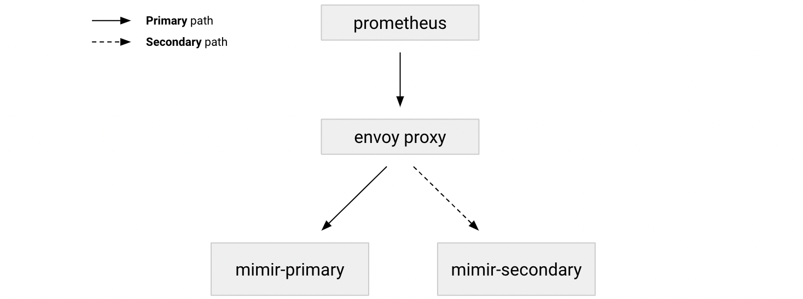

---
aliases:
  - /docs/mimir/latest/operators-guide/configuring/mirroring-requests-to-a-second-cluster/
description:
  Learn how to set up a testing cluster that receives the same series of
  the primary cluster.
menuTitle: Mirroring requests to a second cluster
title: Mirroring requests to a second Grafana Mimir cluster
weight: 120
---

# Mirroring requests to a second Grafana Mimir cluster

Use request mirroring when you want to set up a Grafana Mimir testing cluster that receives the same series that are ingested by a primary cluster and when you don't have control over the Prometheus remote write configuration.

If you have control over the Prometheus remote write configuration, we recommend that you configure two remote write entries in Prometheus. For more information about Prometheus remote write configuration, refer to [Prometheus remote write reference][reference-prom-rw].

[reference-prom-rw]: https://prometheus.io/docs/prometheus/latest/configuration/configuration/#remote_write

## Mirroring with Envoy proxy

You can use [Envoy proxy](https://www.envoyproxy.io/) to mirror HTTP requests to a secondary upstream cluster.
From a network path perspective, run Envoy in front of both clusters' [distributors]().

This approach enables the Envoy proxy to make requests to the primary Grafana Mimir cluster and then in the background, Envoy mirrors the requests to the secondary cluster.

The performance and availability of the secondary cluster have no impact on the requests to the primary cluster.
The response to the client is always sent from the primary cluster.

Requests from Envoy to the secondary cluster are "fire and forget", which means that Envoy doesn't wait until the requests are completed to the secondary cluster before sending back the response to the client.

The following diagram illustrates a simplified network structure.

<!-- Diagram source at https://docs.google.com/presentation/d/1bHp8_zcoWCYoNU2AhO2lSagQyuIrghkCncViSqn14cU/edit -->



### Example Envoy configuration

The following Envoy configuration shows an example that includes two Grafana Mimir clusters. Envoy listens on port `9900` and proxies all requests to `mimir-primary:8080`, while also mirroring them to `mimir-secondary:8080`.

<!-- prettier-ignore-start -->
[embedmd]:# (../../../../configurations/requests-mirroring-envoy.yaml)
```yaml
admin:
  # No access logs.
  access_log_path: /dev/null
  address:
    socket_address: { address: 0.0.0.0, port_value: 9901 }

static_resources:
  listeners:
    - name: mimir_listener
      address:
        socket_address: { address: 0.0.0.0, port_value: 9900 }
      filter_chains:
        - filters:
            - name: envoy.http_connection_manager
              config:
                stat_prefix: mimir_ingress
                route_config:
                  name: all_routes
                  virtual_hosts:
                    - name: all_hosts
                      domains: ["*"]
                      routes:
                        - match: { prefix: "/" }
                          route:
                            cluster: mimir_primary

                            # Specifies the upstream timeout. This spans between the point at which the entire downstream
                            # request has been processed and when the upstream response has been completely processed.
                            timeout: 15s

                            # Specifies the cluster that requests will be mirrored to. The performance
                            # and availability of the secondary cluster have no impact on the requests to the primary
                            # one. The response to the client will always be the one from the primary one. In this sense,
                            # the requests from Envoy to the secondary cluster are "fire and forget".
                            request_mirror_policies:
                              - cluster: mimir_secondary
                http_filters:
                  - name: envoy.router
  clusters:
    - name: mimir_primary
      type: STRICT_DNS
      connect_timeout: 1s
      # Replace mimir-primary with the address and port the distributor of your primary mimir cluster
      hosts: [{ socket_address: { address: mimir-primary, port_value: 8080 }}]
      dns_refresh_rate: 5s
    - name: mimir_secondary
      type: STRICT_DNS
      connect_timeout: 1s
      # Replace mimir-secondary with the address and port the distributor of your secondary mimir cluster
      hosts: [{ socket_address: { address: mimir-secondary, port_value: 8080 }}]
      dns_refresh_rate: 5s
```
<!-- prettier-ignore-end -->
