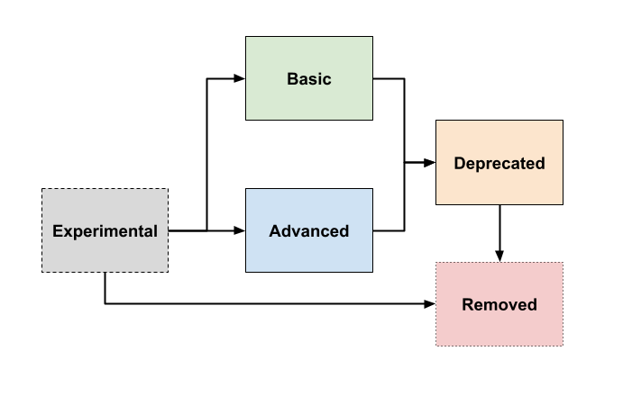

---
aliases:
  - /docs/mimir/latest/operators-guide/configuring/reference-configuration-parameters/
description: Describes parameters used to configure Grafana Mimir.
menuTitle: Configuration parameters
title: Grafana Mimir configuration parameters
weight: 130
---

# Grafana Mimir configuration parameters

<!-- DO NOT EDIT THIS FILE - This file has been automatically generated from its .template -->

You can configure Grafana Mimir by using a YAML file or via command-line flags
that represent configuration parameters.
To specify the YAML file, use the `-config.file` command-line option.
If you specify both the command-line flags and YAML configuration parameters,
the command-line flags take precedence over values in a YAML file.

To see the current configuration of any component,
go to the `/config` HTTP API endpoint.
Passwords are filtered out of this endpoint.

Parameters are
written in [YAML format](https://en.wikipedia.org/wiki/YAML), and
brackets indicate that a parameter is optional.

## Generic placeholders

- `<boolean>`: a boolean that can take the values `true` or `false`
- `<int>`: any integer matching the regular expression `[1-9]+[0-9]*`
- `<duration>`: a duration matching the regular expression `[0-9]+(ns|us|µs|ms|s|m|h|d|w|y)` where y = 365 days
- `<string>`: a string
- `<url>`: a URL
- `<filepath>`: a string containing an absolute or relative path and filename to a file on disk
- `<prefix>`: a CLI flag prefix based on the context (look at the parent configuration block to see which CLI flags prefix should be used)
- `<relabel_config>`: a [Prometheus relabeling configuration](https://prometheus.io/docs/prometheus/latest/configuration/configuration/#relabel_config)
- `<time>`: a timestamp, with available formats:
  - `2006-01-20` (midnight, local timezone)
  - `2006-01-20T15:04` (local timezone)
  - RFC 3339 formats: `2006-01-20T15:04:05Z` (UTC) or `2006-01-20T15:04:05+07:00` (explicit timezone)

## Parameter categories

In order to simplify Mimir configuration, we categorize parameters by
maturity level and intended use:

- **Basic** parameters are ones that we expect the majority of users to modify.
  Examples of basic parameters are object store credentials and
  other dependency connection information.
  These parameters will generally remain stable for long periods of time,
  and they focus on user goals.
  In this reference, any parameters that are not marked as `(advanced)` or
  `(experimental)` are in the basic category.

- **Advanced** parameters are ones that few users will change
  from their default values.
  There are strong use cases for altered values.
  In this reference, advanced-category parameters include `(advanced)` at
  the beginning of their description.

- **Experimental** parameters are for new and experimental features.
  These parameters permit
  early adopters and Mimir developers to gain confidence with new
  features.
  In this reference, experimental-category parameters include `(experimental)` at
  the beginning of their description.

### Parameter lifecycle

When new parameters are added, they can be introduced as **basic**, **advanced**, or **experimental**.

**Experimental** parameters will remain experimental until they are either made stable or removed. Parameters that are made stable will be classified as either **basic** or **advanced**. We aim to make this decision on an experimental parameter within 6 months of its initial release, but this decision may take longer depending on what we discover during testing, or if upstream dependencies (e.g., Prometheus) of our code changes.

If we decide to eliminate a **basic** or **advanced** parameter, we will first mark it deprecated. After two more minor releases, a deprecated flag will be removed entirely. Use the metric `deprecated_flags_inuse_total` to determine whether you're using deprecated flags.



## Use environment variables in the configuration

You can use environment variable references in the YAML configuration file
to set values that need to be configurable during deployment.
To do this, pass `-config.expand-env=true` on the command line and use
`${VAR}`,
where `VAR` is the name of the environment variable.

Each variable reference is replaced at startup by the value of the environment variable.
The replacement is case-sensitive and occurs before the YAML file is parsed.
References to undefined variables are replaced by empty strings unless you specify a default value or custom error text.

To specify a default value, use `${VAR:default_value}`,
where `default_value` is the value to use if the environment variable is undefined.

## Configuration parameters

```yaml
# Comma-separated list of components to include in the instantiated process. The
# default value 'all' includes all components that are required to form a
# functional Grafana Mimir instance in single-binary mode. Use the '-modules'
# command line flag to get a list of available components, and to see which
# components are included with 'all'.
# CLI flag: -target
[target: <string> | default = "all"]

# When set to true, incoming HTTP requests must specify tenant ID in HTTP
# X-Scope-OrgId header. When set to false, tenant ID from -auth.no-auth-tenant
# is used instead.
# CLI flag: -auth.multitenancy-enabled
[multitenancy_enabled: <boolean> | default = true]

# (advanced) Tenant ID to use when multitenancy is disabled.
# CLI flag: -auth.no-auth-tenant
[no_auth_tenant: <string> | default = "anonymous"]

api:
  # (advanced) Allows to skip label name validation via
  # X-Mimir-SkipLabelNameValidation header on the http write path. Use with
  # caution as it breaks PromQL. Allowing this for external clients allows any
  # client to send invalid label names. After enabling it, requests with a
  # specific HTTP header set to true will not have label names validated.
  # CLI flag: -api.skip-label-name-validation-header-enabled
  [skip_label_name_validation_header_enabled: <boolean> | default = false]

  # (advanced) HTTP URL path under which the Alertmanager ui and api will be
  # served.
  # CLI flag: -http.alertmanager-http-prefix
  [alertmanager_http_prefix: <string> | default = "/alertmanager"]

  # (advanced) HTTP URL path under which the Prometheus api will be served.
  # CLI flag: -http.prometheus-http-prefix
  [prometheus_http_prefix: <string> | default = "/prometheus"]

# The server block configures the HTTP and gRPC server of the launched
# service(s).
[server: <server>]

# The distributor block configures the distributor.
[distributor: <distributor>]

# The querier block configures the querier.
[querier: <querier>]

# The ingester_client block configures how the distributors connect to the
# ingesters.
[ingester_client: <ingester_client>]

# The ingester block configures the ingester.
[ingester: <ingester>]

# The flusher block configures the WAL flusher target, used to manually run
# one-time flushes when scaling down ingesters.
[flusher: <flusher>]

# The limits block configures default and per-tenant limits imposed by
# components.
[limits: <limits>]

# The frontend_worker block configures the worker running within the querier,
# picking up and executing queries enqueued by the query-frontend or the
# query-scheduler.
[frontend_worker: <frontend_worker>]

# The frontend block configures the query-frontend.
[frontend: <frontend>]

# The blocks_storage block configures the blocks storage.
[blocks_storage: <blocks_storage>]

# The compactor block configures the compactor component.
[compactor: <compactor>]

# The store_gateway block configures the store-gateway component.
[store_gateway: <store_gateway>]

tenant_federation:
  # If enabled on all services, queries can be federated across multiple
  # tenants. The tenant IDs involved need to be specified separated by a '|'
  # character in the 'X-Scope-OrgID' header.
  # CLI flag: -tenant-federation.enabled
  [enabled: <boolean> | default = false]

activity_tracker:
  # File where ongoing activities are stored. If empty, activity tracking is
  # disabled.
  # CLI flag: -activity-tracker.filepath
  [filepath: <string> | default = "./metrics-activity.log"]

  # (advanced) Max number of concurrent activities that can be tracked. Used to
  # size the file in advance. Additional activities are ignored.
  # CLI flag: -activity-tracker.max-entries
  [max_entries: <int> | default = 1024]

# The ruler block configures the ruler.
[ruler: <ruler>]

# The ruler_storage block configures the ruler storage backend.
[ruler_storage: <ruler_storage>]

# The alertmanager block configures the alertmanager.
[alertmanager: <alertmanager>]

# The alertmanager_storage block configures the alertmanager storage backend.
[alertmanager_storage: <alertmanager_storage>]

runtime_config:
  # (advanced) How often to check runtime config files.
  # CLI flag: -runtime-config.reload-period
  [period: <duration> | default = 10s]

  # Comma separated list of yaml files with the configuration that can be
  # updated at runtime. Runtime config files will be merged from left to right.
  # CLI flag: -runtime-config.file
  [file: <string> | default = ""]

# The memberlist block configures the Gossip memberlist.
[memberlist: <memberlist>]

# The query_scheduler block configures the query-scheduler.
[query_scheduler: <query_scheduler>]

usage_stats:
  # (experimental) Enable anonymous usage reporting.
  # CLI flag: -usage-stats.enabled
  [enabled: <boolean> | default = true]

# The common block holds configurations that configure multiple components at a
# time.
[common: <common>]
```

### common

The `common` block holds configurations that configure multiple components at a time.

```yaml
storage:
  # Backend storage to use. Supported backends are: s3, gcs, azure, swift,
  # filesystem.
  # CLI flag: -common.storage.backend
  [backend: <string> | default = "filesystem"]

  # The s3_backend block configures the connection to Amazon S3 object storage
  # backend.
  # The CLI flags prefix for this block configuration is: common.storage
  [s3: <s3_storage_backend>]

  # The gcs_backend block configures the connection to Google Cloud Storage
  # object storage backend.
  # The CLI flags prefix for this block configuration is: common.storage
  [gcs: <gcs_storage_backend>]

  # The azure_storage_backend block configures the connection to Azure object
  # storage backend.
  # The CLI flags prefix for this block configuration is: common.storage
  [azure: <azure_storage_backend>]

  # The swift_storage_backend block configures the connection to OpenStack
  # Object Storage (Swift) object storage backend.
  # The CLI flags prefix for this block configuration is: common.storage
  [swift: <swift_storage_backend>]

  # The filesystem_storage_backend block configures the usage of local file
  # system as object storage backend.
  # The CLI flags prefix for this block configuration is: common.storage
  [filesystem: <filesystem_storage_backend>]
```

### server

The `server` block configures the HTTP and gRPC server of the launched service(s).

```yaml
# (advanced) HTTP server listen network, default tcp
# CLI flag: -server.http-listen-network
[http_listen_network: <string> | default = "tcp"]

# HTTP server listen address.
# CLI flag: -server.http-listen-address
[http_listen_address: <string> | default = ""]

# HTTP server listen port.
# CLI flag: -server.http-listen-port
[http_listen_port: <int> | default = 8080]

# (advanced) Maximum number of simultaneous http connections, <=0 to disable
# CLI flag: -server.http-conn-limit
[http_listen_conn_limit: <int> | default = 0]

# (advanced) gRPC server listen network
# CLI flag: -server.grpc-listen-network
[grpc_listen_network: <string> | default = "tcp"]

# gRPC server listen address.
# CLI flag: -server.grpc-listen-address
[grpc_listen_address: <string> | default = ""]

# gRPC server listen port.
# CLI flag: -server.grpc-listen-port
[grpc_listen_port: <int> | default = 9095]

# (advanced) Maximum number of simultaneous grpc connections, <=0 to disable
# CLI flag: -server.grpc-conn-limit
[grpc_listen_conn_limit: <int> | default = 0]

http_tls_config:
  # (advanced) HTTP server cert path.
  # CLI flag: -server.http-tls-cert-path
  [cert_file: <string> | default = ""]

  # (advanced) HTTP server key path.
  # CLI flag: -server.http-tls-key-path
  [key_file: <string> | default = ""]

  # (advanced) HTTP TLS Client Auth type.
  # CLI flag: -server.http-tls-client-auth
  [client_auth_type: <string> | default = ""]

  # (advanced) HTTP TLS Client CA path.
  # CLI flag: -server.http-tls-ca-path
  [client_ca_file: <string> | default = ""]

grpc_tls_config:
  # (advanced) GRPC TLS server cert path.
  # CLI flag: -server.grpc-tls-cert-path
  [cert_file: <string> | default = ""]

  # (advanced) GRPC TLS server key path.
  # CLI flag: -server.grpc-tls-key-path
  [key_file: <string> | default = ""]

  # (advanced) GRPC TLS Client Auth type.
  # CLI flag: -server.grpc-tls-client-auth
  [client_auth_type: <string> | default = ""]

  # (advanced) GRPC TLS Client CA path.
  # CLI flag: -server.grpc-tls-ca-path
  [client_ca_file: <string> | default = ""]

# (advanced) Register the intrumentation handlers (/metrics etc).
# CLI flag: -server.register-instrumentation
[register_instrumentation: <boolean> | default = true]

# (advanced) Timeout for graceful shutdowns
# CLI flag: -server.graceful-shutdown-timeout
[graceful_shutdown_timeout: <duration> | default = 30s]

# (advanced) Read timeout for HTTP server
# CLI flag: -server.http-read-timeout
[http_server_read_timeout: <duration> | default = 30s]

# (advanced) Write timeout for HTTP server
# CLI flag: -server.http-write-timeout
[http_server_write_timeout: <duration> | default = 30s]

# (advanced) Idle timeout for HTTP server
# CLI flag: -server.http-idle-timeout
[http_server_idle_timeout: <duration> | default = 2m]

# (advanced) Limit on the size of a gRPC message this server can receive
# (bytes).
# CLI flag: -server.grpc-max-recv-msg-size-bytes
[grpc_server_max_recv_msg_size: <int> | default = 104857600]

# (advanced) Limit on the size of a gRPC message this server can send (bytes).
# CLI flag: -server.grpc-max-send-msg-size-bytes
[grpc_server_max_send_msg_size: <int> | default = 104857600]

# (advanced) Limit on the number of concurrent streams for gRPC calls (0 =
# unlimited)
# CLI flag: -server.grpc-max-concurrent-streams
[grpc_server_max_concurrent_streams: <int> | default = 100]

# (advanced) The duration after which an idle connection should be closed.
# Default: infinity
# CLI flag: -server.grpc.keepalive.max-connection-idle
[grpc_server_max_connection_idle: <duration> | default = 2562047h47m16.854775807s]

# (advanced) The duration for the maximum amount of time a connection may exist
# before it will be closed. Default: infinity
# CLI flag: -server.grpc.keepalive.max-connection-age
[grpc_server_max_connection_age: <duration> | default = 2562047h47m16.854775807s]

# (advanced) An additive period after max-connection-age after which the
# connection will be forcibly closed. Default: infinity
# CLI flag: -server.grpc.keepalive.max-connection-age-grace
[grpc_server_max_connection_age_grace: <duration> | default = 2562047h47m16.854775807s]

# (advanced) Duration after which a keepalive probe is sent in case of no
# activity over the connection., Default: 2h
# CLI flag: -server.grpc.keepalive.time
[grpc_server_keepalive_time: <duration> | default = 2h]

# (advanced) After having pinged for keepalive check, the duration after which
# an idle connection should be closed, Default: 20s
# CLI flag: -server.grpc.keepalive.timeout
[grpc_server_keepalive_timeout: <duration> | default = 20s]

# (advanced) Minimum amount of time a client should wait before sending a
# keepalive ping. If client sends keepalive ping more often, server will send
# GOAWAY and close the connection.
# CLI flag: -server.grpc.keepalive.min-time-between-pings
[grpc_server_min_time_between_pings: <duration> | default = 10s]

# (advanced) If true, server allows keepalive pings even when there are no
# active streams(RPCs). If false, and client sends ping when there are no active
# streams, server will send GOAWAY and close the connection.
# CLI flag: -server.grpc.keepalive.ping-without-stream-allowed
[grpc_server_ping_without_stream_allowed: <boolean> | default = true]

# Output log messages in the given format. Valid formats: [logfmt, json]
# CLI flag: -log.format
[log_format: <string> | default = "logfmt"]

# Only log messages with the given severity or above. Valid levels: [debug,
# info, warn, error]
# CLI flag: -log.level
[log_level: <string> | default = "info"]

# (advanced) Optionally log the source IPs.
# CLI flag: -server.log-source-ips-enabled
[log_source_ips_enabled: <boolean> | default = false]

# (advanced) Header field storing the source IPs. Only used if
# server.log-source-ips-enabled is true. If not set the default Forwarded,
# X-Real-IP and X-Forwarded-For headers are used
# CLI flag: -server.log-source-ips-header
[log_source_ips_header: <string> | default = ""]

# (advanced) Regex for matching the source IPs. Only used if
# server.log-source-ips-enabled is true. If not set the default Forwarded,
# X-Real-IP and X-Forwarded-For headers are used
# CLI flag: -server.log-source-ips-regex
[log_source_ips_regex: <string> | default = ""]

# (advanced) Optionally log requests at info level instead of debug level.
# CLI flag: -server.log-request-at-info-level-enabled
[log_request_at_info_level_enabled: <boolean> | default = false]

# (advanced) Base path to serve all API routes from (e.g. /v1/)
# CLI flag: -server.path-prefix
[http_path_prefix: <string> | default = ""]
```

### distributor

The `distributor` block configures the distributor.

```yaml
pool:
  # (advanced) How frequently to clean up clients for ingesters that have gone
  # away.
  # CLI flag: -distributor.client-cleanup-period
  [client_cleanup_period: <duration> | default = 15s]

  # (advanced) Run a health check on each ingester client during periodic
  # cleanup.
  # CLI flag: -distributor.health-check-ingesters
  [health_check_ingesters: <boolean> | default = true]

ha_tracker:
  # Enable the distributors HA tracker so that it can accept samples from
  # Prometheus HA replicas gracefully (requires labels).
  # CLI flag: -distributor.ha-tracker.enable
  [enable_ha_tracker: <boolean> | default = false]

  # (advanced) Update the timestamp in the KV store for a given cluster/replica
  # only after this amount of time has passed since the current stored
  # timestamp.
  # CLI flag: -distributor.ha-tracker.update-timeout
  [ha_tracker_update_timeout: <duration> | default = 15s]

  # (advanced) Maximum jitter applied to the update timeout, in order to spread
  # the HA heartbeats over time.
  # CLI flag: -distributor.ha-tracker.update-timeout-jitter-max
  [ha_tracker_update_timeout_jitter_max: <duration> | default = 5s]

  # (advanced) If we don't receive any samples from the accepted replica for a
  # cluster in this amount of time we will failover to the next replica we
  # receive a sample from. This value must be greater than the update timeout
  # CLI flag: -distributor.ha-tracker.failover-timeout
  [ha_tracker_failover_timeout: <duration> | default = 30s]

  # Backend storage to use for the ring. Please be aware that memberlist is not
  # supported by the HA tracker since gossip propagation is too slow for HA
  # purposes.
  kvstore:
    # Backend storage to use for the ring. Supported values are: consul, etcd,
    # inmemory, memberlist, multi.
    # CLI flag: -distributor.ha-tracker.store
    [store: <string> | default = "consul"]

    # (advanced) The prefix for the keys in the store. Should end with a /.
    # CLI flag: -distributor.ha-tracker.prefix
    [prefix: <string> | default = "ha-tracker/"]

    # The consul block configures the consul client.
    # The CLI flags prefix for this block configuration is:
    # distributor.ha-tracker
    [consul: <consul>]

    # The etcd block configures the etcd client.
    # The CLI flags prefix for this block configuration is:
    # distributor.ha-tracker
    [etcd: <etcd>]

    multi:
      # (advanced) Primary backend storage used by multi-client.
      # CLI flag: -distributor.ha-tracker.multi.primary
      [primary: <string> | default = ""]

      # (advanced) Secondary backend storage used by multi-client.
      # CLI flag: -distributor.ha-tracker.multi.secondary
      [secondary: <string> | default = ""]

      # (advanced) Mirror writes to secondary store.
      # CLI flag: -distributor.ha-tracker.multi.mirror-enabled
      [mirror_enabled: <boolean> | default = false]

      # (advanced) Timeout for storing value to secondary store.
      # CLI flag: -distributor.ha-tracker.multi.mirror-timeout
      [mirror_timeout: <duration> | default = 2s]

# (advanced) Max message size in bytes that the distributors will accept for
# incoming push requests to the remote write API. If exceeded, the request will
# be rejected.
# CLI flag: -distributor.max-recv-msg-size
[max_recv_msg_size: <int> | default = 104857600]

# (advanced) Timeout for downstream ingesters.
# CLI flag: -distributor.remote-timeout
[remote_timeout: <duration> | default = 2s]

ring:
  kvstore:
    # Backend storage to use for the ring. Supported values are: consul, etcd,
    # inmemory, memberlist, multi.
    # CLI flag: -distributor.ring.store
    [store: <string> | default = "memberlist"]

    # (advanced) The prefix for the keys in the store. Should end with a /.
    # CLI flag: -distributor.ring.prefix
    [prefix: <string> | default = "collectors/"]

    # The consul block configures the consul client.
    # The CLI flags prefix for this block configuration is: distributor.ring
    [consul: <consul>]

    # The etcd block configures the etcd client.
    # The CLI flags prefix for this block configuration is: distributor.ring
    [etcd: <etcd>]

    multi:
      # (advanced) Primary backend storage used by multi-client.
      # CLI flag: -distributor.ring.multi.primary
      [primary: <string> | default = ""]

      # (advanced) Secondary backend storage used by multi-client.
      # CLI flag: -distributor.ring.multi.secondary
      [secondary: <string> | default = ""]

      # (advanced) Mirror writes to secondary store.
      # CLI flag: -distributor.ring.multi.mirror-enabled
      [mirror_enabled: <boolean> | default = false]

      # (advanced) Timeout for storing value to secondary store.
      # CLI flag: -distributor.ring.multi.mirror-timeout
      [mirror_timeout: <duration> | default = 2s]

  # (advanced) Period at which to heartbeat to the ring. 0 = disabled.
  # CLI flag: -distributor.ring.heartbeat-period
  [heartbeat_period: <duration> | default = 15s]

  # (advanced) The heartbeat timeout after which distributors are considered
  # unhealthy within the ring. 0 = never (timeout disabled).
  # CLI flag: -distributor.ring.heartbeat-timeout
  [heartbeat_timeout: <duration> | default = 1m]

  # (advanced) Instance ID to register in the ring.
  # CLI flag: -distributor.ring.instance-id
  [instance_id: <string> | default = "<hostname>"]

  # List of network interface names to look up when finding the instance IP
  # address.
  # CLI flag: -distributor.ring.instance-interface-names
  [instance_interface_names: <list of strings> | default = [<private network interfaces>]]

  # (advanced) Port to advertise in the ring (defaults to
  # -server.grpc-listen-port).
  # CLI flag: -distributor.ring.instance-port
  [instance_port: <int> | default = 0]

  # (advanced) IP address to advertise in the ring. Default is auto-detected.
  # CLI flag: -distributor.ring.instance-addr
  [instance_addr: <string> | default = ""]

instance_limits:
  # (advanced) Max ingestion rate (samples/sec) that this distributor will
  # accept. This limit is per-distributor, not per-tenant. Additional push
  # requests will be rejected. Current ingestion rate is computed as
  # exponentially weighted moving average, updated every second. 0 = unlimited.
  # CLI flag: -distributor.instance-limits.max-ingestion-rate
  [max_ingestion_rate: <float> | default = 0]

  # (advanced) Max inflight push requests that this distributor can handle. This
  # limit is per-distributor, not per-tenant. Additional requests will be
  # rejected. 0 = unlimited.
  # CLI flag: -distributor.instance-limits.max-inflight-push-requests
  [max_inflight_push_requests: <int> | default = 2000]

  # (advanced) The sum of the request sizes in bytes of inflight push requests
  # that this distributor can handle. This limit is per-distributor, not
  # per-tenant. Additional requests will be rejected. 0 = unlimited.
  # CLI flag: -distributor.instance-limits.max-inflight-push-requests-bytes
  [max_inflight_push_requests_bytes: <int> | default = 0]

forwarding:
  # (experimental) Enables the feature to forward certain metrics in
  # remote_write requests, depending on defined rules.
  # CLI flag: -distributor.forwarding.enabled
  [enabled: <boolean> | default = false]

  # (experimental) Maximum concurrency at which forwarding requests get
  # performed.
  # CLI flag: -distributor.forwarding.request-concurrency
  [request_concurrency: <int> | default = 10]

  # (experimental) Timeout for requests to ingestion endpoints to which we
  # forward metrics.
  # CLI flag: -distributor.forwarding.request-timeout
  [request_timeout: <duration> | default = 2s]

  # (experimental) If disabled then forwarding requests are always considered to
  # be successful, errors are ignored.
  # CLI flag: -distributor.forwarding.propagate-errors
  [propagate_errors: <boolean> | default = true]

  # Configures the gRPC client used to communicate between the distributors and
  # the configured remote write endpoints used by the metrics forwarding
  # feature.
  # The CLI flags prefix for this block configuration is:
  # distributor.forwarding.grpc-client
  [grpc_client: <grpc_client>]
```

### ingester

The `ingester` block configures the ingester.

```yaml
ring:
  # The key-value store used to share the hash ring across multiple instances.
  # This option needs be set on ingesters, distributors, queriers and rulers
  # when running in microservices mode.
  kvstore:
    # Backend storage to use for the ring. Supported values are: consul, etcd,
    # inmemory, memberlist, multi.
    # CLI flag: -ingester.ring.store
    [store: <string> | default = "memberlist"]

    # (advanced) The prefix for the keys in the store. Should end with a /.
    # CLI flag: -ingester.ring.prefix
    [prefix: <string> | default = "collectors/"]

    # The consul block configures the consul client.
    # The CLI flags prefix for this block configuration is: ingester.ring
    [consul: <consul>]

    # The etcd block configures the etcd client.
    # The CLI flags prefix for this block configuration is: ingester.ring
    [etcd: <etcd>]

    multi:
      # (advanced) Primary backend storage used by multi-client.
      # CLI flag: -ingester.ring.multi.primary
      [primary: <string> | default = ""]

      # (advanced) Secondary backend storage used by multi-client.
      # CLI flag: -ingester.ring.multi.secondary
      [secondary: <string> | default = ""]

      # (advanced) Mirror writes to secondary store.
      # CLI flag: -ingester.ring.multi.mirror-enabled
      [mirror_enabled: <boolean> | default = false]

      # (advanced) Timeout for storing value to secondary store.
      # CLI flag: -ingester.ring.multi.mirror-timeout
      [mirror_timeout: <duration> | default = 2s]

  # (advanced) Period at which to heartbeat to the ring. 0 = disabled.
  # CLI flag: -ingester.ring.heartbeat-period
  [heartbeat_period: <duration> | default = 15s]

  # (advanced) The heartbeat timeout after which ingesters are skipped for
  # reads/writes. 0 = never (timeout disabled). This option needs be set on
  # ingesters, distributors, queriers and rulers when running in microservices
  # mode.
  # CLI flag: -ingester.ring.heartbeat-timeout
  [heartbeat_timeout: <duration> | default = 1m]

  # Number of ingesters that each time series is replicated to. This option
  # needs be set on ingesters, distributors, queriers and rulers when running in
  # microservices mode.
  # CLI flag: -ingester.ring.replication-factor
  [replication_factor: <int> | default = 3]

  # True to enable the zone-awareness and replicate ingested samples across
  # different availability zones. This option needs be set on ingesters,
  # distributors, queriers and rulers when running in microservices mode.
  # CLI flag: -ingester.ring.zone-awareness-enabled
  [zone_awareness_enabled: <boolean> | default = false]

  # (advanced) Comma-separated list of zones to exclude from the ring. Instances
  # in excluded zones will be filtered out from the ring. This option needs be
  # set on ingesters, distributors, queriers and rulers when running in
  # microservices mode.
  # CLI flag: -ingester.ring.excluded-zones
  [excluded_zones: <string> | default = ""]

  # File path where tokens are stored. If empty, tokens are not stored at
  # shutdown and restored at startup.
  # CLI flag: -ingester.ring.tokens-file-path
  [tokens_file_path: <string> | default = ""]

  # (advanced) Number of tokens for each ingester.
  # CLI flag: -ingester.ring.num-tokens
  [num_tokens: <int> | default = 128]

  # (advanced) Instance ID to register in the ring.
  # CLI flag: -ingester.ring.instance-id
  [instance_id: <string> | default = "<hostname>"]

  # (advanced) List of network interface names to look up when finding the
  # instance IP address.
  # CLI flag: -ingester.ring.instance-interface-names
  [instance_interface_names: <list of strings> | default = [<private network interfaces>]]

  # (advanced) Port to advertise in the ring (defaults to
  # -server.grpc-listen-port).
  # CLI flag: -ingester.ring.instance-port
  [instance_port: <int> | default = 0]

  # (advanced) IP address to advertise in the ring. Default is auto-detected.
  # CLI flag: -ingester.ring.instance-addr
  [instance_addr: <string> | default = ""]

  # (advanced) The availability zone where this instance is running.
  # CLI flag: -ingester.ring.instance-availability-zone
  [instance_availability_zone: <string> | default = ""]

  # (advanced) Unregister from the ring upon clean shutdown. It can be useful to
  # disable for rolling restarts with consistent naming.
  # CLI flag: -ingester.ring.unregister-on-shutdown
  [unregister_on_shutdown: <boolean> | default = true]

  # (advanced) Observe tokens after generating to resolve collisions. Useful
  # when using gossiping ring.
  # CLI flag: -ingester.ring.observe-period
  [observe_period: <duration> | default = 0s]

  # (advanced) Minimum duration to wait after the internal readiness checks have
  # passed but before succeeding the readiness endpoint. This is used to
  # slowdown deployment controllers (eg. Kubernetes) after an instance is ready
  # and before they proceed with a rolling update, to give the rest of the
  # cluster instances enough time to receive ring updates.
  # CLI flag: -ingester.ring.min-ready-duration
  [min_ready_duration: <duration> | default = 15s]

  # (advanced) Duration to sleep for before exiting, to ensure metrics are
  # scraped.
  # CLI flag: -ingester.ring.final-sleep
  [final_sleep: <duration> | default = 0s]

  # (advanced) When enabled the readiness probe succeeds only after all
  # instances are ACTIVE and healthy in the ring, otherwise only the instance
  # itself is checked. This option should be disabled if in your cluster
  # multiple instances can be rolled out simultaneously, otherwise rolling
  # updates may be slowed down.
  # CLI flag: -ingester.ring.readiness-check-ring-health
  [readiness_check_ring_health: <boolean> | default = false]

# (advanced) Period at which metadata we have not seen will remain in memory
# before being deleted.
# CLI flag: -ingester.metadata-retain-period
[metadata_retain_period: <duration> | default = 10m]

# (advanced) Period with which to update the per-tenant ingestion rates.
# CLI flag: -ingester.rate-update-period
[rate_update_period: <duration> | default = 15s]

# (advanced) Enable tracking of active series and export them as metrics.
# CLI flag: -ingester.active-series-metrics-enabled
[active_series_metrics_enabled: <boolean> | default = true]

# (advanced) How often to update active series metrics.
# CLI flag: -ingester.active-series-metrics-update-period
[active_series_metrics_update_period: <duration> | default = 1m]

# (advanced) After what time a series is considered to be inactive.
# CLI flag: -ingester.active-series-metrics-idle-timeout
[active_series_metrics_idle_timeout: <duration> | default = 10m]

# (experimental) Period with which to update the per-tenant TSDB configuration.
# CLI flag: -ingester.tsdb-config-update-period
[tsdb_config_update_period: <duration> | default = 15s]

instance_limits:
  # (advanced) Max ingestion rate (samples/sec) that ingester will accept. This
  # limit is per-ingester, not per-tenant. Additional push requests will be
  # rejected. Current ingestion rate is computed as exponentially weighted
  # moving average, updated every second. 0 = unlimited.
  # CLI flag: -ingester.instance-limits.max-ingestion-rate
  [max_ingestion_rate: <float> | default = 0]

  # (advanced) Max tenants that this ingester can hold. Requests from additional
  # tenants will be rejected. 0 = unlimited.
  # CLI flag: -ingester.instance-limits.max-tenants
  [max_tenants: <int> | default = 0]

  # (advanced) Max series that this ingester can hold (across all tenants).
  # Requests to create additional series will be rejected. 0 = unlimited.
  # CLI flag: -ingester.instance-limits.max-series
  [max_series: <int> | default = 0]

  # (advanced) Max inflight push requests that this ingester can handle (across
  # all tenants). Additional requests will be rejected. 0 = unlimited.
  # CLI flag: -ingester.instance-limits.max-inflight-push-requests
  [max_inflight_push_requests: <int> | default = 30000]

# (advanced) Comma-separated list of metric names, for which the
# -ingester.max-global-series-per-metric limit will be ignored. Does not affect
# the -ingester.max-global-series-per-user limit.
# CLI flag: -ingester.ignore-series-limit-for-metric-names
[ignore_series_limit_for_metric_names: <string> | default = ""]
```

### querier

The `querier` block configures the querier.

```yaml
# (advanced) Use iterators to execute query, as opposed to fully materialising
# the series in memory.
# CLI flag: -querier.iterators
[iterators: <boolean> | default = false]

# (advanced) Use batch iterators to execute query, as opposed to fully
# materialising the series in memory.  Takes precedent over the
# -querier.iterators flag.
# CLI flag: -querier.batch-iterators
[batch_iterators: <boolean> | default = true]

# (advanced) Maximum lookback beyond which queries are not sent to ingester. 0
# means all queries are sent to ingester.
# CLI flag: -querier.query-ingesters-within
[query_ingesters_within: <duration> | default = 13h]

# (advanced) The time after which a metric should be queried from storage and
# not just ingesters. 0 means all queries are sent to store. If this option is
# enabled, the time range of the query sent to the store-gateway will be
# manipulated to ensure the query end is not more recent than 'now -
# query-store-after'.
# CLI flag: -querier.query-store-after
[query_store_after: <duration> | default = 12h]

# (advanced) Maximum duration into the future you can query. 0 to disable.
# CLI flag: -querier.max-query-into-future
[max_query_into_future: <duration> | default = 10m]

store_gateway_client:
  # (advanced) Enable TLS for gRPC client connecting to store-gateway.
  # CLI flag: -querier.store-gateway-client.tls-enabled
  [tls_enabled: <boolean> | default = false]

  # (advanced) Path to the client certificate file, which will be used for
  # authenticating with the server. Also requires the key path to be configured.
  # CLI flag: -querier.store-gateway-client.tls-cert-path
  [tls_cert_path: <string> | default = ""]

  # (advanced) Path to the key file for the client certificate. Also requires
  # the client certificate to be configured.
  # CLI flag: -querier.store-gateway-client.tls-key-path
  [tls_key_path: <string> | default = ""]

  # (advanced) Path to the CA certificates file to validate server certificate
  # against. If not set, the host's root CA certificates are used.
  # CLI flag: -querier.store-gateway-client.tls-ca-path
  [tls_ca_path: <string> | default = ""]

  # (advanced) Override the expected name on the server certificate.
  # CLI flag: -querier.store-gateway-client.tls-server-name
  [tls_server_name: <string> | default = ""]

  # (advanced) Skip validating server certificate.
  # CLI flag: -querier.store-gateway-client.tls-insecure-skip-verify
  [tls_insecure_skip_verify: <boolean> | default = false]

# (advanced) Fetch in-memory series from the minimum set of required ingesters,
# selecting only ingesters which may have received series since
# -querier.query-ingesters-within. If this setting is false or
# -querier.query-ingesters-within is '0', queriers always query all ingesters
# (ingesters shuffle sharding on read path is disabled).
# CLI flag: -querier.shuffle-sharding-ingesters-enabled
[shuffle_sharding_ingesters_enabled: <boolean> | default = true]

# The maximum number of concurrent queries. This config option should be set on
# query-frontend too when query sharding is enabled.
# CLI flag: -querier.max-concurrent
[max_concurrent: <int> | default = 20]

# The timeout for a query. This config option should be set on query-frontend
# too when query sharding is enabled. This also applies to queries evaluated by
# the ruler (internally or remotely).
# CLI flag: -querier.timeout
[timeout: <duration> | default = 2m]

# Maximum number of samples a single query can load into memory. This config
# option should be set on query-frontend too when query sharding is enabled.
# CLI flag: -querier.max-samples
[max_samples: <int> | default = 50000000]

# (advanced) The default evaluation interval or step size for subqueries. This
# config option should be set on query-frontend too when query sharding is
# enabled.
# CLI flag: -querier.default-evaluation-interval
[default_evaluation_interval: <duration> | default = 1m]

# (advanced) Time since the last sample after which a time series is considered
# stale and ignored by expression evaluations. This config option should be set
# on query-frontend too when query sharding is enabled.
# CLI flag: -querier.lookback-delta
[lookback_delta: <duration> | default = 5m]
```

### frontend

The `frontend` block configures the query-frontend.

```yaml
# Log queries that are slower than the specified duration. Set to 0 to disable.
# Set to < 0 to enable on all queries.
# CLI flag: -query-frontend.log-queries-longer-than
[log_queries_longer_than: <duration> | default = 0s]

# (advanced) Max body size for downstream prometheus.
# CLI flag: -query-frontend.max-body-size
[max_body_size: <int> | default = 10485760]

# (advanced) False to disable query statistics tracking. When enabled, a message
# with some statistics is logged for every query.
# CLI flag: -query-frontend.query-stats-enabled
[query_stats_enabled: <boolean> | default = true]

# (advanced) Maximum number of outstanding requests per tenant per frontend;
# requests beyond this error with HTTP 429.
# CLI flag: -querier.max-outstanding-requests-per-tenant
[max_outstanding_per_tenant: <int> | default = 100]

# (experimental) If a querier disconnects without sending notification about
# graceful shutdown, the query-frontend will keep the querier in the tenant's
# shard until the forget delay has passed. This feature is useful to reduce the
# blast radius when shuffle-sharding is enabled.
# CLI flag: -query-frontend.querier-forget-delay
[querier_forget_delay: <duration> | default = 0s]

# Address of the query-scheduler component, in host:port format. The host should
# resolve to all query-scheduler instances. This option should be set only when
# query-scheduler component is in use and
# -query-scheduler.service-discovery-mode is set to 'dns'.
# CLI flag: -query-frontend.scheduler-address
[scheduler_address: <string> | default = ""]

# (advanced) How often to resolve the scheduler-address, in order to look for
# new query-scheduler instances.
# CLI flag: -query-frontend.scheduler-dns-lookup-period
[scheduler_dns_lookup_period: <duration> | default = 10s]

# (advanced) Number of concurrent workers forwarding queries to single
# query-scheduler.
# CLI flag: -query-frontend.scheduler-worker-concurrency
[scheduler_worker_concurrency: <int> | default = 5]

# Configures the gRPC client used to communicate between the query-frontends and
# the query-schedulers.
# The CLI flags prefix for this block configuration is:
# query-frontend.grpc-client-config
[grpc_client_config: <grpc_client>]

# (advanced) List of network interface names to look up when finding the
# instance IP address. This address is sent to query-scheduler and querier,
# which uses it to send the query response back to query-frontend.
# CLI flag: -query-frontend.instance-interface-names
[instance_interface_names: <list of strings> | default = [<private network interfaces>]]

# (advanced) IP address to advertise to the querier (via scheduler) (default is
# auto-detected from network interfaces).
# CLI flag: -query-frontend.instance-addr
[address: <string> | default = ""]

# (advanced) Port to advertise to querier (via scheduler) (defaults to
# server.grpc-listen-port).
# CLI flag: -query-frontend.instance-port
[port: <int> | default = 0]

# (advanced) Split range queries by an interval and execute in parallel. You
# should use a multiple of 24 hours to optimize querying blocks. 0 to disable
# it.
# CLI flag: -query-frontend.split-queries-by-interval
[split_queries_by_interval: <duration> | default = 24h]

# Mutate incoming queries to align their start and end with their step.
# CLI flag: -query-frontend.align-queries-with-step
[align_queries_with_step: <boolean> | default = false]

results_cache:
  # Backend for query-frontend results cache, if not empty. Supported values:
  # [memcached].
  # CLI flag: -query-frontend.results-cache.backend
  [backend: <string> | default = ""]

  # The memcached block configures the Memcached-based caching backend.
  # The CLI flags prefix for this block configuration is:
  # query-frontend.results-cache
  [memcached: <memcached>]

  # Enable cache compression, if not empty. Supported values are: snappy.
  # CLI flag: -query-frontend.results-cache.compression
  [compression: <string> | default = ""]

# Cache query results.
# CLI flag: -query-frontend.cache-results
[cache_results: <boolean> | default = false]

# (advanced) Maximum number of retries for a single request; beyond this, the
# downstream error is returned.
# CLI flag: -query-frontend.max-retries-per-request
[max_retries: <int> | default = 5]

# True to enable query sharding.
# CLI flag: -query-frontend.parallelize-shardable-queries
[parallelize_shardable_queries: <boolean> | default = false]

# (advanced) Cache requests that are not step-aligned.
# CLI flag: -query-frontend.cache-unaligned-requests
[cache_unaligned_requests: <boolean> | default = false]

# (advanced) URL of downstream Prometheus.
# CLI flag: -query-frontend.downstream-url
[downstream_url: <string> | default = ""]
```

### query_scheduler

The `query_scheduler` block configures the query-scheduler.

```yaml
# Maximum number of outstanding requests per tenant per query-scheduler.
# In-flight requests above this limit will fail with HTTP response status code
# 429.
# CLI flag: -query-scheduler.max-outstanding-requests-per-tenant
[max_outstanding_requests_per_tenant: <int> | default = 100]

# (experimental) If a querier disconnects without sending notification about
# graceful shutdown, the query-scheduler will keep the querier in the tenant's
# shard until the forget delay has passed. This feature is useful to reduce the
# blast radius when shuffle-sharding is enabled.
# CLI flag: -query-scheduler.querier-forget-delay
[querier_forget_delay: <duration> | default = 0s]

# This configures the gRPC client used to report errors back to the
# query-frontend.
# The CLI flags prefix for this block configuration is:
# query-scheduler.grpc-client-config
[grpc_client_config: <grpc_client>]

# (experimental) Service discovery mode that query-frontends and queriers use to
# find query-scheduler instances. When query-scheduler ring-based service
# discovery is enabled, this option needs be set on query-schedulers,
# query-frontends and queriers. Supported values are: dns, ring.
# CLI flag: -query-scheduler.service-discovery-mode
[service_discovery_mode: <string> | default = "dns"]

# The hash ring configuration. The query-schedulers hash ring is used for
# service discovery.
ring:
  # The key-value store used to share the hash ring across multiple instances.
  # When query-scheduler ring-based service discovery is enabled, this option
  # needs be set on query-schedulers, query-frontends and queriers.
  kvstore:
    # Backend storage to use for the ring. Supported values are: consul, etcd,
    # inmemory, memberlist, multi.
    # CLI flag: -query-scheduler.ring.store
    [store: <string> | default = "memberlist"]

    # (advanced) The prefix for the keys in the store. Should end with a /.
    # CLI flag: -query-scheduler.ring.prefix
    [prefix: <string> | default = "collectors/"]

    # The consul block configures the consul client.
    # The CLI flags prefix for this block configuration is: query-scheduler.ring
    [consul: <consul>]

    # The etcd block configures the etcd client.
    # The CLI flags prefix for this block configuration is: query-scheduler.ring
    [etcd: <etcd>]

    multi:
      # (advanced) Primary backend storage used by multi-client.
      # CLI flag: -query-scheduler.ring.multi.primary
      [primary: <string> | default = ""]

      # (advanced) Secondary backend storage used by multi-client.
      # CLI flag: -query-scheduler.ring.multi.secondary
      [secondary: <string> | default = ""]

      # (advanced) Mirror writes to secondary store.
      # CLI flag: -query-scheduler.ring.multi.mirror-enabled
      [mirror_enabled: <boolean> | default = false]

      # (advanced) Timeout for storing value to secondary store.
      # CLI flag: -query-scheduler.ring.multi.mirror-timeout
      [mirror_timeout: <duration> | default = 2s]

  # (advanced) Period at which to heartbeat to the ring. 0 = disabled.
  # CLI flag: -query-scheduler.ring.heartbeat-period
  [heartbeat_period: <duration> | default = 15s]

  # (advanced) The heartbeat timeout after which query-schedulers are considered
  # unhealthy within the ring. When query-scheduler ring-based service discovery
  # is enabled, this option needs be set on query-schedulers, query-frontends
  # and queriers.
  # CLI flag: -query-scheduler.ring.heartbeat-timeout
  [heartbeat_timeout: <duration> | default = 1m]

  # (advanced) Instance ID to register in the ring.
  # CLI flag: -query-scheduler.ring.instance-id
  [instance_id: <string> | default = "<hostname>"]

  # List of network interface names to look up when finding the instance IP
  # address.
  # CLI flag: -query-scheduler.ring.instance-interface-names
  [instance_interface_names: <list of strings> | default = [<private network interfaces>]]

  # (advanced) Port to advertise in the ring (defaults to
  # -server.grpc-listen-port).
  # CLI flag: -query-scheduler.ring.instance-port
  [instance_port: <int> | default = 0]

  # (advanced) IP address to advertise in the ring. Default is auto-detected.
  # CLI flag: -query-scheduler.ring.instance-addr
  [instance_addr: <string> | default = ""]

# (experimental) The maximum number of query-scheduler instances to use,
# regardless how many replicas are running. This option can be set only when
# -query-scheduler.service-discovery-mode is set to 'ring'. 0 to use all
# available query-scheduler instances.
# CLI flag: -query-scheduler.max-used-instances
[max_used_instances: <int> | default = 0]
```

### ruler

The `ruler` block configures the ruler.

```yaml
# URL of alerts return path.
# CLI flag: -ruler.external.url
[external_url: <url> | default = ]

# Configures the gRPC client used to communicate between ruler instances.
# The CLI flags prefix for this block configuration is: ruler.client
[ruler_client: <grpc_client>]

# (advanced) How frequently to evaluate rules
# CLI flag: -ruler.evaluation-interval
[evaluation_interval: <duration> | default = 1m]

# (advanced) How frequently to poll for rule changes
# CLI flag: -ruler.poll-interval
[poll_interval: <duration> | default = 1m]

# Directory to store temporary rule files loaded by the Prometheus rule
# managers. This directory is not required to be persisted between restarts.
# CLI flag: -ruler.rule-path
[rule_path: <string> | default = "./data-ruler/"]

# Comma-separated list of URL(s) of the Alertmanager(s) to send notifications
# to. Each URL is treated as a separate group. Multiple Alertmanagers in HA per
# group can be supported by using DNS service discovery format. Basic auth is
# supported as part of the URL.
# CLI flag: -ruler.alertmanager-url
[alertmanager_url: <string> | default = ""]

# (advanced) How long to wait between refreshing DNS resolutions of Alertmanager
# hosts.
# CLI flag: -ruler.alertmanager-refresh-interval
[alertmanager_refresh_interval: <duration> | default = 1m]

# (advanced) Capacity of the queue for notifications to be sent to the
# Alertmanager.
# CLI flag: -ruler.notification-queue-capacity
[notification_queue_capacity: <int> | default = 10000]

# (advanced) HTTP timeout duration when sending notifications to the
# Alertmanager.
# CLI flag: -ruler.notification-timeout
[notification_timeout: <duration> | default = 10s]

alertmanager_client:
  # (advanced) Path to the client certificate file, which will be used for
  # authenticating with the server. Also requires the key path to be configured.
  # CLI flag: -ruler.alertmanager-client.tls-cert-path
  [tls_cert_path: <string> | default = ""]

  # (advanced) Path to the key file for the client certificate. Also requires
  # the client certificate to be configured.
  # CLI flag: -ruler.alertmanager-client.tls-key-path
  [tls_key_path: <string> | default = ""]

  # (advanced) Path to the CA certificates file to validate server certificate
  # against. If not set, the host's root CA certificates are used.
  # CLI flag: -ruler.alertmanager-client.tls-ca-path
  [tls_ca_path: <string> | default = ""]

  # (advanced) Override the expected name on the server certificate.
  # CLI flag: -ruler.alertmanager-client.tls-server-name
  [tls_server_name: <string> | default = ""]

  # (advanced) Skip validating server certificate.
  # CLI flag: -ruler.alertmanager-client.tls-insecure-skip-verify
  [tls_insecure_skip_verify: <boolean> | default = false]

  # HTTP Basic authentication username. It overrides the username set in the URL
  # (if any).
  # CLI flag: -ruler.alertmanager-client.basic-auth-username
  [basic_auth_username: <string> | default = ""]

  # HTTP Basic authentication password. It overrides the password set in the URL
  # (if any).
  # CLI flag: -ruler.alertmanager-client.basic-auth-password
  [basic_auth_password: <string> | default = ""]

# (advanced) Max time to tolerate outage for restoring "for" state of alert.
# CLI flag: -ruler.for-outage-tolerance
[for_outage_tolerance: <duration> | default = 1h]

# (advanced) Minimum duration between alert and restored "for" state. This is
# maintained only for alerts with configured "for" time greater than grace
# period.
# CLI flag: -ruler.for-grace-period
[for_grace_period: <duration> | default = 10m]

# (advanced) Minimum amount of time to wait before resending an alert to
# Alertmanager.
# CLI flag: -ruler.resend-delay
[resend_delay: <duration> | default = 1m]

ring:
  kvstore:
    # Backend storage to use for the ring. Supported values are: consul, etcd,
    # inmemory, memberlist, multi.
    # CLI flag: -ruler.ring.store
    [store: <string> | default = "memberlist"]

    # (advanced) The prefix for the keys in the store. Should end with a /.
    # CLI flag: -ruler.ring.prefix
    [prefix: <string> | default = "rulers/"]

    # The consul block configures the consul client.
    # The CLI flags prefix for this block configuration is: ruler.ring
    [consul: <consul>]

    # The etcd block configures the etcd client.
    # The CLI flags prefix for this block configuration is: ruler.ring
    [etcd: <etcd>]

    multi:
      # (advanced) Primary backend storage used by multi-client.
      # CLI flag: -ruler.ring.multi.primary
      [primary: <string> | default = ""]

      # (advanced) Secondary backend storage used by multi-client.
      # CLI flag: -ruler.ring.multi.secondary
      [secondary: <string> | default = ""]

      # (advanced) Mirror writes to secondary store.
      # CLI flag: -ruler.ring.multi.mirror-enabled
      [mirror_enabled: <boolean> | default = false]

      # (advanced) Timeout for storing value to secondary store.
      # CLI flag: -ruler.ring.multi.mirror-timeout
      [mirror_timeout: <duration> | default = 2s]

  # (advanced) Period at which to heartbeat to the ring. 0 = disabled.
  # CLI flag: -ruler.ring.heartbeat-period
  [heartbeat_period: <duration> | default = 15s]

  # (advanced) The heartbeat timeout after which rulers are considered unhealthy
  # within the ring. 0 = never (timeout disabled).
  # CLI flag: -ruler.ring.heartbeat-timeout
  [heartbeat_timeout: <duration> | default = 1m]

  # (advanced) Instance ID to register in the ring.
  # CLI flag: -ruler.ring.instance-id
  [instance_id: <string> | default = "<hostname>"]

  # List of network interface names to look up when finding the instance IP
  # address.
  # CLI flag: -ruler.ring.instance-interface-names
  [instance_interface_names: <list of strings> | default = [<private network interfaces>]]

  # (advanced) Port to advertise in the ring (defaults to
  # -server.grpc-listen-port).
  # CLI flag: -ruler.ring.instance-port
  [instance_port: <int> | default = 0]

  # (advanced) IP address to advertise in the ring. Default is auto-detected.
  # CLI flag: -ruler.ring.instance-addr
  [instance_addr: <string> | default = ""]

  # (advanced) Number of tokens for each ruler.
  # CLI flag: -ruler.ring.num-tokens
  [num_tokens: <int> | default = 128]

# Enable the ruler config API.
# CLI flag: -ruler.enable-api
[enable_api: <boolean> | default = true]

# (advanced) Comma separated list of tenants whose rules this ruler can
# evaluate. If specified, only these tenants will be handled by ruler, otherwise
# this ruler can process rules from all tenants. Subject to sharding.
# CLI flag: -ruler.enabled-tenants
[enabled_tenants: <string> | default = ""]

# (advanced) Comma separated list of tenants whose rules this ruler cannot
# evaluate. If specified, a ruler that would normally pick the specified
# tenant(s) for processing will ignore them instead. Subject to sharding.
# CLI flag: -ruler.disabled-tenants
[disabled_tenants: <string> | default = ""]

# (advanced) Report the wall time for ruler queries to complete as a per-tenant
# metric and as an info level log message.
# CLI flag: -ruler.query-stats-enabled
[query_stats_enabled: <boolean> | default = false]

query_frontend:
  # GRPC listen address of the query-frontend(s). Must be a DNS address
  # (prefixed with dns:///) to enable client side load balancing.
  # CLI flag: -ruler.query-frontend.address
  [address: <string> | default = ""]

  # Configures the gRPC client used to communicate between the rulers and
  # query-frontends.
  # The CLI flags prefix for this block configuration is:
  # ruler.query-frontend.grpc-client-config
  [grpc_client_config: <grpc_client>]

tenant_federation:
  # Enable running rule groups against multiple tenants. The tenant IDs involved
  # need to be in the rule group's 'source_tenants' field. If this flag is set
  # to 'false' when there are already created federated rule groups, then these
  # rules groups will be skipped during evaluations.
  # CLI flag: -ruler.tenant-federation.enabled
  [enabled: <boolean> | default = false]
```

### ruler_storage

The `ruler_storage` block configures the ruler storage backend.

```yaml
# Backend storage to use. Supported backends are: s3, gcs, azure, swift,
# filesystem, local.
# CLI flag: -ruler-storage.backend
[backend: <string> | default = "filesystem"]

# The s3_backend block configures the connection to Amazon S3 object storage
# backend.
# The CLI flags prefix for this block configuration is: ruler-storage
[s3: <s3_storage_backend>]

# The gcs_backend block configures the connection to Google Cloud Storage object
# storage backend.
# The CLI flags prefix for this block configuration is: ruler-storage
[gcs: <gcs_storage_backend>]

# The azure_storage_backend block configures the connection to Azure object
# storage backend.
# The CLI flags prefix for this block configuration is: ruler-storage
[azure: <azure_storage_backend>]

# The swift_storage_backend block configures the connection to OpenStack Object
# Storage (Swift) object storage backend.
# The CLI flags prefix for this block configuration is: ruler-storage
[swift: <swift_storage_backend>]

# The filesystem_storage_backend block configures the usage of local file system
# as object storage backend.
# The CLI flags prefix for this block configuration is: ruler-storage
[filesystem: <filesystem_storage_backend>]

# (experimental) Prefix for all objects stored in the backend storage. For
# simplicity, it may only contain digits and English alphabet letters.
# CLI flag: -ruler-storage.storage-prefix
[storage_prefix: <string> | default = ""]

local:
  # Directory to scan for rules
  # CLI flag: -ruler-storage.local.directory
  [directory: <string> | default = ""]
```

### alertmanager

The `alertmanager` block configures the alertmanager.

```yaml
# Directory to store Alertmanager state and temporarily configuration files. The
# content of this directory is not required to be persisted between restarts
# unless Alertmanager replication has been disabled.
# CLI flag: -alertmanager.storage.path
[data_dir: <string> | default = "./data-alertmanager/"]

# (advanced) How long should we store stateful data (notification logs and
# silences). For notification log entries, refers to how long should we keep
# entries before they expire and are deleted. For silences, refers to how long
# should tenants view silences after they expire and are deleted.
# CLI flag: -alertmanager.storage.retention
[retention: <duration> | default = 120h]

# The URL under which Alertmanager is externally reachable (eg. could be
# different than -http.alertmanager-http-prefix in case Alertmanager is served
# via a reverse proxy). This setting is used both to configure the internal
# requests router and to generate links in alert templates. If the external URL
# has a path portion, it will be used to prefix all HTTP endpoints served by
# Alertmanager, both the UI and API.
# CLI flag: -alertmanager.web.external-url
[external_url: <url> | default = http://localhost:8080/alertmanager]

# (advanced) How frequently to poll Alertmanager configs.
# CLI flag: -alertmanager.configs.poll-interval
[poll_interval: <duration> | default = 15s]

# (advanced) Maximum size (bytes) of an accepted HTTP request body.
# CLI flag: -alertmanager.max-recv-msg-size
[max_recv_msg_size: <int> | default = 104857600]

sharding_ring:
  # The key-value store used to share the hash ring across multiple instances.
  kvstore:
    # Backend storage to use for the ring. Supported values are: consul, etcd,
    # inmemory, memberlist, multi.
    # CLI flag: -alertmanager.sharding-ring.store
    [store: <string> | default = "memberlist"]

    # (advanced) The prefix for the keys in the store. Should end with a /.
    # CLI flag: -alertmanager.sharding-ring.prefix
    [prefix: <string> | default = "alertmanagers/"]

    # The consul block configures the consul client.
    # The CLI flags prefix for this block configuration is:
    # alertmanager.sharding-ring
    [consul: <consul>]

    # The etcd block configures the etcd client.
    # The CLI flags prefix for this block configuration is:
    # alertmanager.sharding-ring
    [etcd: <etcd>]

    multi:
      # (advanced) Primary backend storage used by multi-client.
      # CLI flag: -alertmanager.sharding-ring.multi.primary
      [primary: <string> | default = ""]

      # (advanced) Secondary backend storage used by multi-client.
      # CLI flag: -alertmanager.sharding-ring.multi.secondary
      [secondary: <string> | default = ""]

      # (advanced) Mirror writes to secondary store.
      # CLI flag: -alertmanager.sharding-ring.multi.mirror-enabled
      [mirror_enabled: <boolean> | default = false]

      # (advanced) Timeout for storing value to secondary store.
      # CLI flag: -alertmanager.sharding-ring.multi.mirror-timeout
      [mirror_timeout: <duration> | default = 2s]

  # (advanced) Period at which to heartbeat to the ring. 0 = disabled.
  # CLI flag: -alertmanager.sharding-ring.heartbeat-period
  [heartbeat_period: <duration> | default = 15s]

  # (advanced) The heartbeat timeout after which alertmanagers are considered
  # unhealthy within the ring. 0 = never (timeout disabled).
  # CLI flag: -alertmanager.sharding-ring.heartbeat-timeout
  [heartbeat_timeout: <duration> | default = 1m]

  # (advanced) The replication factor to use when sharding the alertmanager.
  # CLI flag: -alertmanager.sharding-ring.replication-factor
  [replication_factor: <int> | default = 3]

  # (advanced) True to enable zone-awareness and replicate alerts across
  # different availability zones.
  # CLI flag: -alertmanager.sharding-ring.zone-awareness-enabled
  [zone_awareness_enabled: <boolean> | default = false]

  # (advanced) Instance ID to register in the ring.
  # CLI flag: -alertmanager.sharding-ring.instance-id
  [instance_id: <string> | default = "<hostname>"]

  # (advanced) List of network interface names to look up when finding the
  # instance IP address.
  # CLI flag: -alertmanager.sharding-ring.instance-interface-names
  [instance_interface_names: <list of strings> | default = [<private network interfaces>]]

  # (advanced) Port to advertise in the ring (defaults to
  # -server.grpc-listen-port).
  # CLI flag: -alertmanager.sharding-ring.instance-port
  [instance_port: <int> | default = 0]

  # (advanced) IP address to advertise in the ring. Default is auto-detected.
  # CLI flag: -alertmanager.sharding-ring.instance-addr
  [instance_addr: <string> | default = ""]

  # (advanced) The availability zone where this instance is running. Required if
  # zone-awareness is enabled.
  # CLI flag: -alertmanager.sharding-ring.instance-availability-zone
  [instance_availability_zone: <string> | default = ""]

# Filename of fallback config to use if none specified for instance.
# CLI flag: -alertmanager.configs.fallback
[fallback_config_file: <string> | default = ""]

# (advanced) Time to wait between peers to send notifications.
# CLI flag: -alertmanager.peer-timeout
[peer_timeout: <duration> | default = 15s]

# (advanced) Enable the alertmanager config API.
# CLI flag: -alertmanager.enable-api
[enable_api: <boolean> | default = true]

# (advanced) Maximum number of concurrent GET requests allowed per tenant. The
# zero value (and negative values) result in a limit of GOMAXPROCS or 8,
# whichever is larger. Status code 503 is served for GET requests that would
# exceed the concurrency limit.
# CLI flag: -alertmanager.max-concurrent-get-requests-per-tenant
[max_concurrent_get_requests_per_tenant: <int> | default = 0]

alertmanager_client:
  # (advanced) Timeout for downstream alertmanagers.
  # CLI flag: -alertmanager.alertmanager-client.remote-timeout
  [remote_timeout: <duration> | default = 2s]

  # (advanced) gRPC client max receive message size (bytes).
  # CLI flag: -alertmanager.alertmanager-client.grpc-max-recv-msg-size
  [max_recv_msg_size: <int> | default = 104857600]

  # (advanced) gRPC client max send message size (bytes).
  # CLI flag: -alertmanager.alertmanager-client.grpc-max-send-msg-size
  [max_send_msg_size: <int> | default = 104857600]

  # (advanced) Use compression when sending messages. Supported values are:
  # 'gzip', 'snappy' and '' (disable compression)
  # CLI flag: -alertmanager.alertmanager-client.grpc-compression
  [grpc_compression: <string> | default = ""]

  # (advanced) Rate limit for gRPC client; 0 means disabled.
  # CLI flag: -alertmanager.alertmanager-client.grpc-client-rate-limit
  [rate_limit: <float> | default = 0]

  # (advanced) Rate limit burst for gRPC client.
  # CLI flag: -alertmanager.alertmanager-client.grpc-client-rate-limit-burst
  [rate_limit_burst: <int> | default = 0]

  # (advanced) Enable backoff and retry when we hit ratelimits.
  # CLI flag: -alertmanager.alertmanager-client.backoff-on-ratelimits
  [backoff_on_ratelimits: <boolean> | default = false]

  backoff_config:
    # (advanced) Minimum delay when backing off.
    # CLI flag: -alertmanager.alertmanager-client.backoff-min-period
    [min_period: <duration> | default = 100ms]

    # (advanced) Maximum delay when backing off.
    # CLI flag: -alertmanager.alertmanager-client.backoff-max-period
    [max_period: <duration> | default = 10s]

    # (advanced) Number of times to backoff and retry before failing.
    # CLI flag: -alertmanager.alertmanager-client.backoff-retries
    [max_retries: <int> | default = 10]

  # (advanced) Enable TLS in the GRPC client. This flag needs to be enabled when
  # any other TLS flag is set. If set to false, insecure connection to gRPC
  # server will be used.
  # CLI flag: -alertmanager.alertmanager-client.tls-enabled
  [tls_enabled: <boolean> | default = false]

  # (advanced) Path to the client certificate file, which will be used for
  # authenticating with the server. Also requires the key path to be configured.
  # CLI flag: -alertmanager.alertmanager-client.tls-cert-path
  [tls_cert_path: <string> | default = ""]

  # (advanced) Path to the key file for the client certificate. Also requires
  # the client certificate to be configured.
  # CLI flag: -alertmanager.alertmanager-client.tls-key-path
  [tls_key_path: <string> | default = ""]

  # (advanced) Path to the CA certificates file to validate server certificate
  # against. If not set, the host's root CA certificates are used.
  # CLI flag: -alertmanager.alertmanager-client.tls-ca-path
  [tls_ca_path: <string> | default = ""]

  # (advanced) Override the expected name on the server certificate.
  # CLI flag: -alertmanager.alertmanager-client.tls-server-name
  [tls_server_name: <string> | default = ""]

  # (advanced) Skip validating server certificate.
  # CLI flag: -alertmanager.alertmanager-client.tls-insecure-skip-verify
  [tls_insecure_skip_verify: <boolean> | default = false]

# (advanced) The interval between persisting the current alertmanager state
# (notification log and silences) to object storage. This is only used when
# sharding is enabled. This state is read when all replicas for a shard can not
# be contacted. In this scenario, having persisted the state more frequently
# will result in potentially fewer lost silences, and fewer duplicate
# notifications.
# CLI flag: -alertmanager.persist-interval
[persist_interval: <duration> | default = 15m]
```

### alertmanager_storage

The `alertmanager_storage` block configures the alertmanager storage backend.

```yaml
# Backend storage to use. Supported backends are: s3, gcs, azure, swift,
# filesystem, local.
# CLI flag: -alertmanager-storage.backend
[backend: <string> | default = "filesystem"]

# The s3_backend block configures the connection to Amazon S3 object storage
# backend.
# The CLI flags prefix for this block configuration is: alertmanager-storage
[s3: <s3_storage_backend>]

# The gcs_backend block configures the connection to Google Cloud Storage object
# storage backend.
# The CLI flags prefix for this block configuration is: alertmanager-storage
[gcs: <gcs_storage_backend>]

# The azure_storage_backend block configures the connection to Azure object
# storage backend.
# The CLI flags prefix for this block configuration is: alertmanager-storage
[azure: <azure_storage_backend>]

# The swift_storage_backend block configures the connection to OpenStack Object
# Storage (Swift) object storage backend.
# The CLI flags prefix for this block configuration is: alertmanager-storage
[swift: <swift_storage_backend>]

# The filesystem_storage_backend block configures the usage of local file system
# as object storage backend.
# The CLI flags prefix for this block configuration is: alertmanager-storage
[filesystem: <filesystem_storage_backend>]

# (experimental) Prefix for all objects stored in the backend storage. For
# simplicity, it may only contain digits and English alphabet letters.
# CLI flag: -alertmanager-storage.storage-prefix
[storage_prefix: <string> | default = ""]

local:
  # Path at which alertmanager configurations are stored.
  # CLI flag: -alertmanager-storage.local.path
  [path: <string> | default = ""]
```

### flusher

The `flusher` block configures the WAL flusher target, used to manually run one-time flushes when scaling down ingesters.

```yaml
# (advanced) Stop after flush has finished. If false, process will keep running,
# doing nothing.
# CLI flag: -flusher.exit-after-flush
[exit_after_flush: <boolean> | default = true]
```

### ingester_client

The `ingester_client` block configures how the distributors connect to the ingesters.

```yaml
# Configures the gRPC client used to communicate between distributors and
# ingesters.
# The CLI flags prefix for this block configuration is: ingester.client
[grpc_client_config: <grpc_client>]
```

### grpc_client

The `grpc_client` block configures the gRPC client used to communicate between two Mimir components. The supported CLI flags `<prefix>` used to reference this configuration block are:

- `distributor.forwarding.grpc-client`
- `ingester.client`
- `querier.frontend-client`
- `query-frontend.grpc-client-config`
- `query-scheduler.grpc-client-config`
- `ruler.client`
- `ruler.query-frontend.grpc-client-config`

&nbsp;

```yaml
# (advanced) gRPC client max receive message size (bytes).
# CLI flag: -<prefix>.grpc-max-recv-msg-size
[max_recv_msg_size: <int> | default = 104857600]

# (advanced) gRPC client max send message size (bytes).
# CLI flag: -<prefix>.grpc-max-send-msg-size
[max_send_msg_size: <int> | default = 104857600]

# (advanced) Use compression when sending messages. Supported values are:
# 'gzip', 'snappy' and '' (disable compression)
# CLI flag: -<prefix>.grpc-compression
[grpc_compression: <string> | default = ""]

# (advanced) Rate limit for gRPC client; 0 means disabled.
# CLI flag: -<prefix>.grpc-client-rate-limit
[rate_limit: <float> | default = 0]

# (advanced) Rate limit burst for gRPC client.
# CLI flag: -<prefix>.grpc-client-rate-limit-burst
[rate_limit_burst: <int> | default = 0]

# (advanced) Enable backoff and retry when we hit ratelimits.
# CLI flag: -<prefix>.backoff-on-ratelimits
[backoff_on_ratelimits: <boolean> | default = false]

backoff_config:
  # (advanced) Minimum delay when backing off.
  # CLI flag: -<prefix>.backoff-min-period
  [min_period: <duration> | default = 100ms]

  # (advanced) Maximum delay when backing off.
  # CLI flag: -<prefix>.backoff-max-period
  [max_period: <duration> | default = 10s]

  # (advanced) Number of times to backoff and retry before failing.
  # CLI flag: -<prefix>.backoff-retries
  [max_retries: <int> | default = 10]

# (advanced) Enable TLS in the GRPC client. This flag needs to be enabled when
# any other TLS flag is set. If set to false, insecure connection to gRPC server
# will be used.
# CLI flag: -<prefix>.tls-enabled
[tls_enabled: <boolean> | default = false]

# (advanced) Path to the client certificate file, which will be used for
# authenticating with the server. Also requires the key path to be configured.
# CLI flag: -<prefix>.tls-cert-path
[tls_cert_path: <string> | default = ""]

# (advanced) Path to the key file for the client certificate. Also requires the
# client certificate to be configured.
# CLI flag: -<prefix>.tls-key-path
[tls_key_path: <string> | default = ""]

# (advanced) Path to the CA certificates file to validate server certificate
# against. If not set, the host's root CA certificates are used.
# CLI flag: -<prefix>.tls-ca-path
[tls_ca_path: <string> | default = ""]

# (advanced) Override the expected name on the server certificate.
# CLI flag: -<prefix>.tls-server-name
[tls_server_name: <string> | default = ""]

# (advanced) Skip validating server certificate.
# CLI flag: -<prefix>.tls-insecure-skip-verify
[tls_insecure_skip_verify: <boolean> | default = false]
```

### frontend_worker

The `frontend_worker` block configures the worker running within the querier, picking up and executing queries enqueued by the query-frontend or the query-scheduler.

```yaml
# Address of the query-frontend component, in host:port format. If multiple
# query-frontends are running, the host should be a DNS resolving to all
# query-frontend instances. This option should be set only when query-scheduler
# component is not in use.
# CLI flag: -querier.frontend-address
[frontend_address: <string> | default = ""]

# Address of the query-scheduler component, in host:port format. The host should
# resolve to all query-scheduler instances. This option should be set only when
# query-scheduler component is in use and
# -query-scheduler.service-discovery-mode is set to 'dns'.
# CLI flag: -querier.scheduler-address
[scheduler_address: <string> | default = ""]

# (advanced) How often to query DNS for query-frontend or query-scheduler
# address.
# CLI flag: -querier.dns-lookup-period
[dns_lookup_duration: <duration> | default = 10s]

# (advanced) Querier ID, sent to the query-frontend to identify requests from
# the same querier. Defaults to hostname.
# CLI flag: -querier.id
[id: <string> | default = ""]

# Configures the gRPC client used to communicate between the queriers and the
# query-frontends / query-schedulers.
# The CLI flags prefix for this block configuration is: querier.frontend-client
[grpc_client_config: <grpc_client>]
```

### etcd

The `etcd` block configures the etcd client. The supported CLI flags `<prefix>` used to reference this configuration block are:

- `alertmanager.sharding-ring`
- `compactor.ring`
- `distributor.ha-tracker`
- `distributor.ring`
- `ingester.ring`
- `query-scheduler.ring`
- `ruler.ring`
- `store-gateway.sharding-ring`

&nbsp;

```yaml
# The etcd endpoints to connect to.
# CLI flag: -<prefix>.etcd.endpoints
[endpoints: <list of strings> | default = []]

# (advanced) The dial timeout for the etcd connection.
# CLI flag: -<prefix>.etcd.dial-timeout
[dial_timeout: <duration> | default = 10s]

# (advanced) The maximum number of retries to do for failed ops.
# CLI flag: -<prefix>.etcd.max-retries
[max_retries: <int> | default = 10]

# (advanced) Enable TLS.
# CLI flag: -<prefix>.etcd.tls-enabled
[tls_enabled: <boolean> | default = false]

# (advanced) Path to the client certificate file, which will be used for
# authenticating with the server. Also requires the key path to be configured.
# CLI flag: -<prefix>.etcd.tls-cert-path
[tls_cert_path: <string> | default = ""]

# (advanced) Path to the key file for the client certificate. Also requires the
# client certificate to be configured.
# CLI flag: -<prefix>.etcd.tls-key-path
[tls_key_path: <string> | default = ""]

# (advanced) Path to the CA certificates file to validate server certificate
# against. If not set, the host's root CA certificates are used.
# CLI flag: -<prefix>.etcd.tls-ca-path
[tls_ca_path: <string> | default = ""]

# (advanced) Override the expected name on the server certificate.
# CLI flag: -<prefix>.etcd.tls-server-name
[tls_server_name: <string> | default = ""]

# (advanced) Skip validating server certificate.
# CLI flag: -<prefix>.etcd.tls-insecure-skip-verify
[tls_insecure_skip_verify: <boolean> | default = false]

# Etcd username.
# CLI flag: -<prefix>.etcd.username
[username: <string> | default = ""]

# Etcd password.
# CLI flag: -<prefix>.etcd.password
[password: <string> | default = ""]
```

### consul

The `consul` block configures the consul client. The supported CLI flags `<prefix>` used to reference this configuration block are:

- `alertmanager.sharding-ring`
- `compactor.ring`
- `distributor.ha-tracker`
- `distributor.ring`
- `ingester.ring`
- `query-scheduler.ring`
- `ruler.ring`
- `store-gateway.sharding-ring`

&nbsp;

```yaml
# Hostname and port of Consul.
# CLI flag: -<prefix>.consul.hostname
[host: <string> | default = "localhost:8500"]

# (advanced) ACL Token used to interact with Consul.
# CLI flag: -<prefix>.consul.acl-token
[acl_token: <string> | default = ""]

# (advanced) HTTP timeout when talking to Consul
# CLI flag: -<prefix>.consul.client-timeout
[http_client_timeout: <duration> | default = 20s]

# (advanced) Enable consistent reads to Consul.
# CLI flag: -<prefix>.consul.consistent-reads
[consistent_reads: <boolean> | default = false]

# (advanced) Rate limit when watching key or prefix in Consul, in requests per
# second. 0 disables the rate limit.
# CLI flag: -<prefix>.consul.watch-rate-limit
[watch_rate_limit: <float> | default = 1]

# (advanced) Burst size used in rate limit. Values less than 1 are treated as 1.
# CLI flag: -<prefix>.consul.watch-burst-size
[watch_burst_size: <int> | default = 1]

# (advanced) Maximum duration to wait before retrying a Compare And Swap (CAS)
# operation.
# CLI flag: -<prefix>.consul.cas-retry-delay
[cas_retry_delay: <duration> | default = 1s]
```

### memberlist

The `memberlist` block configures the Gossip memberlist.

```yaml
# (advanced) Name of the node in memberlist cluster. Defaults to hostname.
# CLI flag: -memberlist.nodename
[node_name: <string> | default = ""]

# (advanced) Add random suffix to the node name.
# CLI flag: -memberlist.randomize-node-name
[randomize_node_name: <boolean> | default = true]

# (advanced) The timeout for establishing a connection with a remote node, and
# for read/write operations.
# CLI flag: -memberlist.stream-timeout
[stream_timeout: <duration> | default = 10s]

# (advanced) Multiplication factor used when sending out messages (factor *
# log(N+1)).
# CLI flag: -memberlist.retransmit-factor
[retransmit_factor: <int> | default = 4]

# (advanced) How often to use pull/push sync.
# CLI flag: -memberlist.pullpush-interval
[pull_push_interval: <duration> | default = 30s]

# (advanced) How often to gossip.
# CLI flag: -memberlist.gossip-interval
[gossip_interval: <duration> | default = 200ms]

# (advanced) How many nodes to gossip to.
# CLI flag: -memberlist.gossip-nodes
[gossip_nodes: <int> | default = 3]

# (advanced) How long to keep gossiping to dead nodes, to give them chance to
# refute their death.
# CLI flag: -memberlist.gossip-to-dead-nodes-time
[gossip_to_dead_nodes_time: <duration> | default = 30s]

# (advanced) How soon can dead node's name be reclaimed with new address. 0 to
# disable.
# CLI flag: -memberlist.dead-node-reclaim-time
[dead_node_reclaim_time: <duration> | default = 0s]

# (advanced) Enable message compression. This can be used to reduce bandwidth
# usage at the cost of slightly more CPU utilization.
# CLI flag: -memberlist.compression-enabled
[compression_enabled: <boolean> | default = true]

# Gossip address to advertise to other members in the cluster. Used for NAT
# traversal.
# CLI flag: -memberlist.advertise-addr
[advertise_addr: <string> | default = ""]

# Gossip port to advertise to other members in the cluster. Used for NAT
# traversal.
# CLI flag: -memberlist.advertise-port
[advertise_port: <int> | default = 7946]

# (experimental) The cluster label is an optional string to include in outbound
# packets and gossip streams. Other members in the memberlist cluster will
# discard any message whose label doesn't match the configured one, unless the
# 'cluster-label-verification-disabled' configuration option is set to true.
# CLI flag: -memberlist.cluster-label
[cluster_label: <string> | default = ""]

# (experimental) When true, memberlist doesn't verify that inbound packets and
# gossip streams have the cluster label matching the configured one. This
# verification should be disabled while rolling out the change to the configured
# cluster label in a live memberlist cluster.
# CLI flag: -memberlist.cluster-label-verification-disabled
[cluster_label_verification_disabled: <boolean> | default = false]

# Other cluster members to join. Can be specified multiple times. It can be an
# IP, hostname or an entry specified in the DNS Service Discovery format.
# CLI flag: -memberlist.join
[join_members: <list of strings> | default = []]

# (advanced) Min backoff duration to join other cluster members.
# CLI flag: -memberlist.min-join-backoff
[min_join_backoff: <duration> | default = 1s]

# (advanced) Max backoff duration to join other cluster members.
# CLI flag: -memberlist.max-join-backoff
[max_join_backoff: <duration> | default = 1m]

# (advanced) Max number of retries to join other cluster members.
# CLI flag: -memberlist.max-join-retries
[max_join_retries: <int> | default = 10]

# If this node fails to join memberlist cluster, abort.
# CLI flag: -memberlist.abort-if-join-fails
[abort_if_cluster_join_fails: <boolean> | default = false]

# (advanced) If not 0, how often to rejoin the cluster. Occasional rejoin can
# help to fix the cluster split issue, and is harmless otherwise. For example
# when using only few components as a seed nodes (via -memberlist.join), then
# it's recommended to use rejoin. If -memberlist.join points to dynamic service
# that resolves to all gossiping nodes (eg. Kubernetes headless service), then
# rejoin is not needed.
# CLI flag: -memberlist.rejoin-interval
[rejoin_interval: <duration> | default = 0s]

# (advanced) How long to keep LEFT ingesters in the ring.
# CLI flag: -memberlist.left-ingesters-timeout
[left_ingesters_timeout: <duration> | default = 5m]

# (advanced) Timeout for leaving memberlist cluster.
# CLI flag: -memberlist.leave-timeout
[leave_timeout: <duration> | default = 20s]

# (advanced) How much space to use for keeping received and sent messages in
# memory for troubleshooting (two buffers). 0 to disable.
# CLI flag: -memberlist.message-history-buffer-bytes
[message_history_buffer_bytes: <int> | default = 0]

# IP address to listen on for gossip messages. Multiple addresses may be
# specified. Defaults to 0.0.0.0
# CLI flag: -memberlist.bind-addr
[bind_addr: <list of strings> | default = []]

# Port to listen on for gossip messages.
# CLI flag: -memberlist.bind-port
[bind_port: <int> | default = 7946]

# (advanced) Timeout used when connecting to other nodes to send packet.
# CLI flag: -memberlist.packet-dial-timeout
[packet_dial_timeout: <duration> | default = 2s]

# (advanced) Timeout for writing 'packet' data.
# CLI flag: -memberlist.packet-write-timeout
[packet_write_timeout: <duration> | default = 5s]

# (advanced) Enable TLS on the memberlist transport layer.
# CLI flag: -memberlist.tls-enabled
[tls_enabled: <boolean> | default = false]

# (advanced) Path to the client certificate file, which will be used for
# authenticating with the server. Also requires the key path to be configured.
# CLI flag: -memberlist.tls-cert-path
[tls_cert_path: <string> | default = ""]

# (advanced) Path to the key file for the client certificate. Also requires the
# client certificate to be configured.
# CLI flag: -memberlist.tls-key-path
[tls_key_path: <string> | default = ""]

# (advanced) Path to the CA certificates file to validate server certificate
# against. If not set, the host's root CA certificates are used.
# CLI flag: -memberlist.tls-ca-path
[tls_ca_path: <string> | default = ""]

# (advanced) Override the expected name on the server certificate.
# CLI flag: -memberlist.tls-server-name
[tls_server_name: <string> | default = ""]

# (advanced) Skip validating server certificate.
# CLI flag: -memberlist.tls-insecure-skip-verify
[tls_insecure_skip_verify: <boolean> | default = false]
```

### limits

The `limits` block configures default and per-tenant limits imposed by components.

```yaml
# (experimental) Per-tenant request rate limit in requests per second. 0 to
# disable.
# CLI flag: -distributor.request-rate-limit
[request_rate: <float> | default = 0]

# (experimental) Per-tenant allowed request burst size. 0 to disable.
# CLI flag: -distributor.request-burst-size
[request_burst_size: <int> | default = 0]

# Per-tenant ingestion rate limit in samples per second.
# CLI flag: -distributor.ingestion-rate-limit
[ingestion_rate: <float> | default = 10000]

# Per-tenant allowed ingestion burst size (in number of samples).
# CLI flag: -distributor.ingestion-burst-size
[ingestion_burst_size: <int> | default = 200000]

# Flag to enable, for all tenants, handling of samples with external labels
# identifying replicas in an HA Prometheus setup.
# CLI flag: -distributor.ha-tracker.enable-for-all-users
[accept_ha_samples: <boolean> | default = false]

# Prometheus label to look for in samples to identify a Prometheus HA cluster.
# CLI flag: -distributor.ha-tracker.cluster
[ha_cluster_label: <string> | default = "cluster"]

# Prometheus label to look for in samples to identify a Prometheus HA replica.
# CLI flag: -distributor.ha-tracker.replica
[ha_replica_label: <string> | default = "__replica__"]

# Maximum number of clusters that HA tracker will keep track of for a single
# tenant. 0 to disable the limit.
# CLI flag: -distributor.ha-tracker.max-clusters
[ha_max_clusters: <int> | default = 100]

# (advanced) This flag can be used to specify label names that to drop during
# sample ingestion within the distributor and can be repeated in order to drop
# multiple labels.
# CLI flag: -distributor.drop-label
[drop_labels: <list of strings> | default = []]

# Maximum length accepted for label names
# CLI flag: -validation.max-length-label-name
[max_label_name_length: <int> | default = 1024]

# Maximum length accepted for label value. This setting also applies to the
# metric name
# CLI flag: -validation.max-length-label-value
[max_label_value_length: <int> | default = 2048]

# Maximum number of label names per series.
# CLI flag: -validation.max-label-names-per-series
[max_label_names_per_series: <int> | default = 30]

# Maximum length accepted for metric metadata. Metadata refers to Metric Name,
# HELP and UNIT. Longer metadata is dropped except for HELP which is truncated.
# CLI flag: -validation.max-metadata-length
[max_metadata_length: <int> | default = 1024]

# (advanced) Controls how far into the future incoming samples are accepted
# compared to the wall clock. Any sample with timestamp `t` will be rejected if
# `t > (now + validation.create-grace-period)`.
# CLI flag: -validation.create-grace-period
[creation_grace_period: <duration> | default = 10m]

# (advanced) Enforce every metadata has a metric name.
# CLI flag: -validation.enforce-metadata-metric-name
[enforce_metadata_metric_name: <boolean> | default = true]

# The tenant's shard size used by shuffle-sharding. Must be set both on
# ingesters and distributors. 0 disables shuffle sharding.
# CLI flag: -distributor.ingestion-tenant-shard-size
[ingestion_tenant_shard_size: <int> | default = 0]

# (experimental) List of metric relabel configurations. Note that in most
# situations, it is more effective to use metrics relabeling directly in the
# Prometheus server, e.g. remote_write.write_relabel_configs.
[metric_relabel_configs: <relabel_config...> | default = ]

# The maximum number of in-memory series per tenant, across the cluster before
# replication. 0 to disable.
# CLI flag: -ingester.max-global-series-per-user
[max_global_series_per_user: <int> | default = 150000]

# The maximum number of in-memory series per metric name, across the cluster
# before replication. 0 to disable.
# CLI flag: -ingester.max-global-series-per-metric
[max_global_series_per_metric: <int> | default = 0]

# The maximum number of in-memory metrics with metadata per tenant, across the
# cluster. 0 to disable.
# CLI flag: -ingester.max-global-metadata-per-user
[max_global_metadata_per_user: <int> | default = 0]

# The maximum number of metadata per metric, across the cluster. 0 to disable.
# CLI flag: -ingester.max-global-metadata-per-metric
[max_global_metadata_per_metric: <int> | default = 0]

# (experimental) The maximum number of exemplars in memory, across the cluster.
# 0 to disable exemplars ingestion.
# CLI flag: -ingester.max-global-exemplars-per-user
[max_global_exemplars_per_user: <int> | default = 0]

# (advanced) Additional custom trackers for active metrics. If there are active
# series matching a provided matcher (map value), the count will be exposed in
# the custom trackers metric labeled using the tracker name (map key). Zero
# valued counts are not exposed (and removed when they go back to zero).
# Example:
#   The following configuration will count the active series coming from dev and
#   prod namespaces for each tenant and label them as {name="dev"} and
#   {name="prod"} in the cortex_ingester_active_series_custom_tracker metric.
#   active_series_custom_trackers:
#       dev: '{namespace=~"dev-.*"}'
#       prod: '{namespace=~"prod-.*"}'
# CLI flag: -ingester.active-series-custom-trackers
[active_series_custom_trackers: <map of tracker name (string) to matcher (string)> | default = ]

# (experimental) Non-zero value enables out-of-order support for most recent
# samples that are within the time window in relation to the following two
# conditions: (1) The newest sample for that time series, if it exists. For
# example, within [series.maxTime-timeWindow, series.maxTime]). (2) The TSDB's
# maximum time, if the series does not exist. For example, within
# [db.maxTime-timeWindow, db.maxTime]). The ingester will need more memory as a
# factor of rate of out-of-order samples being ingested and the number of series
# that are getting out-of-order samples.
# CLI flag: -ingester.out-of-order-time-window
[out_of_order_time_window: <duration> | default = 0s]

# Maximum number of chunks that can be fetched in a single query from ingesters
# and long-term storage. This limit is enforced in the querier, ruler and
# store-gateway. 0 to disable.
# CLI flag: -querier.max-fetched-chunks-per-query
[max_fetched_chunks_per_query: <int> | default = 2000000]

# The maximum number of unique series for which a query can fetch samples from
# each ingesters and storage. This limit is enforced in the querier and ruler. 0
# to disable
# CLI flag: -querier.max-fetched-series-per-query
[max_fetched_series_per_query: <int> | default = 0]

# The maximum size of all chunks in bytes that a query can fetch from each
# ingester and storage. This limit is enforced in the querier and ruler. 0 to
# disable.
# CLI flag: -querier.max-fetched-chunk-bytes-per-query
[max_fetched_chunk_bytes_per_query: <int> | default = 0]

# Limit how long back data (series and metadata) can be queried, up until
# <lookback> duration ago. This limit is enforced in the query-frontend, querier
# and ruler. If the requested time range is outside the allowed range, the
# request will not fail but will be manipulated to only query data within the
# allowed time range. 0 to disable.
# CLI flag: -querier.max-query-lookback
[max_query_lookback: <duration> | default = 0s]

# Limit the query time range (end - start time). This limit is enforced in the
# query-frontend (on the received query), in the querier (on the query possibly
# split by the query-frontend) and ruler. 0 to disable.
# CLI flag: -store.max-query-length
[max_query_length: <duration> | default = 0s]

# Maximum number of split (by time) or partial (by shard) queries that will be
# scheduled in parallel by the query-frontend for a single input query. This
# limit is introduced to have a fairer query scheduling and avoid a single query
# over a large time range saturating all available queriers.
# CLI flag: -querier.max-query-parallelism
[max_query_parallelism: <int> | default = 14]

# Limit the time range (end - start time) of series, label names and values
# queries. This limit is enforced in the querier. If the requested time range is
# outside the allowed range, the request will not fail but will be manipulated
# to only query data within the allowed time range. 0 to disable.
# CLI flag: -store.max-labels-query-length
[max_labels_query_length: <duration> | default = 0s]

# (advanced) Most recent allowed cacheable result per-tenant, to prevent caching
# very recent results that might still be in flux.
# CLI flag: -query-frontend.max-cache-freshness
[max_cache_freshness: <duration> | default = 1m]

# Maximum number of queriers that can handle requests for a single tenant. If
# set to 0 or value higher than number of available queriers, *all* queriers
# will handle requests for the tenant. Each frontend (or query-scheduler, if
# used) will select the same set of queriers for the same tenant (given that all
# queriers are connected to all frontends / query-schedulers). This option only
# works with queriers connecting to the query-frontend / query-scheduler, not
# when using downstream URL.
# CLI flag: -query-frontend.max-queriers-per-tenant
[max_queriers_per_tenant: <int> | default = 0]

# The amount of shards to use when doing parallelisation via query sharding by
# tenant. 0 to disable query sharding for tenant. Query sharding implementation
# will adjust the number of query shards based on compactor shards. This allows
# querier to not search the blocks which cannot possibly have the series for
# given query shard.
# CLI flag: -query-frontend.query-sharding-total-shards
[query_sharding_total_shards: <int> | default = 16]

# The max number of sharded queries that can be run for a given received query.
# 0 to disable limit.
# CLI flag: -query-frontend.query-sharding-max-sharded-queries
[query_sharding_max_sharded_queries: <int> | default = 128]

# (experimental) Split instant queries by an interval and execute in parallel. 0
# to disable it.
# CLI flag: -query-frontend.split-instant-queries-by-interval
[split_instant_queries_by_interval: <duration> | default = 0s]

# Enables endpoints used for cardinality analysis.
# CLI flag: -querier.cardinality-analysis-enabled
[cardinality_analysis_enabled: <boolean> | default = false]

# Maximum size in bytes of distinct label names and values. When querier
# receives response from ingester, it merges the response with responses from
# other ingesters. This maximum size limit is applied to the merged(distinct)
# results. If the limit is reached, an error is returned.
# CLI flag: -querier.label-names-and-values-results-max-size-bytes
[label_names_and_values_results_max_size_bytes: <int> | default = 419430400]

# Maximum number of label names allowed to be queried in a single
# /api/v1/cardinality/label_values API call.
# CLI flag: -querier.label-values-max-cardinality-label-names-per-request
[label_values_max_cardinality_label_names_per_request: <int> | default = 100]

# Duration to delay the evaluation of rules to ensure the underlying metrics
# have been pushed.
# CLI flag: -ruler.evaluation-delay-duration
[ruler_evaluation_delay_duration: <duration> | default = 0s]

# The tenant's shard size when sharding is used by ruler. Value of 0 disables
# shuffle sharding for the tenant, and tenant rules will be sharded across all
# ruler replicas.
# CLI flag: -ruler.tenant-shard-size
[ruler_tenant_shard_size: <int> | default = 0]

# Maximum number of rules per rule group per-tenant. 0 to disable.
# CLI flag: -ruler.max-rules-per-rule-group
[ruler_max_rules_per_rule_group: <int> | default = 20]

# Maximum number of rule groups per-tenant. 0 to disable.
# CLI flag: -ruler.max-rule-groups-per-tenant
[ruler_max_rule_groups_per_tenant: <int> | default = 70]

# The tenant's shard size, used when store-gateway sharding is enabled. Value of
# 0 disables shuffle sharding for the tenant, that is all tenant blocks are
# sharded across all store-gateway replicas.
# CLI flag: -store-gateway.tenant-shard-size
[store_gateway_tenant_shard_size: <int> | default = 0]

# Delete blocks containing samples older than the specified retention period. 0
# to disable.
# CLI flag: -compactor.blocks-retention-period
[compactor_blocks_retention_period: <duration> | default = 0s]

# The number of shards to use when splitting blocks. 0 to disable splitting.
# CLI flag: -compactor.split-and-merge-shards
[compactor_split_and_merge_shards: <int> | default = 0]

# Number of groups that blocks for splitting should be grouped into. Each group
# of blocks is then split separately. Number of output split shards is
# controlled by -compactor.split-and-merge-shards.
# CLI flag: -compactor.split-groups
[compactor_split_groups: <int> | default = 1]

# Max number of compactors that can compact blocks for single tenant. 0 to
# disable the limit and use all compactors.
# CLI flag: -compactor.compactor-tenant-shard-size
[compactor_tenant_shard_size: <int> | default = 0]

# If a partial block (unfinished block without meta.json file) hasn't been
# modified for this time, it will be marked for deletion. The minimum accepted
# value is 4h0m0s: a lower value will be ignored and the feature disabled. 0 to
# disable.
# CLI flag: -compactor.partial-block-deletion-delay
[compactor_partial_block_deletion_delay: <duration> | default = 0s]

# Enable block upload API for the tenant.
# CLI flag: -compactor.block-upload-enabled
[compactor_block_upload_enabled: <boolean> | default = false]

# S3 server-side encryption type. Required to enable server-side encryption
# overrides for a specific tenant. If not set, the default S3 client settings
# are used.
[s3_sse_type: <string> | default = ""]

# S3 server-side encryption KMS Key ID. Ignored if the SSE type override is not
# set.
[s3_sse_kms_key_id: <string> | default = ""]

# S3 server-side encryption KMS encryption context. If unset and the key ID
# override is set, the encryption context will not be provided to S3. Ignored if
# the SSE type override is not set.
[s3_sse_kms_encryption_context: <string> | default = ""]

# Comma-separated list of network CIDRs to block in Alertmanager receiver
# integrations.
# CLI flag: -alertmanager.receivers-firewall-block-cidr-networks
[alertmanager_receivers_firewall_block_cidr_networks: <string> | default = ""]

# True to block private and local addresses in Alertmanager receiver
# integrations. It blocks private addresses defined by  RFC 1918 (IPv4
# addresses) and RFC 4193 (IPv6 addresses), as well as loopback, local unicast
# and local multicast addresses.
# CLI flag: -alertmanager.receivers-firewall-block-private-addresses
[alertmanager_receivers_firewall_block_private_addresses: <boolean> | default = false]

# Per-tenant rate limit for sending notifications from Alertmanager in
# notifications/sec. 0 = rate limit disabled. Negative value = no notifications
# are allowed.
# CLI flag: -alertmanager.notification-rate-limit
[alertmanager_notification_rate_limit: <float> | default = 0]

# Per-integration notification rate limits. Value is a map, where each key is
# integration name and value is a rate-limit (float). On command line, this map
# is given in JSON format. Rate limit has the same meaning as
# -alertmanager.notification-rate-limit, but only applies for specific
# integration. Allowed integration names: webhook, email, pagerduty, opsgenie,
# wechat, slack, victorops, pushover, sns.
# CLI flag: -alertmanager.notification-rate-limit-per-integration
[alertmanager_notification_rate_limit_per_integration: <map of string to float64> | default = {}]

# Maximum size of configuration file for Alertmanager that tenant can upload via
# Alertmanager API. 0 = no limit.
# CLI flag: -alertmanager.max-config-size-bytes
[alertmanager_max_config_size_bytes: <int> | default = 0]

# Maximum number of templates in tenant's Alertmanager configuration uploaded
# via Alertmanager API. 0 = no limit.
# CLI flag: -alertmanager.max-templates-count
[alertmanager_max_templates_count: <int> | default = 0]

# Maximum size of single template in tenant's Alertmanager configuration
# uploaded via Alertmanager API. 0 = no limit.
# CLI flag: -alertmanager.max-template-size-bytes
[alertmanager_max_template_size_bytes: <int> | default = 0]

# Maximum number of aggregation groups in Alertmanager's dispatcher that a
# tenant can have. Each active aggregation group uses single goroutine. When the
# limit is reached, dispatcher will not dispatch alerts that belong to
# additional aggregation groups, but existing groups will keep working properly.
# 0 = no limit.
# CLI flag: -alertmanager.max-dispatcher-aggregation-groups
[alertmanager_max_dispatcher_aggregation_groups: <int> | default = 0]

# Maximum number of alerts that a single tenant can have. Inserting more alerts
# will fail with a log message and metric increment. 0 = no limit.
# CLI flag: -alertmanager.max-alerts-count
[alertmanager_max_alerts_count: <int> | default = 0]

# Maximum total size of alerts that a single tenant can have, alert size is the
# sum of the bytes of its labels, annotations and generatorURL. Inserting more
# alerts will fail with a log message and metric increment. 0 = no limit.
# CLI flag: -alertmanager.max-alerts-size-bytes
[alertmanager_max_alerts_size_bytes: <int> | default = 0]

# Remote-write endpoint where metrics specified in forwarding_rules are
# forwarded to. If set, takes precedence over endpoints specified in forwarding
# rules.
[forwarding_endpoint: <string> | default = ""]

# Rules based on which the Distributor decides whether a metric should be
# forwarded to an alternative remote_write API endpoint.
[forwarding_rules: <map of string to validation.ForwardingRule> | default = ]
```

### blocks_storage

The `blocks_storage` block configures the blocks storage.

```yaml
# Backend storage to use. Supported backends are: s3, gcs, azure, swift,
# filesystem.
# CLI flag: -blocks-storage.backend
[backend: <string> | default = "filesystem"]

# The s3_backend block configures the connection to Amazon S3 object storage
# backend.
# The CLI flags prefix for this block configuration is: blocks-storage
[s3: <s3_storage_backend>]

# The gcs_backend block configures the connection to Google Cloud Storage object
# storage backend.
# The CLI flags prefix for this block configuration is: blocks-storage
[gcs: <gcs_storage_backend>]

# The azure_storage_backend block configures the connection to Azure object
# storage backend.
# The CLI flags prefix for this block configuration is: blocks-storage
[azure: <azure_storage_backend>]

# The swift_storage_backend block configures the connection to OpenStack Object
# Storage (Swift) object storage backend.
# The CLI flags prefix for this block configuration is: blocks-storage
[swift: <swift_storage_backend>]

# The filesystem_storage_backend block configures the usage of local file system
# as object storage backend.
# The CLI flags prefix for this block configuration is: blocks-storage
[filesystem: <filesystem_storage_backend>]

# (experimental) Prefix for all objects stored in the backend storage. For
# simplicity, it may only contain digits and English alphabet letters.
# CLI flag: -blocks-storage.storage-prefix
[storage_prefix: <string> | default = ""]

# This configures how the querier and store-gateway discover and synchronize
# blocks stored in the bucket.
bucket_store:
  # Directory to store synchronized TSDB index headers. This directory is not
  # required to be persisted between restarts, but it's highly recommended in
  # order to improve the store-gateway startup time.
  # CLI flag: -blocks-storage.bucket-store.sync-dir
  [sync_dir: <string> | default = "./tsdb-sync/"]

  # (advanced) How frequently to scan the bucket, or to refresh the bucket index
  # (if enabled), in order to look for changes (new blocks shipped by ingesters
  # and blocks deleted by retention or compaction).
  # CLI flag: -blocks-storage.bucket-store.sync-interval
  [sync_interval: <duration> | default = 15m]

  # (advanced) Max number of concurrent queries to execute against the long-term
  # storage. The limit is shared across all tenants.
  # CLI flag: -blocks-storage.bucket-store.max-concurrent
  [max_concurrent: <int> | default = 100]

  # (advanced) Maximum number of concurrent tenants synching blocks.
  # CLI flag: -blocks-storage.bucket-store.tenant-sync-concurrency
  [tenant_sync_concurrency: <int> | default = 10]

  # (advanced) Maximum number of concurrent blocks synching per tenant.
  # CLI flag: -blocks-storage.bucket-store.block-sync-concurrency
  [block_sync_concurrency: <int> | default = 20]

  # (advanced) Number of Go routines to use when syncing block meta files from
  # object storage per tenant.
  # CLI flag: -blocks-storage.bucket-store.meta-sync-concurrency
  [meta_sync_concurrency: <int> | default = 20]

  # (advanced) Minimum age of a block before it's being read. Set it to safe
  # value (e.g 30m) if your object storage is eventually consistent. GCS and S3
  # are (roughly) strongly consistent.
  # CLI flag: -blocks-storage.bucket-store.consistency-delay
  [consistency_delay: <duration> | default = 0s]

  index_cache:
    # The index cache backend type. Supported values: inmemory, memcached.
    # CLI flag: -blocks-storage.bucket-store.index-cache.backend
    [backend: <string> | default = "inmemory"]

    # The memcached block configures the Memcached-based caching backend.
    # The CLI flags prefix for this block configuration is:
    # blocks-storage.bucket-store.index-cache
    [memcached: <memcached>]

    inmemory:
      # Maximum size in bytes of in-memory index cache used to speed up blocks
      # index lookups (shared between all tenants).
      # CLI flag: -blocks-storage.bucket-store.index-cache.inmemory.max-size-bytes
      [max_size_bytes: <int> | default = 1073741824]

  chunks_cache:
    # Backend for chunks cache, if not empty. Supported values: memcached.
    # CLI flag: -blocks-storage.bucket-store.chunks-cache.backend
    [backend: <string> | default = ""]

    # The memcached block configures the Memcached-based caching backend.
    # The CLI flags prefix for this block configuration is:
    # blocks-storage.bucket-store.chunks-cache
    [memcached: <memcached>]

    # (advanced) Size of each subrange that bucket object is split into for
    # better caching.
    # CLI flag: -blocks-storage.bucket-store.chunks-cache.subrange-size
    [subrange_size: <int> | default = 16000]

    # (advanced) Maximum number of sub-GetRange requests that a single GetRange
    # request can be split into when fetching chunks. Zero or negative value =
    # unlimited number of sub-requests.
    # CLI flag: -blocks-storage.bucket-store.chunks-cache.max-get-range-requests
    [max_get_range_requests: <int> | default = 3]

    # (advanced) TTL for caching object attributes for chunks. If the metadata
    # cache is configured, attributes will be stored under this cache backend,
    # otherwise attributes are stored in the chunks cache backend.
    # CLI flag: -blocks-storage.bucket-store.chunks-cache.attributes-ttl
    [attributes_ttl: <duration> | default = 168h]

    # (advanced) Maximum number of object attribute items to keep in a first
    # level in-memory LRU cache. Metadata will be stored and fetched in-memory
    # before hitting the cache backend. 0 to disable the in-memory cache.
    # CLI flag: -blocks-storage.bucket-store.chunks-cache.attributes-in-memory-max-items
    [attributes_in_memory_max_items: <int> | default = 50000]

    # (advanced) TTL for caching individual chunks subranges.
    # CLI flag: -blocks-storage.bucket-store.chunks-cache.subrange-ttl
    [subrange_ttl: <duration> | default = 24h]

  metadata_cache:
    # Backend for metadata cache, if not empty. Supported values: memcached.
    # CLI flag: -blocks-storage.bucket-store.metadata-cache.backend
    [backend: <string> | default = ""]

    # The memcached block configures the Memcached-based caching backend.
    # The CLI flags prefix for this block configuration is:
    # blocks-storage.bucket-store.metadata-cache
    [memcached: <memcached>]

    # (advanced) How long to cache list of tenants in the bucket.
    # CLI flag: -blocks-storage.bucket-store.metadata-cache.tenants-list-ttl
    [tenants_list_ttl: <duration> | default = 15m]

    # (advanced) How long to cache list of blocks for each tenant.
    # CLI flag: -blocks-storage.bucket-store.metadata-cache.tenant-blocks-list-ttl
    [tenant_blocks_list_ttl: <duration> | default = 5m]

    # (advanced) How long to cache list of chunks for a block.
    # CLI flag: -blocks-storage.bucket-store.metadata-cache.chunks-list-ttl
    [chunks_list_ttl: <duration> | default = 24h]

    # (advanced) How long to cache information that block metafile exists. Also
    # used for tenant deletion mark file.
    # CLI flag: -blocks-storage.bucket-store.metadata-cache.metafile-exists-ttl
    [metafile_exists_ttl: <duration> | default = 2h]

    # (advanced) How long to cache information that block metafile doesn't
    # exist. Also used for tenant deletion mark file.
    # CLI flag: -blocks-storage.bucket-store.metadata-cache.metafile-doesnt-exist-ttl
    [metafile_doesnt_exist_ttl: <duration> | default = 5m]

    # (advanced) How long to cache content of the metafile.
    # CLI flag: -blocks-storage.bucket-store.metadata-cache.metafile-content-ttl
    [metafile_content_ttl: <duration> | default = 24h]

    # (advanced) Maximum size of metafile content to cache in bytes. Caching
    # will be skipped if the content exceeds this size. This is useful to avoid
    # network round trip for large content if the configured caching backend has
    # an hard limit on cached items size (in this case, you should set this
    # limit to the same limit in the caching backend).
    # CLI flag: -blocks-storage.bucket-store.metadata-cache.metafile-max-size-bytes
    [metafile_max_size_bytes: <int> | default = 1048576]

    # (advanced) How long to cache attributes of the block metafile.
    # CLI flag: -blocks-storage.bucket-store.metadata-cache.metafile-attributes-ttl
    [metafile_attributes_ttl: <duration> | default = 168h]

    # (advanced) How long to cache attributes of the block index.
    # CLI flag: -blocks-storage.bucket-store.metadata-cache.block-index-attributes-ttl
    [block_index_attributes_ttl: <duration> | default = 168h]

    # (advanced) How long to cache content of the bucket index.
    # CLI flag: -blocks-storage.bucket-store.metadata-cache.bucket-index-content-ttl
    [bucket_index_content_ttl: <duration> | default = 5m]

    # (advanced) Maximum size of bucket index content to cache in bytes. Caching
    # will be skipped if the content exceeds this size. This is useful to avoid
    # network round trip for large content if the configured caching backend has
    # an hard limit on cached items size (in this case, you should set this
    # limit to the same limit in the caching backend).
    # CLI flag: -blocks-storage.bucket-store.metadata-cache.bucket-index-max-size-bytes
    [bucket_index_max_size_bytes: <int> | default = 1048576]

  # (advanced) Duration after which the blocks marked for deletion will be
  # filtered out while fetching blocks. The idea of ignore-deletion-marks-delay
  # is to ignore blocks that are marked for deletion with some delay. This
  # ensures store can still serve blocks that are meant to be deleted but do not
  # have a replacement yet.
  # CLI flag: -blocks-storage.bucket-store.ignore-deletion-marks-delay
  [ignore_deletion_mark_delay: <duration> | default = 1h]

  bucket_index:
    # If enabled, queriers and store-gateways discover blocks by reading a
    # bucket index (created and updated by the compactor) instead of
    # periodically scanning the bucket.
    # CLI flag: -blocks-storage.bucket-store.bucket-index.enabled
    [enabled: <boolean> | default = true]

    # (advanced) How frequently a bucket index, which previously failed to load,
    # should be tried to load again. This option is used only by querier.
    # CLI flag: -blocks-storage.bucket-store.bucket-index.update-on-error-interval
    [update_on_error_interval: <duration> | default = 1m]

    # (advanced) How long a unused bucket index should be cached. Once this
    # timeout expires, the unused bucket index is removed from the in-memory
    # cache. This option is used only by querier.
    # CLI flag: -blocks-storage.bucket-store.bucket-index.idle-timeout
    [idle_timeout: <duration> | default = 1h]

    # (advanced) The maximum allowed age of a bucket index (last updated) before
    # queries start failing because the bucket index is too old. The bucket
    # index is periodically updated by the compactor, and this check is enforced
    # in the querier (at query time).
    # CLI flag: -blocks-storage.bucket-store.bucket-index.max-stale-period
    [max_stale_period: <duration> | default = 1h]

  # (advanced) Blocks with minimum time within this duration are ignored, and
  # not loaded by store-gateway. Useful when used together with
  # -querier.query-store-after to prevent loading young blocks, because there
  # are usually many of them (depending on number of ingesters) and they are not
  # yet compacted. Negative values or 0 disable the filter.
  # CLI flag: -blocks-storage.bucket-store.ignore-blocks-within
  [ignore_blocks_within: <duration> | default = 10h]

  # (advanced) Max size - in bytes - of a chunks pool, used to reduce memory
  # allocations. The pool is shared across all tenants. 0 to disable the limit.
  # CLI flag: -blocks-storage.bucket-store.max-chunk-pool-bytes
  [max_chunk_pool_bytes: <int> | default = 2147483648]

  # (advanced) Size - in bytes - of the smallest chunks pool bucket.
  # CLI flag: -blocks-storage.bucket-store.chunk-pool-min-bucket-size-bytes
  [chunk_pool_min_bucket_size_bytes: <int> | default = 16000]

  # (advanced) Size - in bytes - of the largest chunks pool bucket.
  # CLI flag: -blocks-storage.bucket-store.chunk-pool-max-bucket-size-bytes
  [chunk_pool_max_bucket_size_bytes: <int> | default = 50000000]

  # (advanced) Max size - in bytes - of the in-memory series hash cache. The
  # cache is shared across all tenants and it's used only when query sharding is
  # enabled.
  # CLI flag: -blocks-storage.bucket-store.series-hash-cache-max-size-bytes
  [series_hash_cache_max_size_bytes: <int> | default = 1073741824]

  # (advanced) If enabled, store-gateway will lazy load an index-header only
  # once required by a query.
  # CLI flag: -blocks-storage.bucket-store.index-header-lazy-loading-enabled
  [index_header_lazy_loading_enabled: <boolean> | default = true]

  # (advanced) If index-header lazy loading is enabled and this setting is > 0,
  # the store-gateway will offload unused index-headers after 'idle timeout'
  # inactivity.
  # CLI flag: -blocks-storage.bucket-store.index-header-lazy-loading-idle-timeout
  [index_header_lazy_loading_idle_timeout: <duration> | default = 1h]

  # (advanced) Max size - in bytes - of a gap for which the partitioner
  # aggregates together two bucket GET object requests.
  # CLI flag: -blocks-storage.bucket-store.partitioner-max-gap-bytes
  [partitioner_max_gap_bytes: <int> | default = 524288]

  # (advanced) Controls what is the ratio of postings offsets that the store
  # will hold in memory.
  # CLI flag: -blocks-storage.bucket-store.posting-offsets-in-mem-sampling
  [postings_offsets_in_mem_sampling: <int> | default = 32]

  index_header:
    # (experimental) If enabled, the store-gateway will attempt to pre-populate
    # the file system cache when memory-mapping index-header files.
    # CLI flag: -blocks-storage.bucket-store.index-header.map-populate-enabled
    [map_populate_enabled: <boolean> | default = false]

tsdb:
  # Directory to store TSDBs (including WAL) in the ingesters. This directory is
  # required to be persisted between restarts.
  # CLI flag: -blocks-storage.tsdb.dir
  [dir: <string> | default = "./tsdb/"]

  # (advanced) TSDB blocks range period.
  # CLI flag: -blocks-storage.tsdb.block-ranges-period
  [block_ranges_period: <list of durations> | default = 2h0m0s]

  # TSDB blocks retention in the ingester before a block is removed, relative to
  # the newest block written for the tenant. This should be larger than the
  # -blocks-storage.tsdb.block-ranges-period, -querier.query-store-after and
  # large enough to give store-gateways and queriers enough time to discover
  # newly uploaded blocks.
  # CLI flag: -blocks-storage.tsdb.retention-period
  [retention_period: <duration> | default = 24h]

  # (advanced) How frequently the TSDB blocks are scanned and new ones are
  # shipped to the storage. 0 means shipping is disabled.
  # CLI flag: -blocks-storage.tsdb.ship-interval
  [ship_interval: <duration> | default = 1m]

  # (advanced) Maximum number of tenants concurrently shipping blocks to the
  # storage.
  # CLI flag: -blocks-storage.tsdb.ship-concurrency
  [ship_concurrency: <int> | default = 10]

  # (advanced) How frequently ingesters try to compact TSDB head. Block is only
  # created if data covers smallest block range. Must be greater than 0 and max
  # 5 minutes.
  # CLI flag: -blocks-storage.tsdb.head-compaction-interval
  [head_compaction_interval: <duration> | default = 1m]

  # (advanced) Maximum number of tenants concurrently compacting TSDB head into
  # a new block
  # CLI flag: -blocks-storage.tsdb.head-compaction-concurrency
  [head_compaction_concurrency: <int> | default = 5]

  # (advanced) If TSDB head is idle for this duration, it is compacted. Note
  # that up to 25% jitter is added to the value to avoid ingesters compacting
  # concurrently. 0 means disabled.
  # CLI flag: -blocks-storage.tsdb.head-compaction-idle-timeout
  [head_compaction_idle_timeout: <duration> | default = 1h]

  # (advanced) The write buffer size used by the head chunks mapper. Lower
  # values reduce memory utilisation on clusters with a large number of tenants
  # at the cost of increased disk I/O operations.
  # CLI flag: -blocks-storage.tsdb.head-chunks-write-buffer-size-bytes
  [head_chunks_write_buffer_size_bytes: <int> | default = 4194304]

  # (experimental) How much variance (as percentage between 0 and 1) should be
  # applied to the chunk end time, to spread chunks writing across time. Doesn't
  # apply to the last chunk of the chunk range. 0 means no variance.
  # CLI flag: -blocks-storage.tsdb.head-chunks-end-time-variance
  [head_chunks_end_time_variance: <float> | default = 0]

  # (advanced) The number of shards of series to use in TSDB (must be a power of
  # 2). Reducing this will decrease memory footprint, but can negatively impact
  # performance.
  # CLI flag: -blocks-storage.tsdb.stripe-size
  [stripe_size: <int> | default = 16384]

  # (advanced) True to enable TSDB WAL compression.
  # CLI flag: -blocks-storage.tsdb.wal-compression-enabled
  [wal_compression_enabled: <boolean> | default = false]

  # (advanced) TSDB WAL segments files max size (bytes).
  # CLI flag: -blocks-storage.tsdb.wal-segment-size-bytes
  [wal_segment_size_bytes: <int> | default = 134217728]

  # (advanced) True to flush blocks to storage on shutdown. If false, incomplete
  # blocks will be reused after restart.
  # CLI flag: -blocks-storage.tsdb.flush-blocks-on-shutdown
  [flush_blocks_on_shutdown: <boolean> | default = false]

  # (advanced) If TSDB has not received any data for this duration, and all
  # blocks from TSDB have been shipped, TSDB is closed and deleted from local
  # disk. If set to positive value, this value should be equal or higher than
  # -querier.query-ingesters-within flag to make sure that TSDB is not closed
  # prematurely, which could cause partial query results. 0 or negative value
  # disables closing of idle TSDB.
  # CLI flag: -blocks-storage.tsdb.close-idle-tsdb-timeout
  [close_idle_tsdb_timeout: <duration> | default = 13h]

  # (experimental) True to enable snapshotting of in-memory TSDB data on disk
  # when shutting down.
  # CLI flag: -blocks-storage.tsdb.memory-snapshot-on-shutdown
  [memory_snapshot_on_shutdown: <boolean> | default = false]

  # (advanced) The size of the write queue used by the head chunks mapper. Lower
  # values reduce memory utilisation at the cost of potentially higher ingest
  # latency. Value of 0 switches chunks mapper to implementation without a
  # queue.
  # CLI flag: -blocks-storage.tsdb.head-chunks-write-queue-size
  [head_chunks_write_queue_size: <int> | default = 1000000]

  # (advanced) Max size - in bytes - of the in-memory series hash cache. The
  # cache is shared across all tenants and it's used only when query sharding is
  # enabled.
  # CLI flag: -blocks-storage.tsdb.series-hash-cache-max-size-bytes
  [series_hash_cache_max_size_bytes: <int> | default = 1073741824]

  # (advanced) limit the number of concurrently opening TSDB's on startup
  # CLI flag: -blocks-storage.tsdb.max-tsdb-opening-concurrency-on-startup
  [max_tsdb_opening_concurrency_on_startup: <int> | default = 10]

  # (experimental) Minimum capacity for out-of-order chunks, in samples between
  # 0 and 255.
  # CLI flag: -blocks-storage.tsdb.out-of-order-capacity-min
  [out_of_order_capacity_min: <int> | default = 4]

  # (experimental) Maximum capacity for out of order chunks, in samples between
  # 1 and 255.
  # CLI flag: -blocks-storage.tsdb.out-of-order-capacity-max
  [out_of_order_capacity_max: <int> | default = 32]
```

### compactor

The `compactor` block configures the compactor component.

```yaml
# (advanced) List of compaction time ranges.
# CLI flag: -compactor.block-ranges
[block_ranges: <list of durations> | default = 2h0m0s,12h0m0s,24h0m0s]

# (advanced) Number of Go routines to use when downloading blocks for compaction
# and uploading resulting blocks.
# CLI flag: -compactor.block-sync-concurrency
[block_sync_concurrency: <int> | default = 8]

# (advanced) Number of Go routines to use when syncing block meta files from the
# long term storage.
# CLI flag: -compactor.meta-sync-concurrency
[meta_sync_concurrency: <int> | default = 20]

# (advanced) Minimum age of fresh (non-compacted) blocks before they are being
# processed.
# CLI flag: -compactor.consistency-delay
[consistency_delay: <duration> | default = 0s]

# Directory to temporarily store blocks during compaction. This directory is not
# required to be persisted between restarts.
# CLI flag: -compactor.data-dir
[data_dir: <string> | default = "./data-compactor/"]

# (advanced) The frequency at which the compaction runs
# CLI flag: -compactor.compaction-interval
[compaction_interval: <duration> | default = 1h]

# (advanced) How many times to retry a failed compaction within a single
# compaction run.
# CLI flag: -compactor.compaction-retries
[compaction_retries: <int> | default = 3]

# (advanced) Max number of concurrent compactions running.
# CLI flag: -compactor.compaction-concurrency
[compaction_concurrency: <int> | default = 1]

# (advanced) How frequently compactor should run blocks cleanup and maintenance,
# as well as update the bucket index.
# CLI flag: -compactor.cleanup-interval
[cleanup_interval: <duration> | default = 15m]

# (advanced) Max number of tenants for which blocks cleanup and maintenance
# should run concurrently.
# CLI flag: -compactor.cleanup-concurrency
[cleanup_concurrency: <int> | default = 20]

# (advanced) Time before a block marked for deletion is deleted from bucket. If
# not 0, blocks will be marked for deletion and compactor component will
# permanently delete blocks marked for deletion from the bucket. If 0, blocks
# will be deleted straight away. Note that deleting blocks immediately can cause
# query failures.
# CLI flag: -compactor.deletion-delay
[deletion_delay: <duration> | default = 12h]

# (advanced) For tenants marked for deletion, this is time between deleting of
# last block, and doing final cleanup (marker files, debug files) of the tenant.
# CLI flag: -compactor.tenant-cleanup-delay
[tenant_cleanup_delay: <duration> | default = 6h]

# (advanced) Max time for starting compactions for a single tenant. After this
# time no new compactions for the tenant are started before next compaction
# cycle. This can help in multi-tenant environments to avoid single tenant using
# all compaction time, but also in single-tenant environments to force new
# discovery of blocks more often. 0 = disabled.
# CLI flag: -compactor.max-compaction-time
[max_compaction_time: <duration> | default = 1h]

# (advanced) Number of goroutines opening blocks before compaction.
# CLI flag: -compactor.max-opening-blocks-concurrency
[max_opening_blocks_concurrency: <int> | default = 1]

# (advanced) Max number of blocks that can be closed concurrently during split
# compaction. Note that closing of newly compacted block uses a lot of memory
# for writing index.
# CLI flag: -compactor.max-closing-blocks-concurrency
[max_closing_blocks_concurrency: <int> | default = 1]

# (advanced) Number of symbols flushers used when doing split compaction.
# CLI flag: -compactor.symbols-flushers-concurrency
[symbols_flushers_concurrency: <int> | default = 1]

# (advanced) Comma separated list of tenants that can be compacted. If
# specified, only these tenants will be compacted by compactor, otherwise all
# tenants can be compacted. Subject to sharding.
# CLI flag: -compactor.enabled-tenants
[enabled_tenants: <string> | default = ""]

# (advanced) Comma separated list of tenants that cannot be compacted by this
# compactor. If specified, and compactor would normally pick given tenant for
# compaction (via -compactor.enabled-tenants or sharding), it will be ignored
# instead.
# CLI flag: -compactor.disabled-tenants
[disabled_tenants: <string> | default = ""]

sharding_ring:
  kvstore:
    # Backend storage to use for the ring. Supported values are: consul, etcd,
    # inmemory, memberlist, multi.
    # CLI flag: -compactor.ring.store
    [store: <string> | default = "memberlist"]

    # (advanced) The prefix for the keys in the store. Should end with a /.
    # CLI flag: -compactor.ring.prefix
    [prefix: <string> | default = "collectors/"]

    # The consul block configures the consul client.
    # The CLI flags prefix for this block configuration is: compactor.ring
    [consul: <consul>]

    # The etcd block configures the etcd client.
    # The CLI flags prefix for this block configuration is: compactor.ring
    [etcd: <etcd>]

    multi:
      # (advanced) Primary backend storage used by multi-client.
      # CLI flag: -compactor.ring.multi.primary
      [primary: <string> | default = ""]

      # (advanced) Secondary backend storage used by multi-client.
      # CLI flag: -compactor.ring.multi.secondary
      [secondary: <string> | default = ""]

      # (advanced) Mirror writes to secondary store.
      # CLI flag: -compactor.ring.multi.mirror-enabled
      [mirror_enabled: <boolean> | default = false]

      # (advanced) Timeout for storing value to secondary store.
      # CLI flag: -compactor.ring.multi.mirror-timeout
      [mirror_timeout: <duration> | default = 2s]

  # (advanced) Period at which to heartbeat to the ring. 0 = disabled.
  # CLI flag: -compactor.ring.heartbeat-period
  [heartbeat_period: <duration> | default = 15s]

  # (advanced) The heartbeat timeout after which compactors are considered
  # unhealthy within the ring. 0 = never (timeout disabled).
  # CLI flag: -compactor.ring.heartbeat-timeout
  [heartbeat_timeout: <duration> | default = 1m]

  # (advanced) Minimum time to wait for ring stability at startup. 0 to disable.
  # CLI flag: -compactor.ring.wait-stability-min-duration
  [wait_stability_min_duration: <duration> | default = 0s]

  # (advanced) Maximum time to wait for ring stability at startup. If the
  # compactor ring keeps changing after this period of time, the compactor will
  # start anyway.
  # CLI flag: -compactor.ring.wait-stability-max-duration
  [wait_stability_max_duration: <duration> | default = 5m]

  # (advanced) Instance ID to register in the ring.
  # CLI flag: -compactor.ring.instance-id
  [instance_id: <string> | default = "<hostname>"]

  # List of network interface names to look up when finding the instance IP
  # address.
  # CLI flag: -compactor.ring.instance-interface-names
  [instance_interface_names: <list of strings> | default = [<private network interfaces>]]

  # (advanced) Port to advertise in the ring (defaults to
  # -server.grpc-listen-port).
  # CLI flag: -compactor.ring.instance-port
  [instance_port: <int> | default = 0]

  # (advanced) IP address to advertise in the ring. Default is auto-detected.
  # CLI flag: -compactor.ring.instance-addr
  [instance_addr: <string> | default = ""]

  # (advanced) Timeout for waiting on compactor to become ACTIVE in the ring.
  # CLI flag: -compactor.ring.wait-active-instance-timeout
  [wait_active_instance_timeout: <duration> | default = 10m]

# (advanced) The sorting to use when deciding which compaction jobs should run
# first for a given tenant. Supported values are:
# smallest-range-oldest-blocks-first, newest-blocks-first.
# CLI flag: -compactor.compaction-jobs-order
[compaction_jobs_order: <string> | default = "smallest-range-oldest-blocks-first"]
```

### store_gateway

The `store_gateway` block configures the store-gateway component.

```yaml
# The hash ring configuration.
sharding_ring:
  # The key-value store used to share the hash ring across multiple instances.
  # This option needs be set both on the store-gateway, querier and ruler when
  # running in microservices mode.
  kvstore:
    # Backend storage to use for the ring. Supported values are: consul, etcd,
    # inmemory, memberlist, multi.
    # CLI flag: -store-gateway.sharding-ring.store
    [store: <string> | default = "memberlist"]

    # (advanced) The prefix for the keys in the store. Should end with a /.
    # CLI flag: -store-gateway.sharding-ring.prefix
    [prefix: <string> | default = "collectors/"]

    # The consul block configures the consul client.
    # The CLI flags prefix for this block configuration is:
    # store-gateway.sharding-ring
    [consul: <consul>]

    # The etcd block configures the etcd client.
    # The CLI flags prefix for this block configuration is:
    # store-gateway.sharding-ring
    [etcd: <etcd>]

    multi:
      # (advanced) Primary backend storage used by multi-client.
      # CLI flag: -store-gateway.sharding-ring.multi.primary
      [primary: <string> | default = ""]

      # (advanced) Secondary backend storage used by multi-client.
      # CLI flag: -store-gateway.sharding-ring.multi.secondary
      [secondary: <string> | default = ""]

      # (advanced) Mirror writes to secondary store.
      # CLI flag: -store-gateway.sharding-ring.multi.mirror-enabled
      [mirror_enabled: <boolean> | default = false]

      # (advanced) Timeout for storing value to secondary store.
      # CLI flag: -store-gateway.sharding-ring.multi.mirror-timeout
      [mirror_timeout: <duration> | default = 2s]

  # (advanced) Period at which to heartbeat to the ring. 0 = disabled.
  # CLI flag: -store-gateway.sharding-ring.heartbeat-period
  [heartbeat_period: <duration> | default = 15s]

  # (advanced) The heartbeat timeout after which store gateways are considered
  # unhealthy within the ring. 0 = never (timeout disabled). This option needs
  # be set both on the store-gateway, querier and ruler when running in
  # microservices mode.
  # CLI flag: -store-gateway.sharding-ring.heartbeat-timeout
  [heartbeat_timeout: <duration> | default = 1m]

  # (advanced) The replication factor to use when sharding blocks. This option
  # needs be set both on the store-gateway, querier and ruler when running in
  # microservices mode.
  # CLI flag: -store-gateway.sharding-ring.replication-factor
  [replication_factor: <int> | default = 3]

  # File path where tokens are stored. If empty, tokens are not stored at
  # shutdown and restored at startup.
  # CLI flag: -store-gateway.sharding-ring.tokens-file-path
  [tokens_file_path: <string> | default = ""]

  # True to enable zone-awareness and replicate blocks across different
  # availability zones. This option needs be set both on the store-gateway,
  # querier and ruler when running in microservices mode.
  # CLI flag: -store-gateway.sharding-ring.zone-awareness-enabled
  [zone_awareness_enabled: <boolean> | default = false]

  # (advanced) Minimum time to wait for ring stability at startup, if set to
  # positive value.
  # CLI flag: -store-gateway.sharding-ring.wait-stability-min-duration
  [wait_stability_min_duration: <duration> | default = 0s]

  # (advanced) Maximum time to wait for ring stability at startup. If the
  # store-gateway ring keeps changing after this period of time, the
  # store-gateway will start anyway.
  # CLI flag: -store-gateway.sharding-ring.wait-stability-max-duration
  [wait_stability_max_duration: <duration> | default = 5m]

  # (advanced) Instance ID to register in the ring.
  # CLI flag: -store-gateway.sharding-ring.instance-id
  [instance_id: <string> | default = "<hostname>"]

  # List of network interface names to look up when finding the instance IP
  # address.
  # CLI flag: -store-gateway.sharding-ring.instance-interface-names
  [instance_interface_names: <list of strings> | default = [<private network interfaces>]]

  # (advanced) Port to advertise in the ring (defaults to
  # -server.grpc-listen-port).
  # CLI flag: -store-gateway.sharding-ring.instance-port
  [instance_port: <int> | default = 0]

  # (advanced) IP address to advertise in the ring. Default is auto-detected.
  # CLI flag: -store-gateway.sharding-ring.instance-addr
  [instance_addr: <string> | default = ""]

  # The availability zone where this instance is running. Required if
  # zone-awareness is enabled.
  # CLI flag: -store-gateway.sharding-ring.instance-availability-zone
  [instance_availability_zone: <string> | default = ""]

  # Unregister from the ring upon clean shutdown.
  # CLI flag: -store-gateway.sharding-ring.unregister-on-shutdown
  [unregister_on_shutdown: <boolean> | default = true]
```

### memcached

The `memcached` block configures the Memcached-based caching backend. The supported CLI flags `<prefix>` used to reference this configuration block are:

- `blocks-storage.bucket-store.chunks-cache`
- `blocks-storage.bucket-store.index-cache`
- `blocks-storage.bucket-store.metadata-cache`
- `query-frontend.results-cache`

&nbsp;

```yaml
# Comma-separated list of memcached addresses. Each address can be an IP
# address, hostname, or an entry specified in the DNS Service Discovery format.
# CLI flag: -<prefix>.memcached.addresses
[addresses: <string> | default = ""]

# The socket read/write timeout.
# CLI flag: -<prefix>.memcached.timeout
[timeout: <duration> | default = 200ms]

# (advanced) The maximum number of idle connections that will be maintained per
# address.
# CLI flag: -<prefix>.memcached.max-idle-connections
[max_idle_connections: <int> | default = 100]

# (advanced) The maximum number of concurrent asynchronous operations can occur.
# CLI flag: -<prefix>.memcached.max-async-concurrency
[max_async_concurrency: <int> | default = 50]

# (advanced) The maximum number of enqueued asynchronous operations allowed.
# CLI flag: -<prefix>.memcached.max-async-buffer-size
[max_async_buffer_size: <int> | default = 25000]

# (advanced) The maximum number of concurrent connections running get
# operations. If set to 0, concurrency is unlimited.
# CLI flag: -<prefix>.memcached.max-get-multi-concurrency
[max_get_multi_concurrency: <int> | default = 100]

# (advanced) The maximum number of keys a single underlying get operation should
# run. If more keys are specified, internally keys are split into multiple
# batches and fetched concurrently, honoring the max concurrency. If set to 0,
# the max batch size is unlimited.
# CLI flag: -<prefix>.memcached.max-get-multi-batch-size
[max_get_multi_batch_size: <int> | default = 100]

# (advanced) The maximum size of an item stored in memcached. Bigger items are
# not stored. If set to 0, no maximum size is enforced.
# CLI flag: -<prefix>.memcached.max-item-size
[max_item_size: <int> | default = 1048576]
```

### s3_storage_backend

The s3_backend block configures the connection to Amazon S3 object storage backend. The supported CLI flags `<prefix>` used to reference this configuration block are:

- `alertmanager-storage`
- `blocks-storage`
- `common.storage`
- `ruler-storage`

&nbsp;

```yaml
# The S3 bucket endpoint. It could be an AWS S3 endpoint listed at
# https://docs.aws.amazon.com/general/latest/gr/s3.html or the address of an
# S3-compatible service in hostname:port format.
# CLI flag: -<prefix>.s3.endpoint
[endpoint: <string> | default = ""]

# S3 region. If unset, the client will issue a S3 GetBucketLocation API call to
# autodetect it.
# CLI flag: -<prefix>.s3.region
[region: <string> | default = ""]

# S3 bucket name
# CLI flag: -<prefix>.s3.bucket-name
[bucket_name: <string> | default = ""]

# S3 secret access key
# CLI flag: -<prefix>.s3.secret-access-key
[secret_access_key: <string> | default = ""]

# S3 access key ID
# CLI flag: -<prefix>.s3.access-key-id
[access_key_id: <string> | default = ""]

# (advanced) If enabled, use http:// for the S3 endpoint instead of https://.
# This could be useful in local dev/test environments while using an
# S3-compatible backend storage, like Minio.
# CLI flag: -<prefix>.s3.insecure
[insecure: <boolean> | default = false]

# (advanced) The signature version to use for authenticating against S3.
# Supported values are: v4, v2.
# CLI flag: -<prefix>.s3.signature-version
[signature_version: <string> | default = "v4"]

sse:
  # Enable AWS Server Side Encryption. Supported values: SSE-KMS, SSE-S3.
  # CLI flag: -<prefix>.s3.sse.type
  [type: <string> | default = ""]

  # KMS Key ID used to encrypt objects in S3
  # CLI flag: -<prefix>.s3.sse.kms-key-id
  [kms_key_id: <string> | default = ""]

  # KMS Encryption Context used for object encryption. It expects JSON formatted
  # string.
  # CLI flag: -<prefix>.s3.sse.kms-encryption-context
  [kms_encryption_context: <string> | default = ""]

http:
  # (advanced) The time an idle connection will remain idle before closing.
  # CLI flag: -<prefix>.s3.http.idle-conn-timeout
  [idle_conn_timeout: <duration> | default = 1m30s]

  # (advanced) The amount of time the client will wait for a servers response
  # headers.
  # CLI flag: -<prefix>.s3.http.response-header-timeout
  [response_header_timeout: <duration> | default = 2m]

  # (advanced) If the client connects to S3 via HTTPS and this option is
  # enabled, the client will accept any certificate and hostname.
  # CLI flag: -<prefix>.s3.http.insecure-skip-verify
  [insecure_skip_verify: <boolean> | default = false]

  # (advanced) Maximum time to wait for a TLS handshake. 0 means no limit.
  # CLI flag: -<prefix>.s3.tls-handshake-timeout
  [tls_handshake_timeout: <duration> | default = 10s]

  # (advanced) The time to wait for a server's first response headers after
  # fully writing the request headers if the request has an Expect header. 0 to
  # send the request body immediately.
  # CLI flag: -<prefix>.s3.expect-continue-timeout
  [expect_continue_timeout: <duration> | default = 1s]

  # (advanced) Maximum number of idle (keep-alive) connections across all hosts.
  # 0 means no limit.
  # CLI flag: -<prefix>.s3.max-idle-connections
  [max_idle_connections: <int> | default = 100]

  # (advanced) Maximum number of idle (keep-alive) connections to keep per-host.
  # If 0, a built-in default value is used.
  # CLI flag: -<prefix>.s3.max-idle-connections-per-host
  [max_idle_connections_per_host: <int> | default = 100]

  # (advanced) Maximum number of connections per host. 0 means no limit.
  # CLI flag: -<prefix>.s3.max-connections-per-host
  [max_connections_per_host: <int> | default = 0]
```

### gcs_storage_backend

The gcs_backend block configures the connection to Google Cloud Storage object storage backend. The supported CLI flags `<prefix>` used to reference this configuration block are:

- `alertmanager-storage`
- `blocks-storage`
- `common.storage`
- `ruler-storage`

&nbsp;

```yaml
# GCS bucket name
# CLI flag: -<prefix>.gcs.bucket-name
[bucket_name: <string> | default = ""]

# JSON either from a Google Developers Console client_credentials.json file, or
# a Google Developers service account key. Needs to be valid JSON, not a
# filesystem path. If empty, fallback to Google default logic:
# 1. A JSON file whose path is specified by the GOOGLE_APPLICATION_CREDENTIALS
# environment variable. For workload identity federation, refer to
# https://cloud.google.com/iam/docs/how-to#using-workload-identity-federation on
# how to generate the JSON configuration file for on-prem/non-Google cloud
# platforms.
# 2. A JSON file in a location known to the gcloud command-line tool:
# $HOME/.config/gcloud/application_default_credentials.json.
# 3. On Google Compute Engine it fetches credentials from the metadata server.
# CLI flag: -<prefix>.gcs.service-account
[service_account: <string> | default = ""]
```

### azure_storage_backend

The `azure_storage_backend` block configures the connection to Azure object storage backend. The supported CLI flags `<prefix>` used to reference this configuration block are:

- `alertmanager-storage`
- `blocks-storage`
- `common.storage`
- `ruler-storage`

&nbsp;

```yaml
# Azure storage account name
# CLI flag: -<prefix>.azure.account-name
[account_name: <string> | default = ""]

# Azure storage account key
# CLI flag: -<prefix>.azure.account-key
[account_key: <string> | default = ""]

# Azure storage container name
# CLI flag: -<prefix>.azure.container-name
[container_name: <string> | default = ""]

# Azure storage endpoint suffix without schema. The account name will be
# prefixed to this value to create the FQDN. If set to empty string, default
# endpoint suffix is used.
# CLI flag: -<prefix>.azure.endpoint-suffix
[endpoint_suffix: <string> | default = ""]

# (advanced) Number of retries for recoverable errors
# CLI flag: -<prefix>.azure.max-retries
[max_retries: <int> | default = 20]

# (advanced) If set, this URL is used instead of
# https://<storage-account-name>.<endpoint-suffix> for obtaining
# ServicePrincipalToken from MSI.
# CLI flag: -<prefix>.azure.msi-resource
[msi_resource: <string> | default = ""]

# (advanced) User assigned identity. If empty, then System assigned identity is
# used.
# CLI flag: -<prefix>.azure.user-assigned-id
[user_assigned_id: <string> | default = ""]
```

### swift_storage_backend

The `swift_storage_backend` block configures the connection to OpenStack Object Storage (Swift) object storage backend. The supported CLI flags `<prefix>` used to reference this configuration block are:

- `alertmanager-storage`
- `blocks-storage`
- `common.storage`
- `ruler-storage`

&nbsp;

```yaml
# OpenStack Swift authentication API version. 0 to autodetect.
# CLI flag: -<prefix>.swift.auth-version
[auth_version: <int> | default = 0]

# OpenStack Swift authentication URL
# CLI flag: -<prefix>.swift.auth-url
[auth_url: <string> | default = ""]

# OpenStack Swift username.
# CLI flag: -<prefix>.swift.username
[username: <string> | default = ""]

# OpenStack Swift user's domain name.
# CLI flag: -<prefix>.swift.user-domain-name
[user_domain_name: <string> | default = ""]

# OpenStack Swift user's domain ID.
# CLI flag: -<prefix>.swift.user-domain-id
[user_domain_id: <string> | default = ""]

# OpenStack Swift user ID.
# CLI flag: -<prefix>.swift.user-id
[user_id: <string> | default = ""]

# OpenStack Swift API key.
# CLI flag: -<prefix>.swift.password
[password: <string> | default = ""]

# OpenStack Swift user's domain ID.
# CLI flag: -<prefix>.swift.domain-id
[domain_id: <string> | default = ""]

# OpenStack Swift user's domain name.
# CLI flag: -<prefix>.swift.domain-name
[domain_name: <string> | default = ""]

# OpenStack Swift project ID (v2,v3 auth only).
# CLI flag: -<prefix>.swift.project-id
[project_id: <string> | default = ""]

# OpenStack Swift project name (v2,v3 auth only).
# CLI flag: -<prefix>.swift.project-name
[project_name: <string> | default = ""]

# ID of the OpenStack Swift project's domain (v3 auth only), only needed if it
# differs the from user domain.
# CLI flag: -<prefix>.swift.project-domain-id
[project_domain_id: <string> | default = ""]

# Name of the OpenStack Swift project's domain (v3 auth only), only needed if it
# differs from the user domain.
# CLI flag: -<prefix>.swift.project-domain-name
[project_domain_name: <string> | default = ""]

# OpenStack Swift Region to use (v2,v3 auth only).
# CLI flag: -<prefix>.swift.region-name
[region_name: <string> | default = ""]

# Name of the OpenStack Swift container to put chunks in.
# CLI flag: -<prefix>.swift.container-name
[container_name: <string> | default = ""]

# (advanced) Max retries on requests error.
# CLI flag: -<prefix>.swift.max-retries
[max_retries: <int> | default = 3]

# (advanced) Time after which a connection attempt is aborted.
# CLI flag: -<prefix>.swift.connect-timeout
[connect_timeout: <duration> | default = 10s]

# (advanced) Time after which an idle request is aborted. The timeout watchdog
# is reset each time some data is received, so the timeout triggers after X time
# no data is received on a request.
# CLI flag: -<prefix>.swift.request-timeout
[request_timeout: <duration> | default = 5s]
```

### filesystem_storage_backend

The `filesystem_storage_backend` block configures the usage of local file system as object storage backend. The supported CLI flags `<prefix>` used to reference this configuration block are:

- `alertmanager-storage`
- `blocks-storage`
- `common.storage`
- `ruler-storage`

&nbsp;

```yaml
# Local filesystem storage directory.
# CLI flag: -<prefix>.filesystem.dir
[dir: <string> | default = ""]
```
