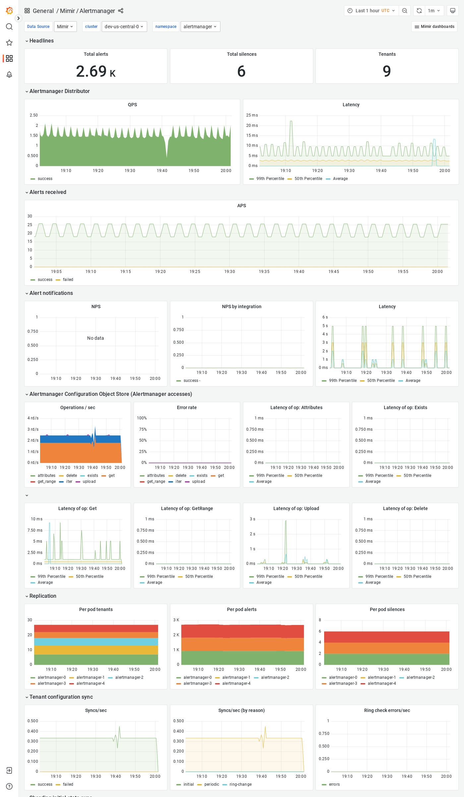

---
aliases:
  - ../../visualizing-metrics/dashboards/alertmanager/
  - /docs/mimir/latest/operators-guide/monitoring-grafana-mimir/dashboards/alertmanager/
description: View an example Alertmanager dashboard.
menuTitle: Alertmanager
title: Grafana Mimir Alertmanager dashboard
weight: 10
---

# Grafana Mimir Alertmanager dashboard

The Alertmanager dashboard shows health and activity metrics for the Alertmanager, and object storage metrics for operations triggered by the Alertmanager.

## Example

The following example shows an Alertmanager dashboard from a demo cluster.

