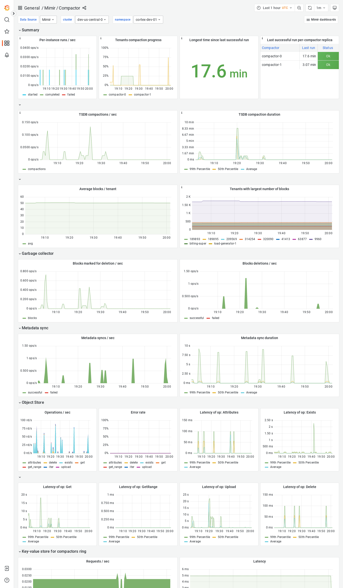

---
aliases:
  - ../../visualizing-metrics/dashboards/compactor/
  - /docs/mimir/latest/operators-guide/monitoring-grafana-mimir/dashboards/compactor/
description: View an example Compactor dashboard.
menuTitle: Compactor
title: Grafana Mimir Compactor dashboard
weight: 30
---

# Grafana Mimir Compactor dashboard

The Compactor dashboard shows health and activity metrics for the compactor and object storage metrics for operations triggered by the compactor.

## Example

The following example shows a Compactor dashboard from a demo cluster.

