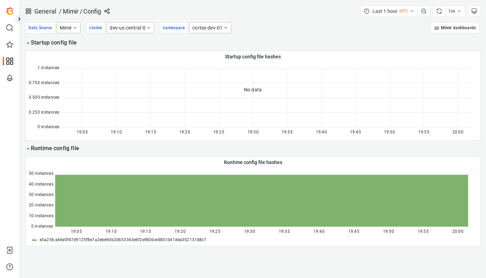

---
aliases:
  - ../../visualizing-metrics/dashboards/config/
  - /docs/mimir/latest/operators-guide/monitoring-grafana-mimir/dashboards/config/
description: View an example Config dashboard.
menuTitle: Config
title: Grafana Mimir Config dashboard
weight: 50
---

# Grafana Mimir Config dashboard

The Config dashboard shows details about the runtime configuration currently loaded by each Grafana Mimir instance.

## Example

The following example shows a Config dashboard from a demo cluster.

