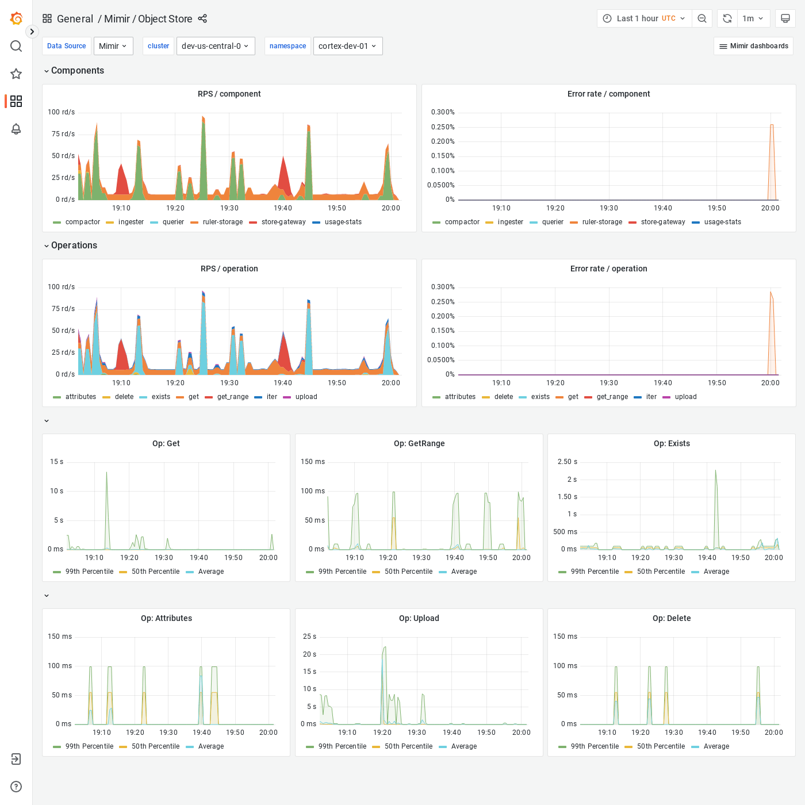

---
aliases:
  - ../../visualizing-metrics/dashboards/object-store/
  - /docs/mimir/latest/operators-guide/monitoring-grafana-mimir/dashboards/object-store/
description: View an example Object Store dashboard.
menuTitle: Object Store
title: Grafana Mimir Object Store dashboard
weight: 60
---

# Grafana Mimir Object Store dashboard

The Object Store dashboard shows an overview of all activity and operations run by any Grafana Mimir component on the object storage.

## Example

The following example shows an Object Store dashboard from a demo cluster.

