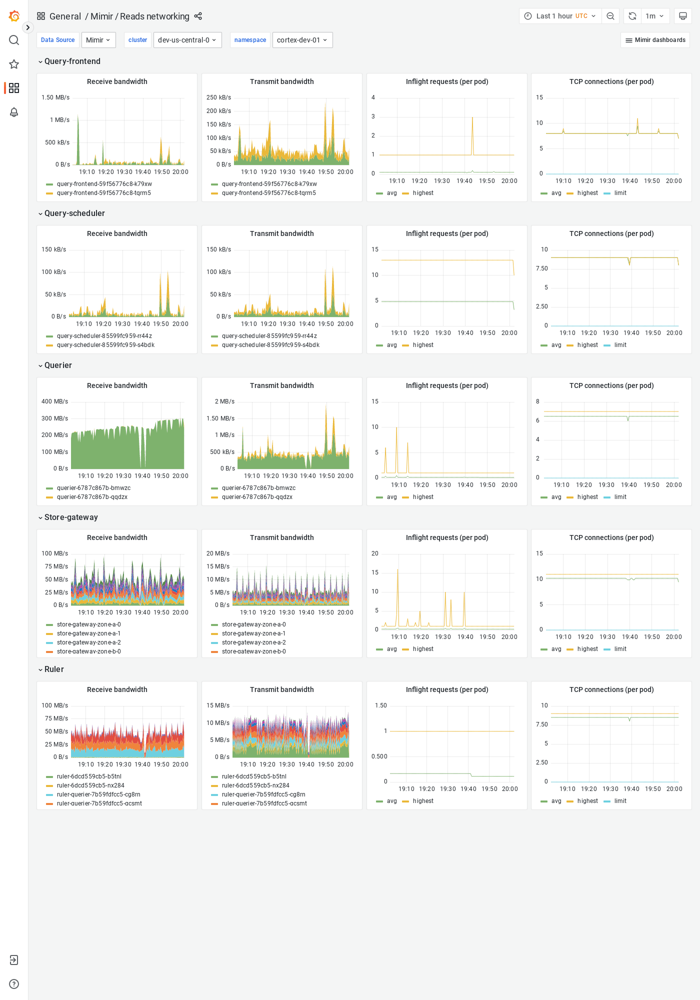

---
aliases:
  - ../../visualizing-metrics/dashboards/reads-networking/
  - /docs/mimir/latest/operators-guide/monitoring-grafana-mimir/dashboards/reads-networking/
description: View an example Reads networking dashboard.
menuTitle: Reads networking
title: Grafana Mimir Reads networking dashboard
weight: 100
---

# Grafana Mimir Reads networking dashboard

The Reads networking dashboard shows receive and transmit bandwidth, in-flight requests, and TCP connections.
The dashboard isolates each service on the read path into its own section and displays the order in which a read request flows.

This dashboard requires [additional resources metrics]().

## Example

The following example shows a Reads networking dashboard from a demo cluster.

