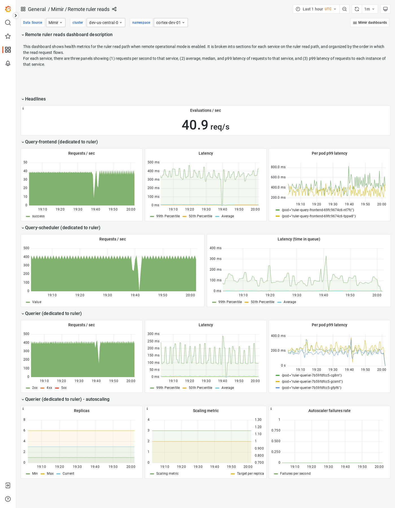

---
aliases:
  - ../../visualizing-metrics/dashboards/remote-ruler-reads/
  - /docs/mimir/latest/operators-guide/monitoring-grafana-mimir/dashboards/remote-ruler-reads/
description: View an example Remote ruler reads dashboard.
menuTitle: Remote ruler reads
title: Grafana Mimir Remote ruler reads dashboard
weight: 90
---

# Grafana Mimir Remote ruler reads dashboard

The Remote ruler reads dashboard shows health metrics for the ruler read path when remote operational mode is enabled.

The dashboard isolates each service on the ruler read path into its own section and displays the order in which a read request flows.

## Example

The following example shows a Remote ruler reads dashboard from a demo cluster.

