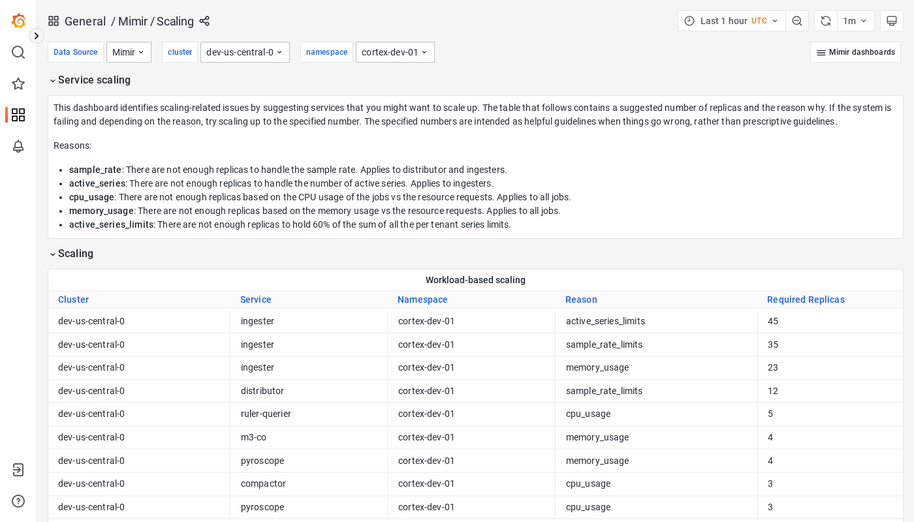

---
aliases:
  - ../../visualizing-metrics/dashboards/scaling/
  - /docs/mimir/latest/operators-guide/monitoring-grafana-mimir/dashboards/scaling/
description: View an example Scaling dashboard.
menuTitle: Scaling
title: Grafana Mimir scaling dashboard
weight: 140
---

# Grafana Mimir scaling dashboard

The scaling dashboard displays services that you can optionally scale up, in the event of a failure that is caused by one or more specific reasons.

## Example

The following example shows a Scaling dashboard from a demo cluster.

