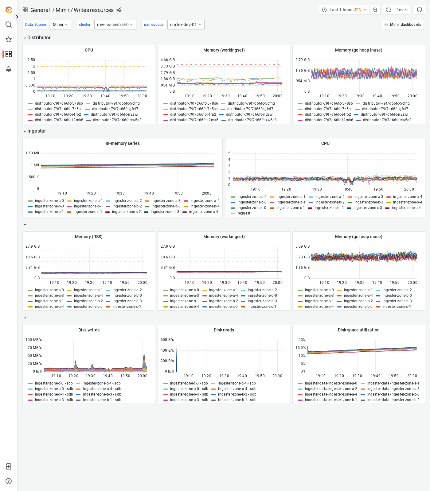

---
aliases:
  - ../../visualizing-metrics/dashboards/writes-resources/
  - /docs/mimir/latest/operators-guide/monitoring-grafana-mimir/dashboards/writes-resources/
description: View an example Writes resources dashboard.
menuTitle: Writes resources
title: Grafana Mimir Writes resources dashboard
weight: 200
---

# Grafana Mimir Writes resources dashboard

The Writes resources dashboard shows CPU, memory, disk, and other resource utilization metrics.
The dashboard isolates each service on the write path into its own section and displays the order in which a write request flows.

This dashboard requires [additional resources metrics]().

## Example

The following example shows a Writes resources dashboard from a demo cluster.

