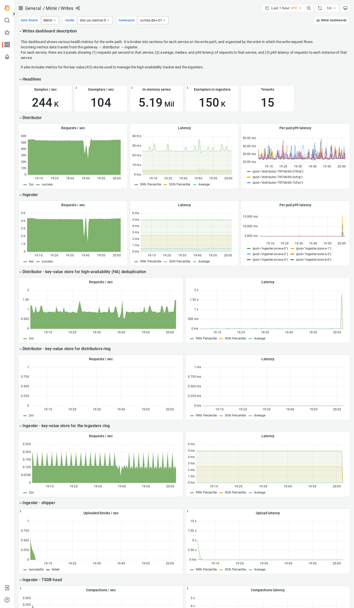

---
aliases:
  - ../../visualizing-metrics/dashboards/writes/
  - /docs/mimir/latest/operators-guide/monitoring-grafana-mimir/dashboards/writes/
description: View an example Writes dashboard.
menuTitle: Writes
title: Grafana Mimir Writes dashboard
weight: 180
---

# Grafana Mimir Writes dashboard

The Writes dashboard shows health metrics for the write path and object storage metrics for operations triggered by the write path.

The dashboard isolates each service on the write path into its own section and displays the order in which a write request flows.

## Example

The following example shows a Writes dashboard from a demo cluster.

