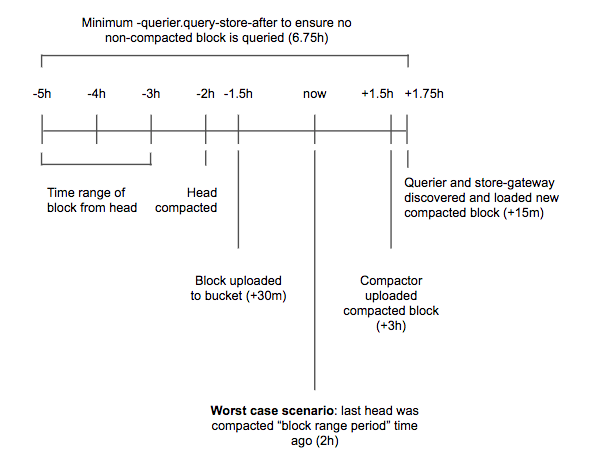

---
aliases:
  - /docs/mimir/latest/operators-guide/running-production-environment/production-tips/
description: Learn tips for setting up a production Grafana Mimir cluster.
menuTitle: Production tips
title: Grafana Mimir production tips
weight: 40
---

# Grafana Mimir production tips

This topic provides tips and techniques for you to consider when setting up a production Grafana Mimir cluster.

## Ingester

### Ensure a high number of max open file descriptors

The ingester receives samples from distributor, and appends the received samples to the specific per-tenant TSDB that is stored on the ingester local disk.
The per-tenant TSDB is composed of several files and the ingester keeps a file descriptor open for each TSDB file.
The total number of file descriptors, used to load TSDB files, linearly increases with the number of tenants in the Grafana Mimir cluster and the configured `-blocks-storage.tsdb.retention-period`.

We recommend fine-tuning the following settings to avoid reaching the maximum number of open file descriptors:

1. Configure the system's `file-max` ulimit to at least `65536`. Increase the limit to `1048576` when running a Grafana Mimir cluster with more than a thousand tenants.
1. Enable ingesters [shuffle sharding]() to reduce the number of tenants per ingester.

### Ingester disk space

The ingester writes received samples to a write-ahead log (WAL) and by default, compacts them into a new block every two hours.
Both the WAL and blocks are temporarily stored on the local disk.
The required disk space depends on the number of time series stored in the ingester and the configured `-blocks-storage.tsdb.retention-period`.

For more information about estimating the required ingester disk space, refer to [Planning capacity]().

### Ingester disk IOPS

The IOPS (input/output operations per second) and latency performances of the ingester disks can affect both write and read requests.
On the write path, the ingester writes to the write-ahead log (WAL) on disk.
On the read path, the ingester reads from the series whose chunks have already been written to disk.

For these reasons, run the ingesters on disks such as SSDs that have fast disk speed.

## Querier

### Ensure caching is enabled

The querier supports caching to reduce the number API calls to the long-term storage.

We recommend enabling caching in the querier.
For more information about configuring the cache, refer to [querier]().

### Avoid querying non-compacted blocks

When running Grafana Mimir at scale, querying non-compacted blocks might be inefficient for the following reasons:

- Non compacted blocks contain duplicated samples, as a result of the ingesters replication.
- Querying many small TSDB indexes is slower than querying a few compacted TSDB indexes.

The default values for `-querier.query-store-after`, `-querier.query-ingesters-within`, and `-blocks-storage.bucket-store.ignore-blocks-within` are set such that only compacted blocks are queried. In most cases, no additional configuration is required.

Configure Grafana Mimir so large tenants are parallelized by the compactor:

1. Configure compactor's `-compactor.split-and-merge-shards` and `-compactor.split-groups` for every tenant with more than 20 million active series. For more information about configuring the compactor's split and merge shards, refer to [compactor]().

#### How to estimate `-querier.query-store-after`

If you are not using the defaults, set the `-querier.query-store-after` to a duration that is large enough to give compactor enough time to compact newly uploaded blocks, and queriers and store-gateways to discover and synchronize newly compacted blocks.

The following diagram shows all of the timings involved in the estimation. This diagram should be used only as a template and you can modify the assumptions based on real measurements in your Mimir cluster. The example makes the following assumptions:

- An ingester takes up to 30 minutes to upload a block to the storage
- The compactor takes up to three hours to compact two-hour blocks shipped from all ingesters
- Querier and store-gateways take up to 15 minutes to discover and load a new compacted block

Based on these assumptions, in the worst-case scenario, it takes up to six hours and 45 minutes from when a sample is ingested until that sample has been appended to a block flushed to the storage and the block is [vertically compacted]() with all other overlapping two-hour blocks shipped from ingesters.

[//]: # "Diagram source at https://docs.google.com/presentation/d/1bHp8_zcoWCYoNU2AhO2lSagQyuIrghkCncViSqn14cU/edit"

## Store-gateway

### Ensure caching is enabled

The store-gateway supports caching that reduces the number of API calls to the long-term storage and improves query performance.

We recommend enabling caching in the store-gateway.
For more information about configuring the cache, refer to [store-gateway]().

### Ensure a high number of maximum open file descriptors

The store-gateway stores each block’s index-header on the local disk and loads it via memory mapping.
The store-gateway keeps a file descriptor open for each index-header loaded at a given time.
The total number of file descriptors used to load index-headers linearly increases with the number of blocks owned by the store-gateway instance.

We recommend configuring the system's `file-max` ulimit at least to `65536` to avoid reaching the maximum number of open file descriptors.

### Store-gateway disk IOPS

The IOPS and latency performances of the store-gateway disk can affect queries.
The store-gateway downloads the block’s [index-headers]() onto local disk, and reads them for each query that needs to fetch data from the long-term storage.

For these reasons, run the store-gateways on disks such as SSDs that have fast disk speed.

## Compactor

### Ensure the compactor has enough disk space

The compactor requires a lot of disk space to download source blocks from the long-term storage and temporarily store the compacted block before uploading it to the storage.
For more information about required disk space, refer to [Compactor disk utilization]().

## Caching

### Ensure Memcached is properly scaled

We recommend ensuring Memcached evictions happen infrequently.
Grafana Mimir query performances might be negatively affected if your Memcached cluster evicts items frequently.
We recommend increasing your Memcached cluster replicas to add more memory to the cluster and reduce evictions.

We also recommend running a dedicated Memcached cluster for each type of cache: query results, metadata, index, and chunks.
Running a dedicated Memcached cluster for each cache type is not required, but recommended so that each cache is isolated from the others.

## Security

We recommend securing the Grafana Mimir cluster.
For more information about securing a Mimir cluster, refer to [Secure Grafana Mimir]().
