# Pyroscope Block format

This document describes how Pyroscope stores the data in its blocks. Each
block belongs to a single tenant and is identified by a unique [ULID]. Within
the block there are multiple files:

[ULID]: https://github.com/ulid/spec

* A metadata file `meta.json`, which contains information about what the block
  contains, like the time range of the profiling data.

* A [TSDB index] `index.tsdb` mapping the external labels to the profiles
  stored in the profiles table.

* `profiles.parquet` [parquet] table that contains profiles.

* `symbols` sub-directory contains profiling symbols that provide a link between 
  the compiled or interpreted binary code and the original source code:
   - A `index.symdb` file with meta information, which helps to find symbols for a specific profile.
   - A `stacktraces.symdb` file contains stack traces compacted in the [parent pointer tree].
   - Parquet tables for models referenced by stack traces:
     `locations.parquet`, `functions.parquet`, `mappings.parquet`, `strings.parquet`.

## Data model

The data model within the block is fairly aligned to Google's [proto definition][pprof] for the pprof wire format.

Profile series labels contain additional information gathered at ingestion time and can
be used to select certain profiles. They are comparable to Prometeus'/Loki's labels
and typical label names are `namespace` and `pod` to describe which workload the profiles
are coming from.

Each profile ingested will be added into a new row in the profile table. If
there are entries missing in the tables for the different models they are also
inserted.

[//source]:<> (https://https://mermaid.live/edit#pako:eNptU11P4zAQ_CuWn4HSlgvUjyicVImTTgTdC-ZhsTeJdYkdOfYJVOW_n_PhJFR9W8_Ozs6OkhMVRiJlVFTQtqmCwkLNNSFSWRROGU1eH_v30CeZs0oXy_sXNE0AyKmHCDmmhBGvtEvueqBbiM9GwKA2MafBY7rmE_KsNLaMvL33xblEgKbpn14P3i6NM3Jpf5xYnwLir7MgMHqKHo_pYOHiHb-tyVU1j2RoFbYvmH_3kUHdVOMhY3mmMoKzyOzk_J4_UPmzg7iOmXO65ZRcX5upivbZnC3XfSChrQfiwhhinrrEhM6oEENiS75cr3IamXq9a5UZ1zGcmRaPj41F4DVLH49a4mdYMIYx4ouZZS9bB8Q1vaI12hqUDJ_tECGnrsQaOWWhlJiDrxynXHeB6hsJDp-kcsZSlkPV4hUF70z2pQVlznqMpOnrn1mVAYlh6ETdV9P_I4VqXZAURueq6HFvqwCXzjUt22z69k2hXOk_boSpN62SJVhX_jskm2SXPMBuj8n9Hn7s91J8bA8P-e5um8v72-0OaNd1_wF4hit7)

[ULID]: https://github.com/ulid/spec
[TSDB index]: https://ganeshvernekar.com/blog/prometheus-tsdb-persistent-block-and-its-index/
[Parquet]: https://parquet.apache.org/docs/
[parent pointer tree]: https://en.wikipedia.org/wiki/Parent_pointer_tree
[pprof]: https://github.com/google/pprof/blob/main/proto/profile.proto
