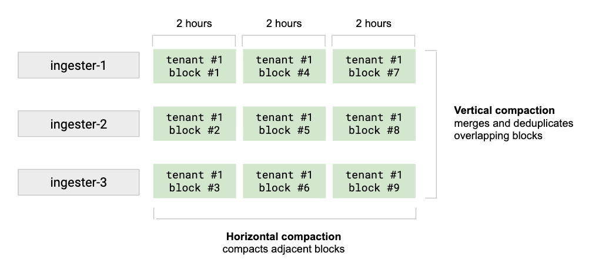
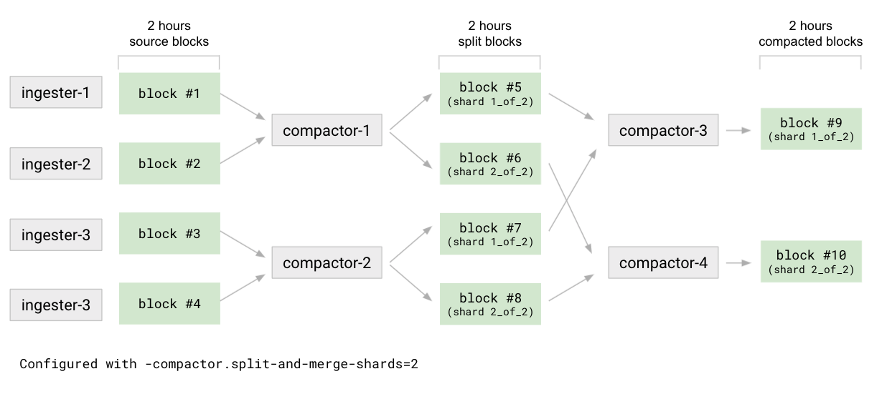

---
description:
  The compactor increases query performance and reduces long-term storage
  usage.
menuTitle: Compactor
title: Grafana Pyroscope compactor
weight: 10
---

# Grafana Pyroscope compactor

The compactor increases query performance and reduces long-term storage usage by combining blocks.

The compactor is the component responsible for:

- Compacting multiple blocks of a given tenant into a single, optimized larger block. This deduplicates chunks and reduces the size of the index, resulting in reduced storage costs. Querying fewer blocks is faster, so it also increases query speed.
- Keeping the per-tenant bucket index updated. The [bucket index]() is used by [queriers]() and [store-gateways]() to discover both new blocks and deleted blocks in the storage.

The compactor is stateless.

## How compaction works

Compaction occurs on a per-tenant basis.

The compactor runs at regular, configurable intervals.

**Vertical compaction** merges all the blocks of a tenant uploaded by ingesters for the same time range (1 hour range by default) into a single block. It also deduplicates samples that were originally written to N blocks as a result of replication. Vertical compaction reduces the number of blocks for a single time range from the quantity of ingesters down to one block per tenant.

**Horizontal compaction** triggers after a vertical compaction. It compacts several blocks with adjacent range periods into a single larger block. The total size of the associated block chunks does not change after horizontal compaction. The horizontal compaction may significantly reduce the size of the index and the index-header kept in memory by store-gateways.



<!-- Diagram source at https://docs.google.com/presentation/d/1bHp8_zcoWCYoNU2AhO2lSagQyuIrghkCncViSqn14cU/edit -->

## Scaling

Compaction can be tuned for clusters with large tenants. Configuration specifies both vertical and horizontal scaling of how the compactor runs as it compacts on a per-tenant basis.

- **Vertical scaling**<br />
  The setting `-compactor.compaction-concurrency` configures the max number of concurrent compactions running in a single compactor instance. Each compaction uses one CPU core.
- **Horizontal scaling**<br />
  By default, tenant blocks can be compacted by any Grafana Pyroscope compactor. When you enable compactor [shuffle sharding]() by setting `-compactor.compactor-tenant-shard-size` (or its respective YAML configuration option) to a value higher than `0` and lower than the number of available compactors, only the specified number of compactors are eligible to compact blocks for a given tenant.

## Compaction algorithm

Pyroscope uses a sophisticated compaction algorithm called split-and-merge.

By design, the split-and-merge algorithm overcomes time series database (TSDB) index limitations, and it avoids situations in which compacted blocks grow indefinitely for a very large tenant at any compaction stage.

This compaction strategy is a two-stage process: split and merge.
The default configuration disables the split stage.

To split, the first level of compaction, for example `2h`, the compactor divides all source blocks into _N_ (`-compactor.split-groups`) groups. For each group, the compactor compacts the blocks, but instead of producing a single result block, it outputs _M_ (`-compactor.split-and-merge-shards`) blocks, known as _split blocks_. Each split block contains only a subset of the series belonging to a given shard out of _M_ shards. At the end of the split stage, the compactor produces _N \* M_ blocks with a reference to their respective shard in the block’s `meta.json` file.

The compactor merges the split blocks for each shard. This compacts all _N_ split blocks of a given shard. The merge reduces the number of blocks from _N \* M_ to _M_. For a given compaction time range, there will be a compacted block for each of the _M_ shards.



<!-- Diagram source at https://docs.google.com/presentation/d/1bHp8_zcoWCYoNU2AhO2lSagQyuIrghkCncViSqn14cU/edit -->

The merge then runs on other configured compaction time ranges, for example 1h and 4h. It compacts blocks belonging to the same shard.

This strategy is suitable for clusters with large tenants. The number of shards _M_ is configurable on a per-tenant basis using `-compactor.split-and-merge-shards`, and it can be adjusted based on the number of series of each tenant. The more a tenant grows in terms of series, the more you can grow the configured number of shards. Doing so improves compaction parallelization and keeps each per-shard compacted block size under control.

The number of split groups, _N_, can also be adjusted per tenant using the `-compactor.split-groups` option. Increasing this value produces more compaction jobs with fewer blocks during the split stage. This allows multiple compactors to work on these jobs, and finish the splitting stage faster. However, increasing this value also generates more intermediate blocks during the split stage, which will only be reduced later in the merge stage.

If the configuration of `-compactor.split-and-merge-shards` changes during compaction, the change will affect only the compaction of blocks which have not yet been split. Already split blocks will use the original configuration when merged. The original configuration is stored in the `meta.json` of each split block.

Splitting and merging can be horizontally scaled. Non-conflicting and non-overlapping jobs will be executed in parallel.

## Compactor sharding

The compactor shards compaction jobs, either from a single tenant or multiple tenants. The compaction of a single tenant can be split and processed by multiple compactor instances.

Whenever the pool of compactors grows or shrinks, tenants and jobs are resharded across the available compactor instances without any manual intervention.

Compactor sharding uses a [hash ring](). At startup, a compactor generates random tokens and registers itself to the compactor hash ring. While running, it periodically scans the storage bucket at every interval defined by `-compactor.compaction-interval`, to discover the list of tenants in storage and to compact blocks for each tenant whose hash matches the token ranges assigned to the instance itself within the hash ring.

To configure the compactors' hash ring, refer to [configuring memberlist]().

### Waiting for a stable hash ring at startup

A cluster cold start or an increase of two or more compactor instances at the same time may result in each new compactor instance starting at a slightly different time. Then, each compactor runs its first compaction based on a different state of the hash ring. This is not an error condition, but it may be inefficient, because multiple compactor instances may start compacting the same tenant at nearly the same time.

To mitigate the issue, compactors can be configured to wait for a stable hash ring at startup. A ring is considered stable if no instance is added to or removed from the hash ring for at least `-compactor.ring.wait-stability-min-duration`. The maximum time the compactor will wait is controlled by the flag `-compactor.ring.wait-stability-max-duration` (or the respective YAML configuration option). Once the compactor has finished waiting, either because the ring stabilized or because the maximum wait time was reached, it will start up normally.

The default value of zero for `-compactor.ring.wait-stability-min-duration` disables waiting for ring stability.

## Compaction jobs order

The compactor allows configuring of the compaction jobs order via the `-compactor.compaction-jobs-order` flag (or its respective YAML config option). The configured ordering defines which compaction jobs should be executed first. The following values of `-compactor.compaction-jobs-order` are supported:

- `smallest-range-oldest-blocks-first` (default)

  This ordering gives priority to smallest range, oldest blocks first.

  For example, with compaction ranges `1h, 4h, 8h`, the compactor will compact the 1h ranges first, and among them give priority to the oldest blocks. Once all blocks in the 1h range have been compacted, it moves to the 2h range, and finally to 8h one.

  All split jobs are moved to the front of the work queue, because finishing all split jobs in a given time range unblocks the merge jobs.

- `newest-blocks-first`

  This ordering gives priority to the most recent time ranges first, regardless of their compaction level.

  For example, with compaction ranges `1h, 4h, 8h`, the compactor compacts the most recent blocks first (up to the 8h range), and then moves to older blocks. This policy favours the most recent blocks, assuming they are queried the most frequently.

## Blocks deletion

Following a successful compaction, the original blocks are deleted from the storage. Block deletion is not immediate; it follows a two step process:

1. An original block is marked for deletion; this is a soft delete
1. Once a block has been marked for deletion for longer than the configurable `-compactor.deletion-delay`, the block is deleted from storage; this is a hard delete

The compactor is responsible for both marking blocks and for hard deletion.
Soft deletion is based on a small `deletion-mark.json` file stored within the block location in the bucket.

The soft delete mechanism gives queriers and store-gateways time to discover the new compacted blocks before the original blocks are deleted. If those original blocks were immediately hard deleted, some queries involving the compacted blocks could temporarily fail or return partial results.

## Compactor disk utilization

The compactor needs to download blocks from the bucket to the local disk, and the compactor needs to store compacted blocks to the local disk before uploading them to the bucket. The largest tenants may need a lot of disk space.

Assuming `max_compaction_range_blocks_size` is the total block size for the largest tenant during the longest `-compactor.block-ranges` period, the expression that estimates the minimum disk space required is:

```
compactor.compaction-concurrency * max_compaction_range_blocks_size * 2
```

## Compactor configuration

Refer to the [compactor]()
block section and the [limits]() block section for details of compaction-related configuration.
