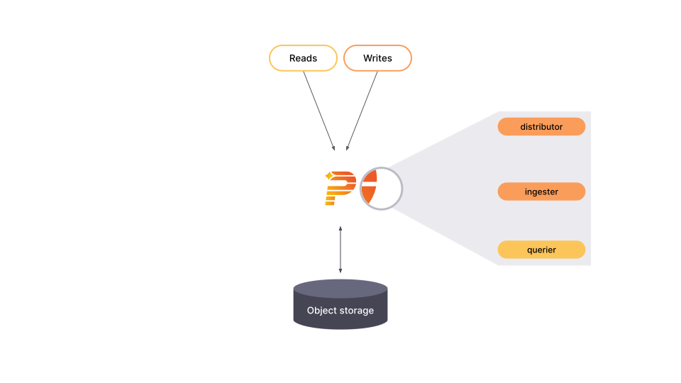
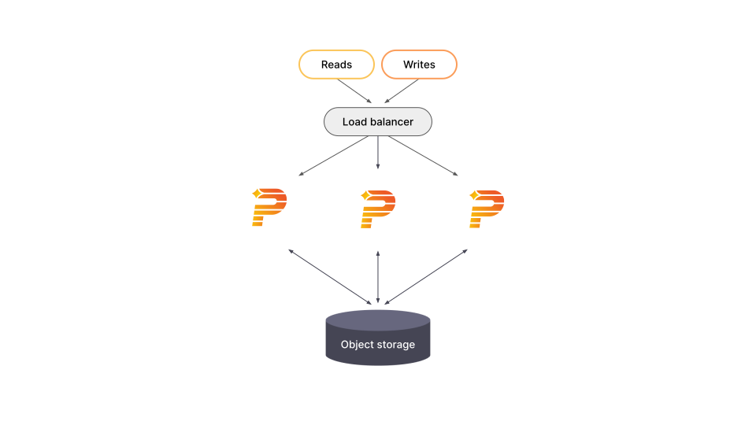
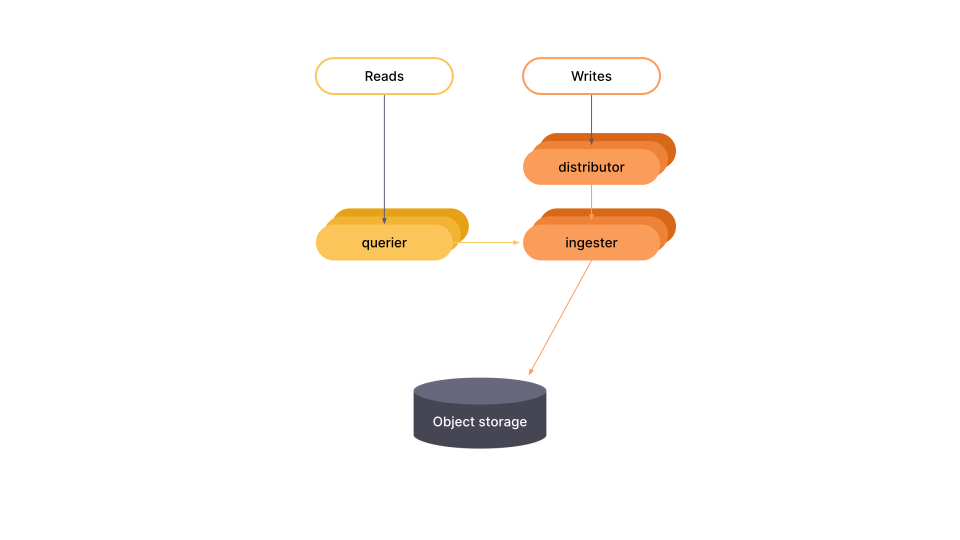

# Pyroscope deployment modes

You can deploy Pyroscope in one of two modes:

- Monolithic mode: In this mode all components run in a single process and is meant to be used when you _only need one pyroscope instance_ as multiple instances will not share information with each other
- Microservices mode: In this mode in this mode as you scale out the number of instances, they will share a singular backend for storage and querying

The deployment mode is determined by the `-target` parameter, which you can set via CLI flag or YAML configuration.

## Monolithic mode

The monolithic mode runs all required components in a single process and is the default mode of operation, which you can set by specifying `-target=all`. Monolithic mode is the simplest way to deploy Pyroscope and is useful if you want to get started quickly or want to work with Pyroscope in a development environment. To see the list of components that run when `-target` is set to `all`, run Pyroscope with the `-modules` flag:

```bash
./pyroscope -modules
```

[//]: # "Diagram source at https://docs.google.com/presentation/d/1C1fl0pH8wmKZe8gXo-VwmUuLvGiPmADfvey15FSkWpE/edit#slide=id.g11694eaa76e_0_0"


<!--
Monolithic mode can be horizontally scaled out by deploying multiple Pyroscope binaries with `-target=all`. This approach provides high-availability and increased scale without the configuration complexity of the full [microservices deployment](#microservices-mode).

[//]: # "Diagram source at https://docs.google.com/presentation/d/1C1fl0pH8wmKZe8gXo-VwmUuLvGiPmADfvey15FSkWpE/edit#slide=id.g11658e7e4c6_1_20"


 -->
## Microservices mode

In microservices mode, components are deployed in distinct processes. Scaling is per component, which allows for greater flexibility in scaling and more granular failure domains. Microservices mode is the preferred method for a production deployment, but it is also the most complex.

In microservices mode, each Pyroscope process is invoked with its `-target` parameter set to a specific Pyroscope component (for example, `-target=ingester` or `-target=distributor`). To get a working Pyroscope instance, you must deploy every required component. For more information about each of the Pyroscope components, refer to [Architecture]().

If you are interested in deploying Pyroscope in microservices mode, we recommend that you use [Kubernetes](https://kubernetes.io/).

[//]: # "Diagram source at https://docs.google.com/presentation/d/1C1fl0pH8wmKZe8gXo-VwmUuLvGiPmADfvey15FSkWpE/edit#slide=id.g11658e7e4c6_1_53"


