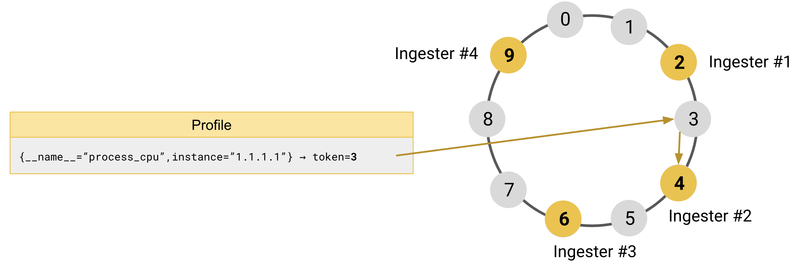
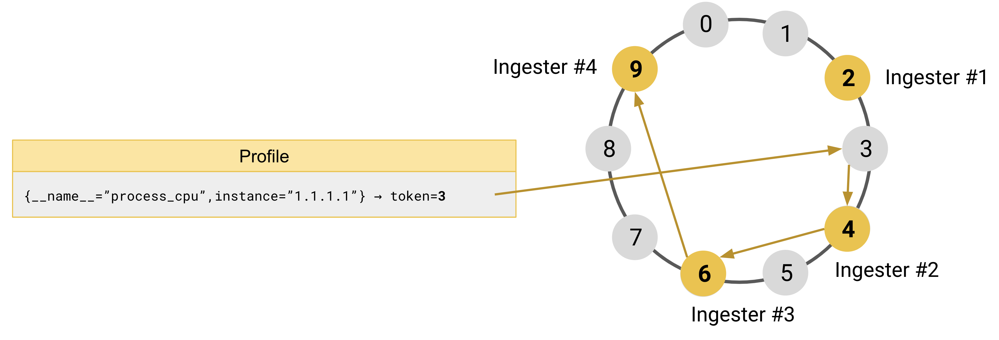

# Pyroscope hash rings

Hash rings are a distributed [consistent hashing scheme](https://en.wikipedia.org/wiki/Consistent_hashing) and are widely used by Pyroscope for sharding and replication.

## How the hash ring works in Pyroscope

The hash ring in Pyroscope is used to share work across several replicas of a component in a consistent way, so that any other component can decide which address to talk to.
The workload or data to share is hashed first and the result of the hashing is used to find which ring member owns it.

Pyroscope uses the `fnv32a` hash function, which returns 32-bit unsigned integers so its value can be between `0` and `(2^32)-1`, inclusive.
This value is called _token_ and used as the ID of the data.
The token determines the location on the hash ring deterministically.
This allows independent determination of what instance of Pyroscope is the authoritative owner of any specific data.

For example, profiles are sharded across [ingesters](../components/ingester/).
The token of a given profile is computed by hashing all of the profile’s labels and the tenant ID: the result of which is an unsigned 32-bit integer within the space of the tokens.
The ingester that owns that series is the instance that owns the range of the tokens, including the profile token.

To divide up set of possible tokens (`2^32`) across the available instances within the cluster, all of the running instances of a given Pyroscope component, such as the ingesters, join a hash ring.
The hash ring is a data structure that splits the space of the tokens into multiple ranges, and assigns each range to a given Pyroscope ring member.

Upon startup, an instance generates random token values, and it registers them into the ring.
The values that each instance registers determine which instance owns a given token.
A token is owned by the instance that registered the smallest value that is higher than the token being looked up (by wrapping around zero when it reaches `(2^32)-1)`).

To replicate the data across multiple instances, Pyroscope finds the replicas by starting from the authoritative owner of the data and walking the ring clockwise.
Data is replicated to the next instances found while walking the ring.

### A practical example

To better understand how it works, take four ingesters and a tokens space between `0` and `9` as an example:

- Ingester #1 is registered in the ring with the token `2`
- Ingester #2 is registered in the ring with the token `4`
- Ingester #3 is registered in the ring with the token `6`
- Ingester #4 is registered in the ring with the token `9`

Pyroscope receives an incoming performance profile with labels `{__name__="process_cpu", instance="1.1.1.1"}`.
It hashes the profile’s labels, and the result of the hashing function is the token `3`.

To find which ingester owns token `3`, Pyroscope looks up the token `3` in the ring and finds the ingester that is registered with the smallest token larger than `3`.
The ingester #2, which is registered with token `4`, is the authoritative owner of the profile `{__name__="process_cpu",instance="1.1.1.1"}`.

[//]: # "Diagram source at https://docs.google.com/presentation/d/1S2sdLUgjaIQucwwmL1iMHhi4ewfPuwL7HGF5mNEF0qc/edit#slide=id.p"

With replication set to `3`, Pyroscope replicates each profile to three ingesters.
After finding the authoritative owner of the profile, Pyroscope continues to walk the ring clockwise to find the remaining two instances where the profile should be replicated.
In the example that follows, the profile is replicated to the instances of `Ingester #3` and `Ingester #4`.

[//]: # "Diagram source at https://docs.google.com/presentation/d/1S2sdLUgjaIQucwwmL1iMHhi4ewfPuwL7HGF5mNEF0qc/edit#slide=id.p"

### Consistent hashing

The hash ring guarantees the property known as consistent hashing.

When an instance is added or removed from the ring, consistent hashing minimizes the number of tokens that are moved from one instance to another.
On average, the number of tokens that need to move to a different instance is only `n/m`, where `n` is the total number of tokens (32-bit unsigned integer) and `m` is the number of instances that are registered in the ring.

## Components that use the hash ring

There are several Pyroscope components that need a hash ring.
Each of the following components builds an independent hash ring:

- [Ingesters](../components/ingester/) shard and replicate series.
- [Distributors](../components/distributor/) enforce rate limits.

## How the hash ring is shared between Pyroscope instances

Hash ring data structures need to be shared between Pyroscope instances.
To propagate changes to the hash ring, Pyroscope uses a key-value store.
The key-value store is required and can be configured independently for the hash rings of different components.

For more information, see the [memberlist documentation](../memberlist-and-the-gossip-protocol/).

## Features that are built using the hash ring

Pyroscope primarily uses the hash ring for sharding and replication.
Features that are built using the hash ring:

- **Service discovery**: Instances can discover each other looking up who is registered in the ring.
- **Heartbeats**: Instances periodically send a heartbeat to the ring to signal they're up and running. An instance is considered unhealthy if it misses the heartbeat for some period of time.
