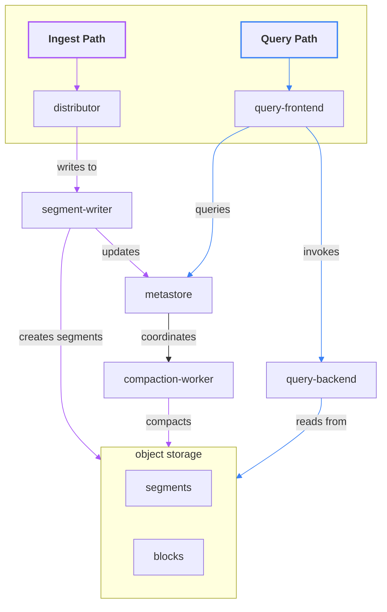

# About the Pyroscope v2 architecture


Pyroscope v2 is currently under active testing. Some features may not yet be fully implemented or stable.


Pyroscope v2 is a complete architectural redesign focused on improving scalability, performance, and cost-efficiency. The architecture is built around the following goals:

- High write throughput
- Cost-effective storage
- Scalable query performance
- Low operational overhead

## Key design changes

The biggest change in Pyroscope v2 is how it handles storage: data is written directly to object storage, removing the need for local disks in ingesters. For single-node deployments, local file systems can still be used as object storage, but this setup isn't supported in microservice mode.

Pyroscope v2 also decouples the write and query paths. This means each path can scale independently, so even the heaviest queries won't interfere with ingestion performance. The read path can scale to hundreds of instances instantly.

## Architecture overview

The high-level components of the architecture include:

## Pyroscope v2 components

Most components in v2 are stateless and do not require any data persisted between process restarts. The metastore is the only stateful component, using Raft consensus for replication. For details about each component, see its page in [Components](../components/).

### The write path

Profiles are ingested through the Push RPC API and HTTP `/ingest` API to [distributors](../components/distributor/). The write path includes distributor and [segment-writer](../components/segment-writer/) services: both are stateless, disk-less, and scale horizontally with high efficiency.

Profile ingest requests are distributed among distributors, which then route them to segment-writers to co-locate profiles from the same application. This ensures that profiles likely to be queried together are stored together.

The segment-writer service accumulates profiles in small blocks (segments) and writes them to object storage while updating the block index with metadata of newly added objects. Each writer produces a single object per shard containing data of all tenant services per shard; this approach minimizes the number of write operations to the object storage, optimizing the cost of the solution.

Ingestion clients are blocked until data is durably stored in object storage and an entry for the object is created in the metadata index. By default, ingestion is synchronous, with median latency expected to be less than 500ms using default settings.

### The read path

Profiling data is queried through the Query API available in the [query-frontend](../components/query-frontend/) service.

A regular flame graph query users see in the UI may require fetching many gigabytes of data from storage. Moreover, the raw profiling data needs expensive post-processing to be displayed in flame graph format. Pyroscope addresses this challenge through adaptive data placement that minimizes the number of objects that need to be read to satisfy a query, and high parallelism in query execution.

The query frontend is responsible for preliminary query planning and routing the query to the [query-backend](../components/query-backend/) service. Data objects are located using the [metastore](../components/metastore/) service, which maintains the metadata index.

Queries are executed by the query-backend service with high parallelism. Query execution is represented as a graph where the results of sub-queries are combined and optimized. This minimizes network overhead and enables horizontal scalability of the read path without needing traditional disk-based solutions or even a caching layer.

Both query-frontend and query-backend are stateless services that can scale out to hundreds of instances.

### Compaction

The number of objects created in storage can reach millions per hour. This can severely degrade query performance due to high read amplification and excessive calls to object storage. Additionally, a high number of metadata entries can degrade performance across the entire cluster, impacting the write path as well.

To ensure high query performance, data objects are compacted in the background. The [compaction-worker](../components/compaction-worker/) service is responsible for merging small segments into larger blocks, which are then written back to object storage. Compaction workers compact data as soon as possible after it's written to object storage, with median time to the first compaction not exceeding 15 seconds.

Compaction workers are coordinated by the metastore service, which maintains the metadata index and schedules compaction jobs. Compaction workers are stateless and do not require any local storage.

For more details, see [Compaction](../compaction/).

## Object storage

Pyroscope v2 is designed to operate without local disks, relying entirely on object storage. This approach minimizes operational overhead and cost.

Pyroscope requires any of the following object stores for block files:

- [Amazon S3](https://aws.amazon.com/s3)
- [Google Cloud Storage](https://cloud.google.com/storage/)
- [Microsoft Azure Storage](https://azure.microsoft.com/en-us/services/storage/)
- [OpenStack Swift](https://wiki.openstack.org/wiki/Swift)
- Local Filesystem (single node only)

## Future directions

Looking ahead, we're exploring a serverless query backend to make querying even more cost-effective. We also plan to transition the control plane to a serverless model, making Pyroscope fully stateless and diskless.
