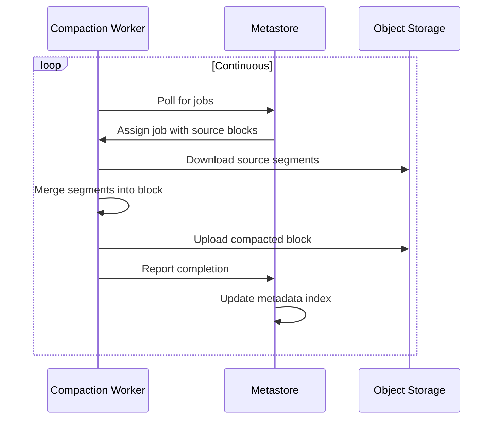
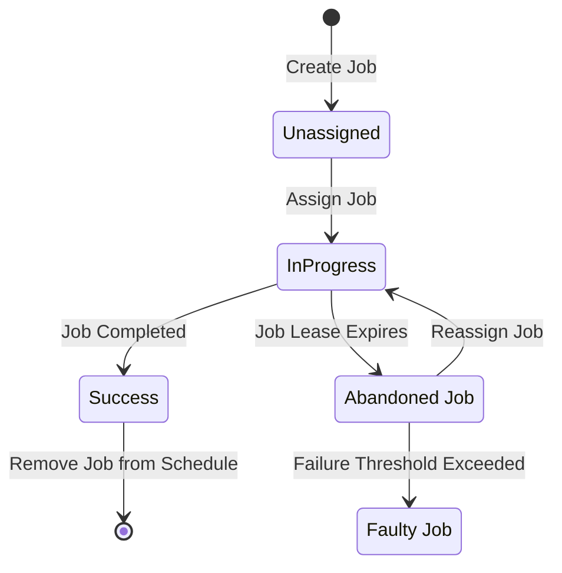

# Compaction

Compaction is the process of merging multiple small segments into larger, optimized blocks. This is essential for maintaining query performance and controlling metadata index size.

## Why compaction matters

The ingestion pipeline creates many small segments—potentially millions of objects per hour at scale. Without compaction:

- **Read amplification**: Queries must fetch many small objects
- **API costs**: More calls to object storage
- **Metadata bloat**: The metastore index grows unboundedly
- **Performance degradation**: Impacts both read and write paths

## How it works

Compaction in Pyroscope v2 is coordinated by the [metastore](../components/metastore/) and executed by [compaction-workers](../components/compaction-worker/).

## Compaction service

The compaction service runs within the metastore and is responsible for:

- **Job planning**: Creating compaction jobs when enough segments are available
- **Job scheduling**: Assigning jobs to workers based on capacity
- **Job tracking**: Monitoring progress and handling failures
- **Index updates**: Replacing source block entries with compacted block entries

### Raft consistency

The compaction service relies on Raft to guarantee consistency:

1. **Plan preparation**: The leader prepares job state changes (read-only)
2. **Plan proposal**: Changes are committed to the Raft log
3. **State update**: All replicas apply the changes atomically

This ensures all replicas maintain consistent views of compaction state.

## Job planner

The job planner maintains a queue of blocks eligible for compaction:

- **Queue structure**: FIFO queue, segmented by tenant, shard, and level
- **Job creation**: Jobs are created when enough blocks are queued
- **Boundaries**: Compaction never crosses tenant, shard, or level boundaries

### Data layout

Profiling data from each service is stored as a separate dataset within a block. During compaction:

- Matching datasets from source blocks are merged
- TSDB indexes are combined
- Symbols and profile tables are merged and rewritten
- Output block contains optimized, non-overlapping datasets

## Job scheduler

The scheduler uses a **Small Job First** strategy:

1. Lower-level blocks are prioritized (smaller, affect read amplification more)
2. Within a level, unassigned jobs are processed first
3. Jobs with fewer failures are prioritized
4. Jobs with earlier lease expiration are considered first

### Adaptive capacity

Workers specify available capacity when polling for jobs. The scheduler:

- Creates jobs based on reported worker capacity
- Balances queue size with worker utilization
- Adapts to available resources automatically

## Job ownership

Jobs are assigned using a lease-based model:

- **Lease duration**: Workers are granted ownership for a limited time
- **Fencing tokens**: Raft log index serves as a unique token
- **Lease refresh**: Workers must refresh leases before expiration
- **Reassignment**: Expired leases allow job reassignment

### Failure handling

When a worker fails:

1. The job lease expires
2. The metastore detects the expired lease
3. The job is reassigned to another worker
4. Source blocks remain until compaction succeeds

Jobs that repeatedly fail are deprioritized to prevent blocking the queue.

## Job status lifecycle

## Performance characteristics

- **Median time to first compaction**: Less than 15 seconds
- **Continuous operation**: Workers constantly poll for new jobs
- **Horizontal scaling**: Add more workers to handle compaction backlog
- **Priority-based**: Smaller blocks compacted first for fastest impact

## Block deletion

After successful compaction:

1. **Tombstone creation**: Source blocks are marked for deletion
2. **Delay period**: Blocks are retained to allow in-flight queries to complete
3. **Hard deletion**: After the delay, source blocks are removed from storage

This two-phase deletion prevents query failures during compaction.

## Implementation details

For detailed implementation information, including job scheduling algorithms and lease management, refer to the [internal documentation](https://github.com/grafana/pyroscope/blob/main/pkg/metastore/compaction/README.md).
