# Data distribution

Pyroscope v2 uses a sophisticated data distribution algorithm to place profiles across segment-writers. The algorithm ensures that profiles from the same application are co-located while maintaining even load distribution across the cluster.

## Design goals

The distribution algorithm is designed to achieve:

- **Data co-location**: Profiles from the same tenant service are stored together
- **Query performance**: Co-located data reduces the number of objects needed for queries
- **Compaction efficiency**: Related data can be compacted more effectively
- **Even distribution**: Load is balanced across segment-writers
- **Minimal re-balancing**: Changes to the cluster minimize data movement

## Three-step placement

The choice of placement for a profile involves a three-step process:

1. **Tenant shards**: Find *m* suitable locations from the total *N* shards using the `tenant_id`.
1. **Dataset shards**: Find *n* suitable locations from *m* options using the `service_name` label.
1. **Final placement**: Select the exact shard *s* from *n* options.

Where:
- **N** is the total number of shards in the deployment
- **m** (tenant shard limit) is configured explicitly
- **n** (dataset shard limit) is selected dynamically based on observed ingestion rate

In this example:
- The tenant's shard range starts at offset 3 with size 8
- The dataset's shard range is a subset within the tenant's range, starting at offset 1 with 4 shards

## Consistent hashing

Pyroscope uses [Jump consistent hash](https://arxiv.org/pdf/1406.2294) to select positions within each subring. This algorithm ensures:

- **Balance**: Objects are evenly distributed among buckets
- **Monotonicity**: When buckets are added, objects only move from old to new buckets

This minimizes data re-balancing when the cluster size changes.

## Availability zone awareness

Distributors are aware of availability zones and route profiles to segment-writers in the same zone. This avoids:

- Cross-AZ traffic charges from cloud providers
- High-latency connections between data centers

## Hot spot mitigation

To prevent hot spots where many datasets end up on the same node, shards are mapped to instances through a separate mapping table. This mapping:

- Ensures even distribution across nodes
- Is updated when nodes are added or removed
- Preserves existing mappings as much as possible

## Adaptive load balancing

Due to the nature of continuous profiling, data can be distributed unevenly across profile series. To mitigate this:

- By default: `fingerprint mod n` is used as the distribution key
- When skew is detected: Switches to `random(n)` distribution

This adaptive approach handles uneven data distribution while maintaining locality when possible.

## Placement management

The Placement Manager runs on the metastore leader and:

- Tracks dataset statistics from segment-writer metadata
- Builds placement rules at regular intervals
- Determines the number of shards for each dataset
- Decides the load balancing strategy (fingerprint mod vs round robin)

Placement rules are stored in object storage and fetched by distributors. Since actual data re-balancing is not performed, placement rules don't need to be synchronized in real-time.

## Failure handling

If a segment-writer fails:

1. The distributor selects the next suitable segment-writer from available options.
1. The shard identifier is specified explicitly in the request.
1. Data locality is maintained even during transient failures.

Two requests with the same distribution key may occasionally end up in different shards, but this is expected to be rare.

## Implementation details

For detailed implementation information, including the full algorithm specification and shard mapping procedures, refer to the [internal documentation](https://github.com/grafana/pyroscope/blob/main/pkg/segmentwriter/client/distributor/README.md).
