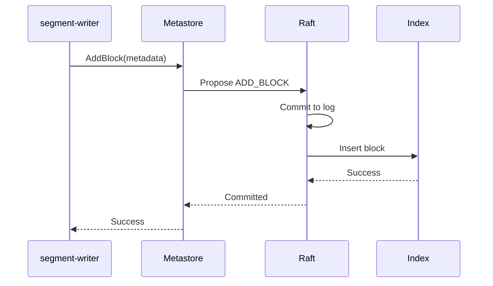
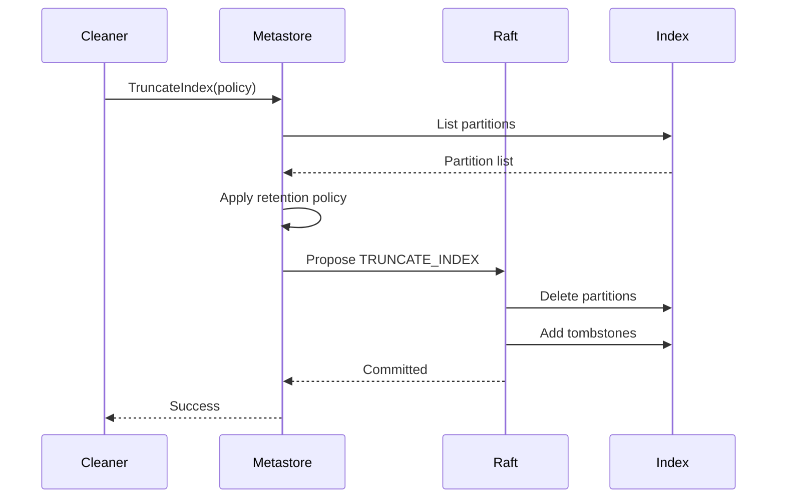

# Metadata index

The metadata index stores information about all data objects (blocks and segments) in object storage. It is maintained by the [metastore](../components/metastore/) service and provides fast lookups for query planning.

## Purpose

The metadata index enables:

- **Block discovery**: Finding blocks that match a query's time range and filters
- **Query planning**: Identifying exactly which objects need to be read
- **Compaction coordination**: Tracking which blocks can be compacted together
- **Retention enforcement**: Managing block lifecycle and cleanup

## Implementation

The index is implemented using:

- **BoltDB**: Key-value store for metadata entries
- **Raft**: Consensus protocol for replication and consistency

BoltDB was chosen for its simplicity and efficiency with a single writer and concurrent readers. For better performance, the index can be stored on an in-memory volume since it's recovered from the Raft log on startup.

## Block metadata

Each block in object storage has a corresponding metadata entry containing:

- **Block ID**: Unique identifier (ULID) based on creation time
- **Tenant**: The tenant that owns the data
- **Shard**: The shard assignment for data distribution
- **Time range**: Start and end timestamps of the data
- **Datasets**: Information about contained datasets (services)

### Dataset information

Each dataset within a block includes:

- **Service name**: The `service_name` label identifying the application
- **Labels**: Additional metadata labels for filtering
- **Table of contents**: Offsets to data sections within the dataset

## Index structure

The index is partitioned by time, with each partition covering a 6-hour window:

```
Partition (6h window)
├── Tenant A
│   ├── Shard 0
│   ├── Shard 1
│   └── Shard N
└── Tenant B
    ├── Shard 0
    └── Shard N
```

Within each shard:

- **Block entries**: Key-value pairs (block ID → metadata)
- **String table**: Deduplicated strings for space efficiency
- **Shard index**: Time range for efficient filtering

## Index writes

Index writes are performed by [segment-writers](../components/segment-writer/) when new segments are created:



### Tombstone protection

Before adding a block, the index checks for tombstones to prevent re-adding blocks that were already compacted. This handles cases where:

- A writer's response was lost but the block was added
- The block was already compacted before the retry

## Index queries

Queries use the linearizable read pattern to ensure consistency:

1. **Read index request**: Query asks for the current commit index.
1. **Leader check**: Verifies the current leader.
1. **Wait for commit**: Waits until the commit index is applied locally.
1. **Read state**: Reads from the local state machine.

This allows both leader and follower replicas to serve queries while ensuring they see the latest committed state.

### Query types

The index supports two main query patterns:

**Metadata queries**: Find blocks matching criteria
```
Query:
  - Time range: [start, end]
  - Tenant: ["tenant-1"]
  - Labels: {service_name="frontend"}
```

**Label queries**: List available labels without reading data
```
Query:
  - Return: distinct values for "profile_type" label
  - Filter: {service_name="frontend"}
```

## Retention

### Compaction-based retention

When blocks are compacted:

1. Source block entries are replaced with compacted block entry.
1. Tombstones are created for source blocks.
1. Tombstones trigger eventual deletion of source objects.

### Time-based retention

Retention policies delete entire partitions based on:

- **Block creation time**: Primary retention criteria
- **Data timestamps**: Blocks are only deleted if data is also past retention

Retention policies are tenant-specific and configurable per tenant.

## Cleanup process

The cleaner runs on the Raft leader and:

1. Lists partitions and applies retention policy.
1. Identifies partitions to delete.
1. Proposes deletion to Raft.
1. Creates tombstones for affected blocks.
1. Tombstones are processed during compaction.



## Performance

### Caching

The index uses several caches:

- **Shard cache**: Keeps shard indexes and string tables in memory
- **Block cache**: Stores decoded metadata entries

### Scalability

- **Storage requirements**: A few gigabytes even at large scale
- **Query performance**: Sub-millisecond lookups with caching
- **Write throughput**: Limited by Raft consensus, typically sufficient for ingestion rates

## Implementation details

For detailed implementation information, including the protobuf schema and internal structures, refer to the [internal documentation](https://github.com/grafana/pyroscope/blob/main/pkg/metastore/index/README.md).
