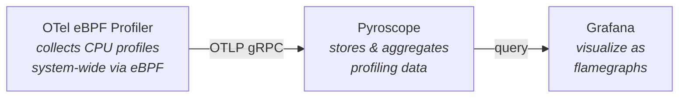

# OpenTelemetry eBPF Profiler with Pyroscope

This example demonstrates system-wide continuous profiling using the [OpenTelemetry eBPF profiler](https://github.com/open-telemetry/opentelemetry-ebpf-profiler), with profiles exported to [Pyroscope](https://github.com/grafana/pyroscope) and visualized in Grafana.

**Linux only (amd64/arm64).** The eBPF profiler requires the Linux kernel and privileged access to system resources (`/proc`, `/sys/kernel`, cgroups).

## Architecture



The profiler runs with host PID namespace access and collects CPU profiles at 97 samples/second from all processes on the host. Profiles are sent to Pyroscope via OTLP gRPC, where `process.executable.name` is relabeled to `service_name`.

## Docker Compose

### Prerequisites

- Docker with Compose v2
- Linux host (amd64 or arm64)

### Run

```bash
cd docker
docker compose up
```

Services:
- **Grafana**: http://localhost:3000 (anonymous auth, no login required)
- **Pyroscope**: http://localhost:4040

To stop:
```bash
docker compose down
```

## Kubernetes

### Prerequisites

- A Kubernetes cluster (e.g., minikube, kind)
- `kubectl` with kustomize support

### Deploy

```bash
kubectl apply -k kubernetes/
```

This deploys:
- **otel-ebpf-profiler** DaemonSet -- runs the profiler on every node (privileged, hostPID)
- **pyroscope** Deployment + Service -- stores profiling data
- **grafana** Deployment + Service -- visualizes profiles (pre-configured with Pyroscope datasource)
- **cpu-stress** Deployment -- sample workload to generate visible profiles
- RBAC resources for the profiler's Kubernetes metadata enrichment

### Access

```bash
kubectl port-forward svc/grafana 3000:3000
```

Then open http://localhost:3000.

### Clean up

```bash
kubectl delete -k kubernetes/
```

## Configuration

| File | Description |
|------|-------------|
| `docker/config/ebpf-profiler-config.yaml` | OTel Collector config for Docker (profiling receiver, OTLP exporter) |
| `docker/config/pyroscope.yaml` | Pyroscope config with `process.executable.name` -> `service_name` relabeling |
| `kubernetes/config/ebpf-profiler-config.yaml` | OTel Collector config for Kubernetes (adds k8sattributes processor for pod metadata) |

## Example output


