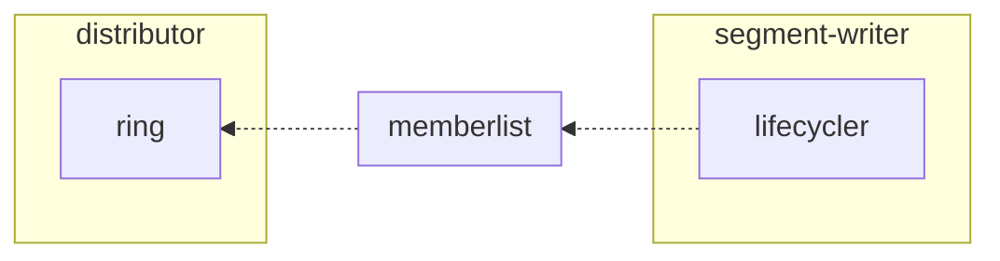
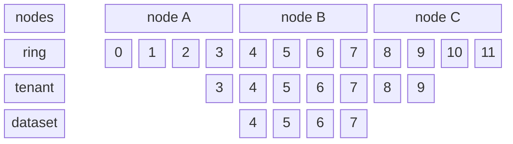
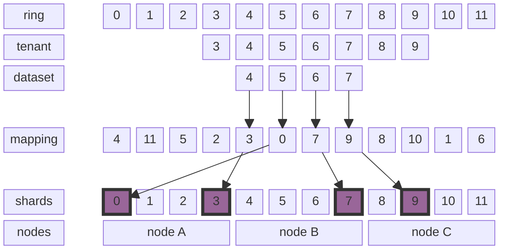
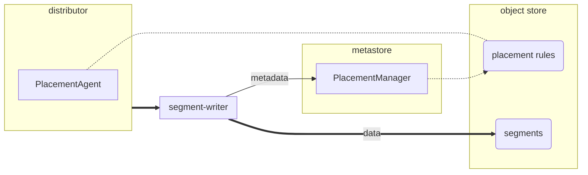
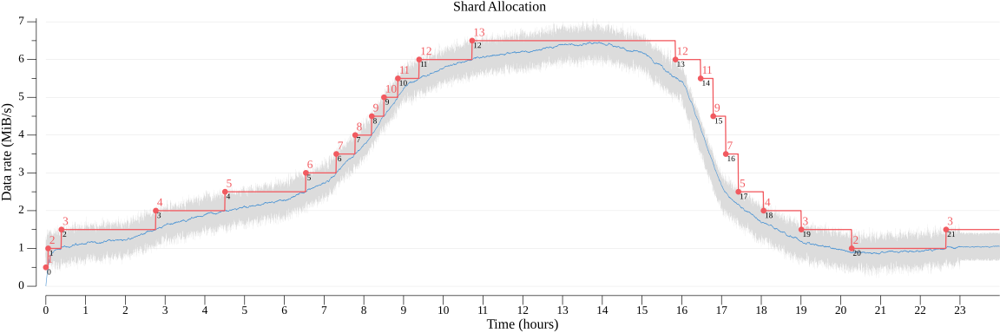
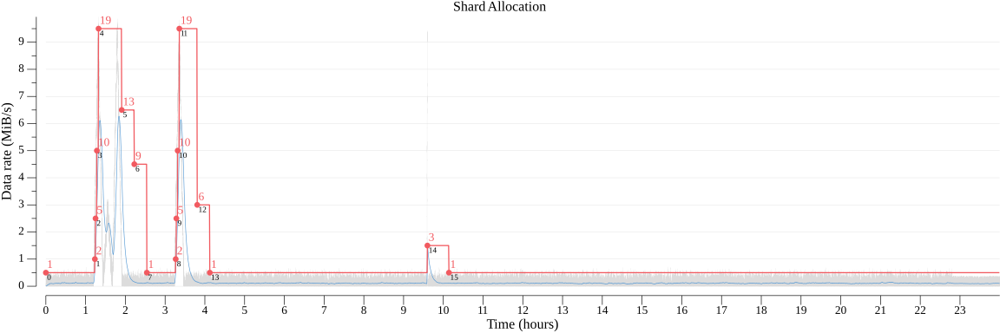

# Pyroscope data distribution

## Background

Data distribution and replication approach we adhere to (consistent hashing and shard shuffling) assume that each
profile is stored on N ingesters from the set S, where N is the replication factor, and S is the shard size for the
given tenant. The exact location is determined based on the profile labels (so called fingerprint – a hash of the labels
sorted in a deterministic order) that form the series the profile belongs to. Essentially, this means that profiles of
the same program will be likely distributed across all the nodes of the set of ingesters S evenly. Hereby, instead of
the configured replication factor N, a stack trace and associated symbolic information is stored up to S times. A very
noticeable side effect of this placement is increased resource consumption (S/N is the upper limit).

After a certain point, adding ingester nodes to the cluster (or increasing the replica set size for a specific tenant)
may not be increasing its capacity to the expected extent. To overcome this limitation, *all* nodes would need to be
scaled up vertically.

In order to address this and some other problems, we propose a new data distribution algorithm.

### Access Patterns

It’s crucial to ensure that the write path aligns with post-processing requirements and doesn't hinder the creation
of read-optimized representations of ingested data. This explains why this paragraph exists.

In Pyroscope, we have a concept called "tenant service" – a set of profile series collected for the same program.
While it's not strictly prohibited, profiling data is typically queried for a specific service.

Additionally, a profile usually encompasses multiple sample types, representing various measurements associated with
a particular stack trace sample. For example, in a Go heap profile, each sample may contain four values:
`alloc_object`, `alloc_space`, `inuse_objects`, and `inuse_space`. A profile (a flame graph or a call graph) is always
generated for a specific sample type.

Historically, the distribution algorithm used in Pyroscope ignores both tenant service and sample types. This results in
redundant duplication of symbolic information associated with profiles and leads to suboptimal distribution of data
across ingesters, blocks, and shards. By "suboptimal," I mean that although uniform distribution is usually achieved,
it badly affects data locality, query selectivity, and read amplification factor: more data needs to be retrieved and
processed during read time. This ultimately poses unavoidable challenges during deduplication at query time and
deduplication at compaction, making both processes very hard to scale and maintain.

## New distribution algorithm

### Requirements

The **main requirement** for a distribution algorithm is that profile series of the same tenant service should be
co-located, as spatial locality is crucial for compaction and query performance. The distribution algorithm should
not aim to place all profiles of a specific tenant service in a dedicated shard; instead, it should distribute them
among the optimal number of shards.

Distributors must be aware of availability zones and should only route profiles to segment writers in the home AZ.
Depending on the environment, crossing AZ network boundaries usually incurs penalties: cloud providers may charge
for cross-AZ traffic, or in on-premises deployments, AZs may represent different data centers with high-latency
connections.

The number of shards and segment writers is not constant and may change over time. The distribution algorithm should
aim to minimize data re-balancing when such changes occur. Nevertheless, we do not perform actual data re-balancing:
data written to a shard remains there until it is compacted or deleted. The only reason for minimizing re-balancing
is to optimize data locality; this concerns both data in transit, as segment writers are sensitive to the variance of
the datasets, and data at rest, as this is crucial for compaction efficiency and query performance in the end.

### Overview

#### Write Path

Profiles are written through the existing gRPC Push API and `/ingest` HTTP API. The requests are randomly distributed
among `distributor` instances that then *redistribute* them among `segment-writer` instances to co-locate profiles of
the same tenant service.

The segment writer service accumulates profiles in small blocks, and writes them to object storage while updating the
block index with metadata of newly added objects. Each writer produces a *single* block containing data of *all tenant
services* per shard; this approach minimizes the number of write operations to the object storage, thereby optimizing
the cost of the solution.

Further block compaction and tenant split takes place in the background until the block reaches a certain size.
To achieve optimal query performance, heavy parallelization of processing is crucial. For easier parallelization,
it is preferable to maintain blocks with a predictable size that can be processed independently within a predictable
time frame. Note that processing a single larger block using multiple workers in parallel may be less efficient due
to the overhead caused by profile symbolization.

#### Algorithm

* Profiles are *redistributed* among segment writers based on the profile labels.
* Profile labels _must_ include `service_name` label, which denotes the dataset the profile belongs to.
* Each profile belongs to a tenant.

The choice of a placement for a profile involves a three-step process:

1. Finding *m* suitable locations from the total of *N* options using the request `tenant_id`.
2. Finding *n* suitable locations from the total of *m* options using the `service_name` label.  
3. Finding the exact location *s* from the total of *n* options.

Where:

 * **N** is the total number of shards in the deployment.
 * **m** – tenant shard limits – is configured explicitly.
 * **n** – dataset shard limits – selected dynamically, based on the observed ingestion rate and patterns.

The number of shards in the deployment is determined by the number of nodes in the deployment:
* We seek to minimize the number of shards to optimize the cost of the solution: as we flush segments per shard,
  the number of shards directly affects the number of write operations to the object storage.
* Experimentally, we found that a conservative processing rate is approximately 8 MB/s per core, depending on the
  processor and the network bandwidth (thus, 128 cores should be generally enough to handle 1 GB/s). This unit is
  recommended as a quantifier of the deployment size and the shard size.

Due to the nature of continuous profiling, it is usually beneficial to keep the same profile series on the same shard,
as this allows for more optimal utilization of the TSDB index (the inverted index used for searching by labels).
However, data is often distributed across profile series unevenly; using a series label hash as the distribution key
at any of the steps above may lead to significant data skews. To mitigate this, we propose to employ adaptive load
balancing: use `fingerprint mod n` as the distribution key at step 3 by default, and switch to `random(n)`, when a
skew is observed.

In case of a failure, the next suitable segment writer is selected (from *n* options available to the tenant service,
increasing the number if needed). The shard identifier is specified explicitly in the request to the segment writer to
maintain data locality in case of transient failures and rollouts.

The proposed approach assumes that two requests with the same distribution key may end up in different shards.
This should be a rare occurrence, but such placement is expected.

### Implementation

The existing ring implementation is used for discovery: the underlying [memberlist](https://github.com/hashicorp/memberlist)
library is used to maintain the list of the segment-writer service instances:



Instead of using the ring for the actual placement, distributor builds its own view of the ring, which is then used to
determine the placement of the keys (profiles). The main reason for this is that the exising ring implementation is not
well suited for the proposed algorithm, as it does not provide a way to map a key to a specific shard.

In accordance to the algorithm, for each key (profile), we need to identify a subset of shards allowed for the tenant,
and subset of shards allowed for the dataset. [Jump consistent hash](https://arxiv.org/pdf/1406.2294) is used to pick
the subring position:

```cpp
int32_t JumpConsistentHash(uint64_t key, int32_t num_buckets) {
    int64_t b = 1, j = 0;
    while (j < num_buckets) {
        b = j;
        key = key * 2862933555777941757ULL + 1;
        j = (b + 1) * (double(1LL << 31) / double((key >> 33) + 1));
    }
    return b;
}
```

The function ensures _balance_, which essentially states that objects are evenly distributed among buckets, and
_monotonicity_, which says that when the number of buckets is increased, objects move only from old buckets to new
buckets, thus doing no unnecessary rearrangement.

The diagram below illustrates how a specific key (profile) can be mapped to a specific shard and node:
1. First subring (tenant shards) starts at offset 3 and its size is 8 (configured explicitly).
2. Second subring (dataset shards) starts at offset 1 within the parent subring (tenant) and includes 4 shards (determined dynamically).



Such placement enables hot spots: in this specific example, all the dataset shards end up on the same node, which may
lead to uneven load distribution and poses problems in case of node failures. For example, if node B fails, all the
requests that target it, would be routed to node A (or C), which may lead to a cascading failure.

To mitigate this, shards are mapped to instances through a separate mapping table. The mapping table is updated every
time when the number of nodes changes, but it preserves the existing mapping as much as possible.



In the current implementation, the mapping is a simple permutation generated with a predefined random seed using the 
Fisher-Yates: when N new shards added or removed, at max N shards are moved to a different node. Ideally, the random
distribution should ensure uniform distribution of the shards across the nodes.

Now, if node B fails, its shards are distributed among the remaining nodes, which ensures that the load is distributed
evenly even in case of a failure. In our example:
1. Suppose, we selected shard 6.
2. It's routed to node B via the mapping table.
3. An attempt to store a profile in the shard 6 fails because of the node failure.
4. We pick the next location (7) which is then mapped to node C.
5. Until node B is back, we will route writes to the shard 6 to node C.

> Use of continuous shard ranges in subrings allows to minimize the number of datasets affected by a topology change:
ones that overlap the parent ring boundaries are affected the most, and it is expected that a dataset may change its
mapping entirely. However, such impact is preferable over the alternative, where larger number of datasets is affected
in a more subtle way.

#### Placement management

Placement is managed by the Placement Manager, which resides in the metastore. The Placement Manager is a singleton and
runs only on the Raft leader node.

The Placement Manager keeps track of dataset statistics based on the metadata records received from the segment-writer
service instances. Currently, the only metric that affects placement is the dataset size after it is written in the wire
format.

The Placement Manager builds placement rules at regular intervals, which are then used by the distributor to determine
the placement for each received profile. Since actual data re-balancing is not performed, the placement rules are not
synchronized across the distributor instances.



Placement rules are defined in the [protobuf format](./placement/adaptive_placement/adaptive_placementpb/adaptive_placement.proto).

As of now, placement rules do not include the exact shards and mappings to nodes. Instead, they specify how many shards
are allocated for a specific dataset and tenant, and what load balancing strategy should be used: `fingerprint mod` or
`round robin`. In the future, placement management might be extended to include direct shard-to-node mappings, thus
implementing directory-based sharding.

There are a number of basic heuristics to determine the minimal sufficient number of shards for a dataset with a minimal
control options. Specifically, due to a substantial lag in the feedback loop (up to tens of seconds), shard allocation
is pessimistic and may lead to over-allocation of shards if a persistent burst trend is observed. Conversely, when the
observed data rate decreases, the number of shards is not reduced immediately. For testing purposes, behavior of the
autoscaling has been simulated on some of the archetypes (and later validated on the read data).




