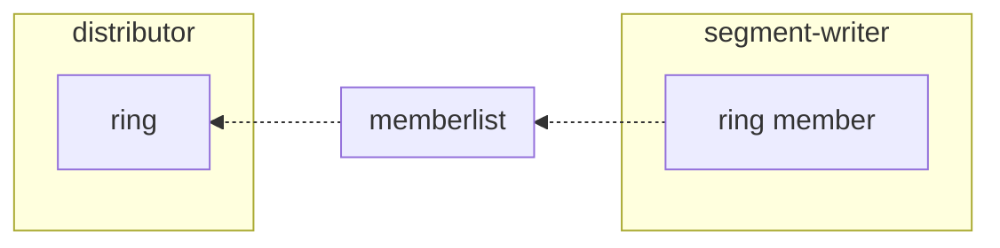
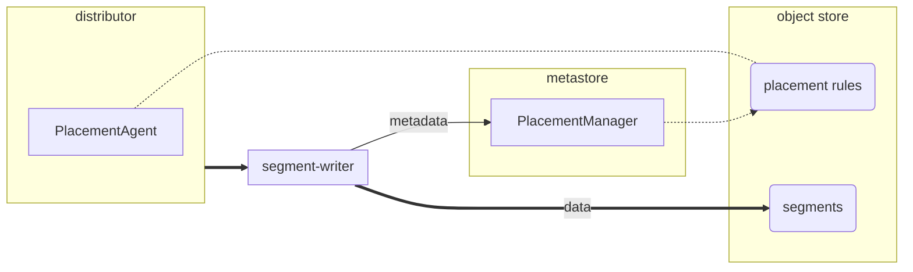

# Pyroscope Distributor

The distributor is a stateless component that receives profiling data from Pyroscope clients such as SDK or Grafana Alloy.
Profiles can also be ingested directly through the Push RPC API and HTTP `/ingest` API.

We recommend randomly load balancing write requests across distributor instances.
If you're running Pyroscope in a Kubernetes cluster, you can define a Kubernetes [Service](https://kubernetes.io/docs/concepts/services-networking/service/) as ingress for the distributors.

> **Note:** A Kubernetes Service balances TCP connections across Kubernetes endpoints and does not balance HTTP requests within a single TCP connection.
> If you enable HTTP persistent connections (HTTP keep-alive), because the Agent uses HTTP keep-alive, it re-uses the same TCP connection for each push HTTP request.
> This can cause distributors to receive an uneven distribution of push HTTP requests.

Distributors route profiles to segment-writers co-locate profiles from the same application. This ensures that
profiles likely to be queried together are stored together.

## Sharding

In Pyroscope, we have a concept called "tenant service" – a set of profile series collected for the same program.
While it's not strictly enforced, profiling data is typically queried for a specific service. It's crucial to ensure
that the data placement aligns with read access patterns, and this principle is the cornerstone of the distributor
service design.

Profiles are distributed among segment-writers by distributors based on the profile labels. Profile labels include the
`service_name` label, which is used to identify the dataset the profile belongs to.

Distributors use consistent hashing ring to determine which segment-writer receives a given profile. The ring is built
based on the segment-writer instances discovered using the [`memberlist`](https://github.com/hashicorp/memberlist) gossip protocol.

Depending on the dataset size, it might be split into multiple shards. Each shard is owned by a segment-writer instance.
The number of shards in a deployment is determined by the number of segment-writer instances; since segments are flushed
for every shard, the number of shards directly affects the number of write operations to the object storage. Therefore,
the number of shards should be chosen carefully to balance the write throughput and the storage cost.

If the request cannot be sent to a segment-writer, the next suitable segment-writer instance is selected, while the
destination shard remains unchanged. The helps to maintain data locality in case of transient failures and rollouts:
the background compaction process merges segments of the same shard, which reduces the read amplification factor.  

[Jump consistent hash](https://arxiv.org/pdf/1406.2294) is used to implement consistent hashing. Using the algorithm, distributors identify a subset
of shards allowed for the tenant, and subset of shards allowed for the dataset, the profile belongs to.

> **Note:** In order to guarantee the best distribution, we recommend that the last segment-writer added to the ring is
> the first instance to be removed from it. This minimizes unnecessary data migrations when the number of nodes in the
> cluster changes.

Due to the nature of continuous profiling, it is usually beneficial to keep the same profile series (profiles having the
same set of labels) on the same shard, as this allows for more optimal utilization of the TSDB index (the inverted index
used for searching by labels). However, data is often distributed across profile series unevenly; using a series label
hash as the distribution key at any of the steps above may lead to significant data skews. To mitigate this, the load
balancing and distribution algorithms are adapt to the data characteristics: distributors use series hash modulo by
default, and switch to random distribution, if a significant skew is observed.

The data distribution algorithm is described in detail in the [Data Distribution](../../../distributor/README.md) section.

### Placement Rules

In order to ensure optimal data placement and distribution of profiles over shards, the distributor uses placement rules
generated based on the data flow. The placement rules are managed by the Placement Manager, which resides in the
metastore component. The Placement Manager is a singleton and runs only on the leader of the metastore cluster.

The Placement Manager keeps track of dataset statistics based on the metadata records received from the segment-writer
service. The Placement Manager builds placement rules at regular intervals, which are then used by the distributor to
determine the placement for each received profile.

Placement rules do not include the exact shards and mappings to nodes. Instead, they specify how many shards
are allocated for a specific dataset and tenant, and what load balancing strategy should be used: `fingerprint mod` or
`round robin`.

## Reliability

* Distributors are stateless and can be scaled horizontally.
* It is recommended to scale distributor horizontally as opposed to vertically.

In case if the distributor instance is unable to send the profile to the selected segment-writer instance, the next
suitable segment writer is selected. The selected shard does not change to maintain data locality in case of transient
failures and rollouts.

If the distributor instance went down while handling a request, the request should be retried by the client or the load
balancer.
