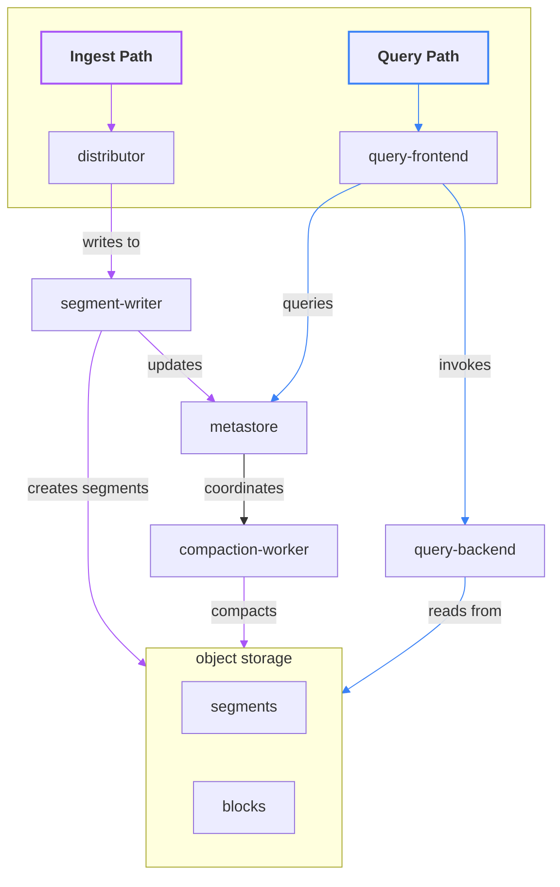

# Pyroscope Architecture Overview

Pyroscope is designed to be a scalable and cost-effective solution for storing and querying profiling data.
The architecture is built around the following goals:
 - High write throughput.
 - Cost-effective storage.
 - Scalable query performance.
 - Low operational overhead.

In order to achieve these goals, Pyroscope uses a distributed architecture consisting of several components that work
together to ingest, store, and query profiling data. We aim at minimizing the number of stateful components, and let
the data storage to not use local disks at all, but rely entirely on the object storage.

The high-level components of the architecture include:

## Ingest Path

Profiles are ingested through the Push RPC API and HTTP `/ingest` API to distributors. The write path includes
distributor and segment-writer services: both of them are state-less, disk-less and scale horizontally efficiently.

The profile ingest requests are randomly distributed among distributors, which then route them to segment-writers
to co-locate profiles that are coming from the same application. This ensures that profiles that are likely to be queried
together are stored together. You can find detailed description of the distribution algorithm in the distributor documentation.

The segment-writer service accumulates profiles in small blocks (segments), and writes them to object storage while
updating the block index with metadata of newly added objects. Each writer produces a _single object per shard_
containing data of _all tenant services_ per shard; this approach minimizes the number of write operations to the
object storage, thereby optimizing the cost of the solution.

The ingestion clients are blocked until the data is durably stored in the object storage and an entry for the object is
created in the metadata index. By default, ingestion is synchronous, and the median latency is expected to be less
than 500ms with the default settings and popular object storage providers such as Amazon S3, Google Cloud Storage, and
Azure Blob Storage.

## Compaction

The number of objects created in the storage can reach millions per hour. This can severely degrade query path
performance due to high read amplification and excessive calls to the object storage. Additionally, a high number of
metadata entries can degrade performance across the entire cluster, impacting the write path as well.

To ensure high query performance, data objects are compacted in the background. The compaction-worker service is
responsible for merging small segments into larger blocks, which are then written back to the object storage. Compaction
workers compact data as soon as possible after the data is written to the object storage, and the median time to the
first compaction does not exceed 15 seconds.

Compaction workers are coordinated by the metastore service, which maintains the metadata index and schedules compaction
jobs. Compaction workers are stateless, and do not require any local storage.

## Query Path

Profiling data is queried through the Query API available in the query-frontend service.

A regular flame graph query users see in the UI may require fetching many gigabytes of data from storage. Moreover, the
raw profiling data needs very expensive post-processing to be displayed in the flame graph format. Pyroscope addresses
the problem by adaptive data placement that minimizes the number of objects that need to be read to satisfy a query,
and high parallelism in the query execution.

The query frontend is responsible for preliminary query planning and routing the query to the query backend service.
Data objects are located using the metastore service, which maintains the metadata index.

A query is executed by the query-backend service with high parallelism. The query execution is represented as a graph
where the results of the sub-queries are combined. This allows minimizing the network overhead and enables horizontal
scalability of the read path without the need for a traditional disk-based solutions or even a caching layer.

Both query-frontend and query-backend are state-less services, that can scale out to hundreds of instances.
In the future versions, we plan to add a server-less query-backend as an option.

## Metastore

The metastore service is responsible for maintaining the metadata index and compaction process coordination.
This is the only stateful component in the architecture, and it uses local disk as durable storage: even a large scale
cluster only needs few gigabytes of disk space for the metadata index. The metastore service is using Raft protocol
for consensus and replication.

The metadata index includes information about the data objects stored in the object storage, and their contents, such
as the time range, the tenant, and the datasets with the object that contain profiling data for a particular service.

