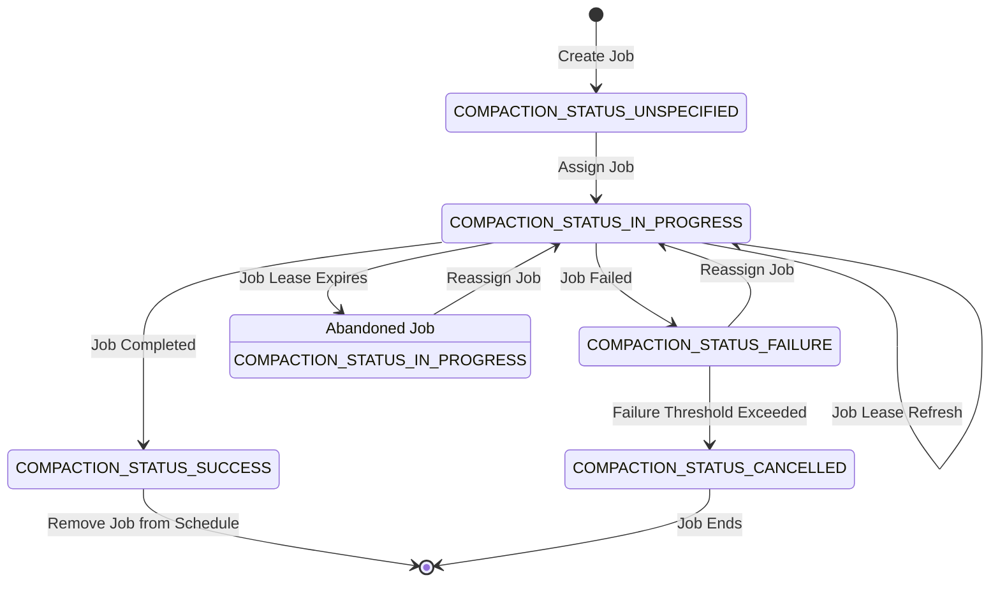

# Compaction Service

TODO

## Sequence diagram

TODO

---

# Job Planner

TODO

---

# Job Scheduler

The scheduler implements the basic **Small Job First** strategy: blocks of lower levels are considered smaller than
blocks of higher levels, and their compaction is prioritized. This is justifiable because the smaller blocks affect
read amplification more than the larger blocks, and the compaction of smaller blocks is more efficient.

---

Compaction jobs are assigned to workers in the order of their priority.

Internally, the scheduler maintains a priority queue of jobs for each compaction level. Jobs of lower levels are
assigned first, and the scheduler does not consider jobs of higher levels until all eligible jobs of lower levels are
assigned.

The priority is determined by several factors:
1. Status (enum order).
2. Lease expiration time: the job with the earliest lease expiration time is considered first.

Priority handling:
- `COMPACTION_STATUS_UNSPECIFIED`: unassigned jobs.
- `COMPACTION_STATUS_IN_PROGRESS`: in-progress jobs:
    - Jobs with expired leases come first.
    - The first job with a non-expired lease is a sentinel: no more jobs are eligible for assignment at this level.
- `COMPACTION_STATUS_CANCELLED`: sentinel; the job will not be assigned.
- The transient statuses communicated by the worker to the scheduler should not be stored in the priority queue:
    - `COMPACTION_STATUS_SUCCESS`: completed jobs are removed from the schedule immediately.
    - `COMPACTION_STATUS_FAILURE`: the job is reassigned or cancelled.

See [Job Status Description](#job-status-description) for more details.

---

## Job Ownership

Distributed locking implementation is inspired by [The Chubby lock service](https://static.googleusercontent.com/media/research.google.com/en//archive/chubby-osdi06.pdf)
and [Leases: An Efficient Fault-Tolerant Mechanism
for Distributed File Cache Consistency](https://dl.acm.org/doi/pdf/10.1145/74851.74870). The implementation is based on
the Raft protocol.

Ownership of a compaction job is granted to a compaction worker for a specified period – a *lease*:
> A lease is a contract that gives its holder specified rights over property for a limited period of time.

The real-time clock of the worker and the scheduler cannot be used; instead, the timestamp of the Raft log entry,
assigned by the Raft leader when the entry is appended to the log, serves as the reference point in time.

> The fact that leases are allocated by the current leader allows for spurious *lease invalidation* when the leader
> changes and the clock skew exceeds the lease duration. This is acceptable because jobs will be reassigned repeatedly,
> and the occurrence of the event should be very rare. However, the solution does not tolerate clock skews exceeding
> the job lease duration (which is 15 seconds by default).

The log entry index is used as the [fencing token](https://martin.kleppmann.com/2016/02/08/how-to-do-distributed-locking.html)
of protected resources (compaction jobs).

The Raft log entry index is a monotonically increasing integer, guaranteed to be unique for each command.
Each time a job is assigned to a worker, the worker is provided with the current Raft log index as the fencing token,
which is also assigned to the job. For subsequent requests, the worker must provide the fencing token it was given at
assignment. The ownership of the job is confirmed if the provided token is greater than or equal to the job's token.
The job's token may change if the job is reassigned to another worker, and the new token is derived from the current
Raft log index, which is guaranteed to be greater.

> Token authentication is not enforced in this design, as the system operates in a trusted environment with cooperative
> workers. However, m malicious workers can arbitrarily specify a token. In the future, we may consider implementing a
> basic authentication mechanism based on cryptographic signatures to further ensure the integrity of token usage.
>
> This is an advisory locking mechanism, meaning resources are not automatically restricted from access when the lock
> is not acquired. Consequently, a client might choose to delete source blocks associated with a compaction job or
> continue processing the job even without holding the lease. This behavior, however, should be avoided in the worker
> implementation.

## Procedures

### Assignment

When a worker requests a new assignment, the scheduler must find the highest-priority job that is not assigned yet,
and assign it to the worker. When a job is assigned, the worker is given a lease with a deadline.
The worker should refresh the lease before it expires.

### Lease Refresh

The worker must send a status update to the scheduler to refresh the lease.
The scheduler must update the lease expiration time if the worker still owns the job.

### Job Reassignment

The scheduler may revoke a job if the worker does not send the status update within the lease duration.

When a new assignment is requested by a worker, the scheduler inspects in-progress jobs and checks if the
lease duration has expired. If the lease has expired, the job is reassigned to the worker requested for a
new assignment.

---

If the timestamp of the current Raft log entry (command) exceeds the job `lease_expires_at` timestamp,
the scheduler must revoke the job:
1. Set the status to `COMPACTION_STATUS_IN_PROGRESS`.
2. Allocate a new lease with an expiration period calculated starting from the current command timestamp.
3. Set the fencing token to the current command index (guaranteed to be higher than the job fencing token).

The worker instance that has lost the job is not notified immediately. If the worker reports an update for the job that
is not assigned to it, or if the job is not found (for example, it has been completed by another worker), the scheduler
does not allocate a new lease; the worker *should* stop processing. This is a general mechanism to prevent the worker
from unwanted processing of the job.

The lost job might be reassigned to the same worker instance if that instance happens to detect the loss before others:
the "abandoned" job is assigned to the first worker that requests new assignments, and no unassigned jobs are available.

### Worker Refusal

If the worker is not capable of executing the job, it may abandon the job without any further notifications.
The scheduler will reassign the job to another worker eventually.

### Job Failure

If the worker reports a failure explicitly, the scheduler must reassign the job. Like in the case of worker refusal,
the lease expiration mechanism can be used in combination with increasing the job fence as we don't want to assign the
job to the same worker.

Additionally, to avoid infinite reassignment loops, the scheduler must keep track of the number of failures for each
job. If the number of failures exceeds the threshold, the job must be marked as `COMPACTION_STATUS_CANCELLED` in the
schedule and never reassigned.

There's no explicit mechanism to protect from malfunctioning or malicious workers.

### Job Completion

When the worker reports a successful completion of the job, the scheduler must remove the job from the schedule and
notify the planner about the completion.

## Job Status Description

The diagram below depicts the state machine of the job status.

### Communication

### Scheduler to Worker

| Status                          | Description                                                                                                                                                                                                       |
|---------------------------------|-------------------------------------------------------------------------------------------------------------------------------------------------------------------------------------------------------------------|
| `COMPACTION_STATUS_UNSPECIFIED` | Not allowed.                                                                                                                                                                                                      |
| `COMPACTION_STATUS_IN_PROGRESS` | Job lease refresh. If the fencing token of the new lease is greater that the worker's one, the worker should stop processing the job. Otherwise, the worker should refresh the new lease before the new deadline. |
| `COMPACTION_STATUS_SUCCESS`     | Not allowed.                                                                                                                                                                                                      |
| `COMPACTION_STATUS_FAILURE`     | Not allowed.                                                                                                                                                                                                      |
| `COMPACTION_STATUS_CANCELLED`   | Not allowed.                                                                                                                                                                                                      |

### Worker to Scheduler

| Status                          | Description                                                                                                                                                                                                                  |
|---------------------------------|------------------------------------------------------------------------------------------------------------------------------------------------------------------------------------------------------------------------------|
| `COMPACTION_STATUS_UNSPECIFIED` | Not allowed.                                                                                                                                                                                                                 |
| `COMPACTION_STATUS_IN_PROGRESS` | Job lease refresh. The scheduler must extend the lease of the job.                                                                                                                                                           | 
| `COMPACTION_STATUS_SUCCESS`     | The job has been successfully completed. The scheduler must remove the job from the schedule and communicate the update to the planner.                                                                                      |
| `COMPACTION_STATUS_FAILURE`     | The job has failed. The scheduler must increase the failure counter. If the counter does not exceed the threshold, the job is reassigned. Otherwise, the scheduler must set the job status to `COMPACTION_STATUS_CANCELLED`. |
| `COMPACTION_STATUS_CANCELLED`   | Not allowed.                                                                                                                                                                                                                 |

### Notes

* The terminal job state is indicated by the following statuses:
  - `COMPACTION_STATUS_SUCCESS`: The job has been successfully completed and must be removed from the schedule.
  - `COMPACTION_STATUS_CANCELLED`: The job has been cancelled and will remain in the schedule. If the failures that
caused the cancellation are resolved, the job might be executed again. *The mechanism is not implemented yet*.

* Job statuses `COMPACTION_STATUS_UNSPECIFIED` and `COMPACTION_STATUS_CANCELLED` are never sent over the wire.

* Job statuses `COMPACTION_STATUS_SUCCESS` and `COMPACTION_STATUS_FAILURE` are never stored.
