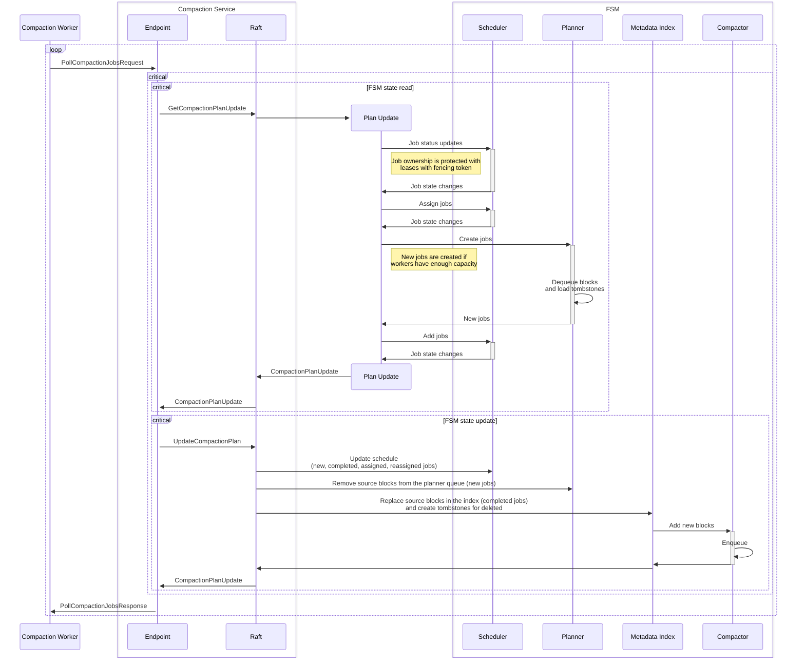
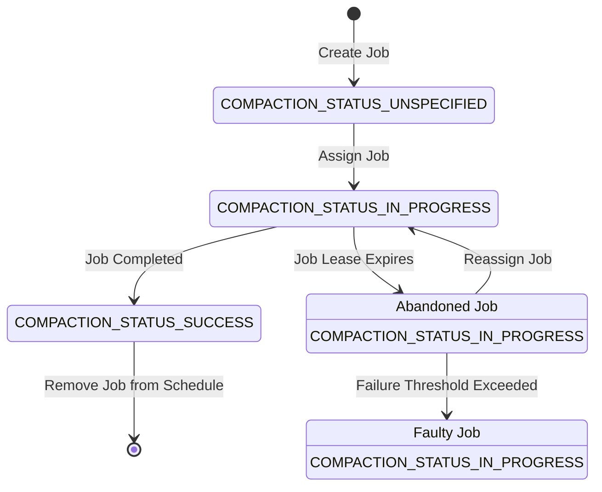

# Block Compaction

## Background

The Pyroscope ingestion pipeline is designed to gather data in memory as small segments, which are periodically flushed
to object storage, along with the metadata entries being added to the metastore index. Depending on the configuration
and deployment scale, the number of segments created per second can increase significantly, reaching millions of objects
per hour or day. This can lead to performance degradation in the query path due to high read amplification caused by the
large number of small segments. In addition to read amplification, a high number of metadata entries can also lead to
performance degradation across the entire cluster, impacting the write path as well.

The new background compaction process helps mitigate this by merging small segments into larger ones, aiming to reduce
the number of objects a query needs to fetch from object storage.

# Compaction Service

The compaction service is responsible for planning compaction jobs, scheduling their execution, and updating the
metastore index with the results. The compaction service resides within the metastore component, while the compaction
worker is a separate service designed to scale horizontally.

The compaction service relies on the Raft protocol to guarantee consistency across the replicas. The diagram below
illustrates the interaction between the compaction worker and the compaction service: workers poll the service on a
regular basis to request new compaction jobs and report status updates.

A status update is processed by the leader node in two steps, each of which is a Raft command committed to the log:
1. First, the leader prepares the plan update – compaction job state changes based on the reported status updates.
This is a read only operation that never modifies the node state.
2. The leader proposes the plan update: all the replicas must apply the planned changes to their state in an idempotent
way, if the proposal is accepted (committed to the Raft log).

Critical sections are guaranteed to be executed serially in the context of the Raft state machine and by the same
leader (within the same *term*), and atomically from the cluster's perspective. If the prepared compaction plan update
is not accepted by the Raft log, the update plan is discarded, and the new leader will propose a new plan.

The two-step process ensures that all the replicas use the same compaction plan, regardless of their internal state,
as long as the replicas can apply `UpdateCompactionPlan`change. This is true even in case the compaction algorithm
(the `GetCompactionPlanUpdate` step) changes across the replicas during the ongoing migration – version upgrade or
downgrade.

> As of now, both steps are committed to the Raft log. However, as an optimization, the first step – preparation,
> can be implemented as a **Linearizable Read** through **Read Index** (which we already use in metadata queries)
> to avoid unnecessary replication of the read-only operation. This approach is already used by the metadata index  
> cleaner: leader read with a follow-up proposal.
>
> However, unlike cleanup, compaction is a more complex operation, and the serialization guarantees provided  
> by Raft command execution flow help avoid many potential issues with concurrent read/write access.

---

# Job Planner

The compactor is responsible for maintaining a queue of source blocks eligible for compaction. Currently, this queue
is a simple doubly-linked FIFO structure, populated with new block batches as they are added to the index. In the
current implementation, a new compaction job is created once the sufficient number of blocks have been enqueued.
Compaction jobs are planned on demand when requests are received from the compaction service.

The queue is segmented by the `Tenant`, `Shard`, and `Level` attributes of the block metadata entries, meaning that
a block compaction never crosses these boundaries. This segmentation helps avoid unnecessary compactions of unrelated
blocks. However, the downside is that blocks are never compacted across different shards, which can lead to suboptimal
compaction results. Due to the dynamic data placement, it is possible for a tenant to be placed on a shard for only a
short period of time. As a result, the data in that shard may not be compacted with other data from the same tenant.

Cross-shard compaction is to be implemented as a future enhancement. The observed impact of the limitation is moderate.

## Data Layout

Profiling data from each service (identified by the `service_name` label) is stored as a separate dataset within a block.

The block layout is composed of a collection of non-overlapping, independent datasets, each containing distinct data.
At compaction, matching datasets from different blocks are merged: their tsdb index, symbols, and profile tables are
merged and rewritten to a new block, to optimize the data for efficient reading.

---

# Job Scheduler

The scheduler implements the basic **Small Job First** strategy: blocks of lower levels are considered smaller than
blocks of higher levels, and their compaction is prioritized. This is justifiable because the smaller blocks affect
read amplification more than the larger blocks, and the compaction of smaller blocks is more efficient.

---

Compaction jobs are assigned to workers in the order of their priority.

Internally, the scheduler maintains a priority queue of jobs for each compaction level. Jobs of lower levels are
assigned first, and the scheduler does not consider jobs of higher levels until all eligible jobs of lower levels are
assigned.

The priority is determined by several factors:
1. Compaction level.
2. Status (enum order).
   - `COMPACTION_STATUS_UNSPECIFIED`: unassigned jobs.
   - `COMPACTION_STATUS_IN_PROGRESS`: in-progress jobs. The first job that can't be reassigned is a sentinel:
      no more jobs are eligible for assignment at this level.
3. Failures: jobs with fewer failures are prioritized.
4. Lease expiration time: the job with the earliest lease expiration time is considered first.

See [Job Status Description](#job-status-description) for more details.

> The challenge is that we don't know the capacity of our worker fleet in advance, and we have no control over them;
they can appear and disappear at any time. Another problem is that in some failure modes, such as unavailability or
lack of compaction workers, or temporary unavailability of the metastore service, the number of blocks to be compacted
may reach significant levels (millions).
>
> Therefore, we use an adaptive approach to keep the scheduler's job queue short while ensuring the compaction
workers are fully utilized. In every request, the worker specifies how many free slots it has available for new jobs.
As the compaction procedure is a synchronous CPU-bound task, we use the number of logical CPU cores as the worker's max
capacity and decrement it for each in-progress compaction job. When a new request arrives, it specifies the current
worker's capacity, which serves as evidence that the entire worker fleet has enough resources to handle at least
this number of jobs. Thus, for every request, we try to enqueue a number of jobs equal to the reported capacity.
>
> Over time, this ensures good balance between the number of jobs in the queue and the worker capacity utilization,
even if there are millions of blocks to compact.

---

## Job Ownership

Distributed locking implementation is inspired by [The Chubby lock service](https://static.googleusercontent.com/media/research.google.com/en//archive/chubby-osdi06.pdf)
and [Leases: An Efficient Fault-Tolerant Mechanism
for Distributed File Cache Consistency](https://dl.acm.org/doi/pdf/10.1145/74851.74870). The implementation is based on
the Raft protocol.

Ownership of a compaction job is granted to a compaction worker for a specified period – a *lease*:
> A lease is a contract that gives its holder specified rights over property for a limited period of time.

The real-time clock of the worker and the scheduler cannot be used; instead, the timestamp of the Raft log entry,
assigned by the Raft leader when the entry is appended to the log, serves as the reference point in time.

> The fact that leases are allocated by the current leader allows for spurious *lease invalidation* when the leader
> changes and the clock skew exceeds the lease duration. This is acceptable because jobs will be reassigned repeatedly,
> and the occurrence of the event should be very rare. However, the solution does not tolerate clock skews exceeding
> the job lease duration (which is 15 seconds by default).

The log entry index is used as the [fencing token](https://martin.kleppmann.com/2016/02/08/how-to-do-distributed-locking.html)
of protected resources (compaction jobs).

The Raft log entry index is a monotonically increasing integer, guaranteed to be unique for each command.
Each time a job is assigned to a worker, the worker is provided with the current Raft log index as the fencing token,
which is also assigned to the job. For subsequent requests, the worker must provide the fencing token it was given at
assignment. The ownership of the job is confirmed if the provided token is greater than or equal to the job's token.
The job's token may change if the job is reassigned to another worker, and the new token is derived from the current
Raft log index, which is guaranteed to be greater.

> Token authentication is not enforced in this design, as the system operates in a trusted environment with cooperative
> workers. However, m malicious workers can arbitrarily specify a token. In the future, we may consider implementing a
> basic authentication mechanism based on cryptographic signatures to further ensure the integrity of token usage.
>
> This is an advisory locking mechanism, meaning resources are not automatically restricted from access when the lock
> is not acquired. Consequently, a client might choose to delete source blocks associated with a compaction job or
> continue processing the job even without holding the lease. This behavior, however, should be avoided in the worker
> implementation.

## Procedures

### Assignment

When a worker requests a new assignment, the scheduler must find the highest-priority job that is not assigned yet,
and assign it to the worker. When a job is assigned, the worker is given a lease with a deadline.
The worker should refresh the lease before it expires.

### Lease Refresh

The worker must send a status update to the scheduler to refresh the lease.
The scheduler must update the lease expiration time if the worker still owns the job.

### Reassignment

The scheduler may revoke a job if the worker does not send the status update within the lease duration.

When a new assignment is requested by a worker, the scheduler inspects in-progress jobs and checks if the
lease duration has expired. If the lease has expired, the job is reassigned to the worker requested for a
new assignment.

---

If the timestamp of the current Raft log entry (command) exceeds the job `lease_expires_at` timestamp,
the scheduler must revoke the job:
1. Set the status to `COMPACTION_STATUS_IN_PROGRESS`.
2. Allocate a new lease with an expiration period calculated starting from the current command timestamp.
3. Set the fencing token to the current command index (guaranteed to be higher than the job fencing token).

---

The worker instance that has lost the job is not notified immediately. If the worker reports an update for a job that it
is not assigned to, or if the job is not found (for example, if it has been completed by another worker), the scheduler
does not allocate a new lease; the worker should stop processing. This mechanism prevents the worker from processing
jobs unnecessarily.

If the worker is not capable of executing the job, it may abandon the job without further notifications. The scheduler
will eventually reassign the job to another worker. The lost job might be reassigned to the same worker instance if that
instance detects the loss before others do: abandoned jobs are assigned to the first worker that requests new
assignments when no unassigned jobs are available.

There is no explicit mechanism for reporting a failure from the worker. In fact, the scheduler must not rely on error
reports from workers, as jobs that cause workers to crash would yield no reports at all.

To avoid infinite reassignment loops, the scheduler keeps track of reassignments (failures) for each job. If the number
of failures exceeds a set threshold, the job is not reassigned and remains at the bottom of the queue. Once the cause of
failure is resolved, the error limit can be temporarily increased to reprocess these jobs.

The scheduler queue has a size limit. Typically, the only scenario in which this limit is reached is when the compaction
process is not functioning correctly (e.g., due to a bug in the compaction procedure), preventing blocks from being
compacted and resulting in many jobs remaining in a failed state. Once the queue size limit is reached, failed jobs are
evicted, meaning the corresponding blocks will never be compacted. This may cause read amplification of the data queries
and bloat the metadata index. Therefore, the limit should be large enough. The recommended course of action is to roll
back or fix the bug and restart the compaction process, temporarily increasing the error limit if necessary.

### Job Completion

When the worker reports a successful completion of the job, the scheduler must remove the job from the schedule and
notify the planner about the completion.

## Job Status Description

The diagram below depicts the state machine of the job status.

### Communication

### Scheduler to Worker

| Status                          | Description                                                                         |
|---------------------------------|-------------------------------------------------------------------------------------|
| `COMPACTION_STATUS_UNSPECIFIED` | Not allowed.                                                                        |
| `COMPACTION_STATUS_IN_PROGRESS` | Job lease refresh. The worker should refresh the new lease before the new deadline. |
| `COMPACTION_STATUS_SUCCESS`     | Not allowed.                                                                        |
| ---                             | No lease refresh from the scheduler. The worker should stop processing.             |

### Worker to Scheduler

| Status                          | Description                                                                                                                             |
|---------------------------------|-----------------------------------------------------------------------------------------------------------------------------------------|
| `COMPACTION_STATUS_UNSPECIFIED` | Not allowed.                                                                                                                            |
| `COMPACTION_STATUS_IN_PROGRESS` | Job lease refresh. The scheduler must extend the lease of the job, if the worker still owns it.                                         | 
| `COMPACTION_STATUS_SUCCESS`     | The job has been successfully completed. The scheduler must remove the job from the schedule and communicate the update to the planner. |

### Notes

* Job status `COMPACTION_STATUS_UNSPECIFIED` is never sent over the wire between the scheduler and workers.
* Job in `COMPACTION_STATUS_IN_PROGRESS` cannot be reassigned if its failure counter exceeds the threshold.
* Job in `COMPACTION_STATUS_SUCCESS` is removed from the schedule immediately.
