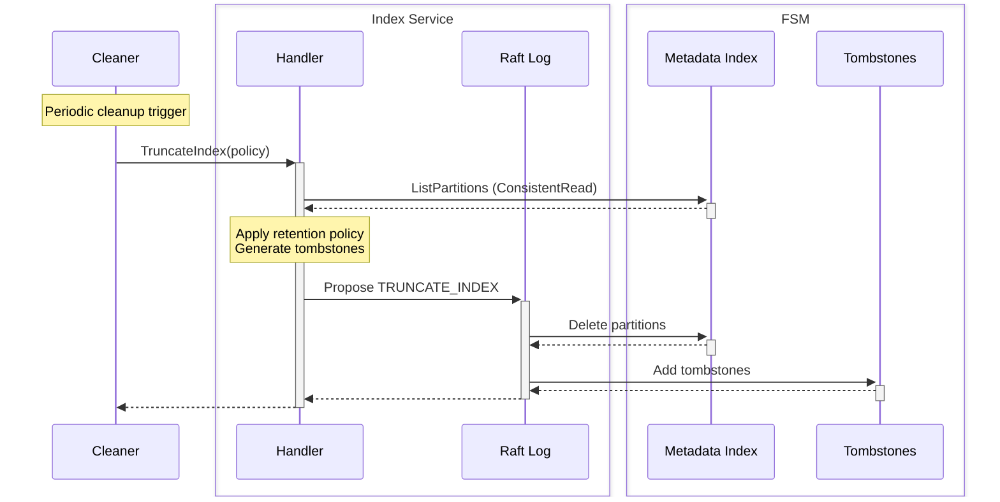

# Data Retention and Cleanup

## Overview

```mermaid
sequenceDiagram
    participant C as Cleaner
    
    box Index Service
        participant H as Handler
        participant R as Raft Log
    end
    
    box FSM
        participant MI as Metadata Index
        participant T as Tombstones
    end
    
    Note over C: Periodic cleanup trigger
    
    C->>+H: TruncateIndex(policy)
    
    H->>+MI: ListPartitions (ConsistentRead)
    MI-->>-H: 
    
    Note over H: Apply retention policy<br/>Generate tombstones
    
    H->>+R: Propose TRUNCATE_INDEX
    
    R->>+MI: Delete partitions
    MI-->>-R: 
    
    R->>+T: Add tombstones
    T-->>-R: 
    
    R-->>-H: 
    H-->>-C: 
``` 
