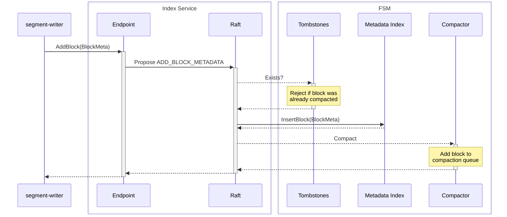
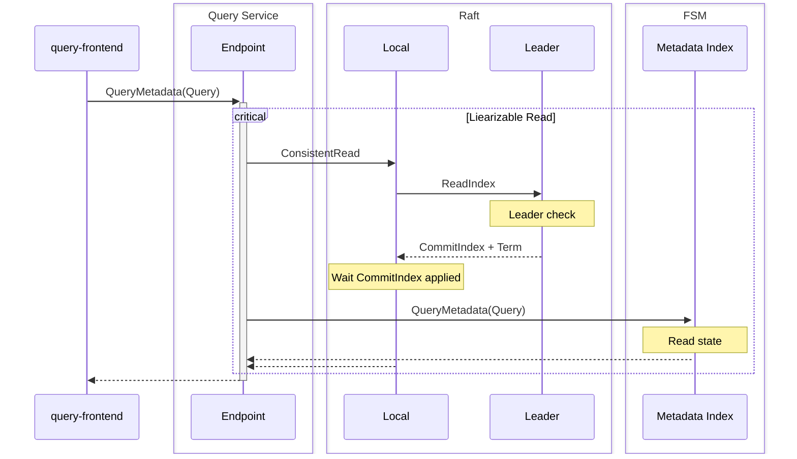
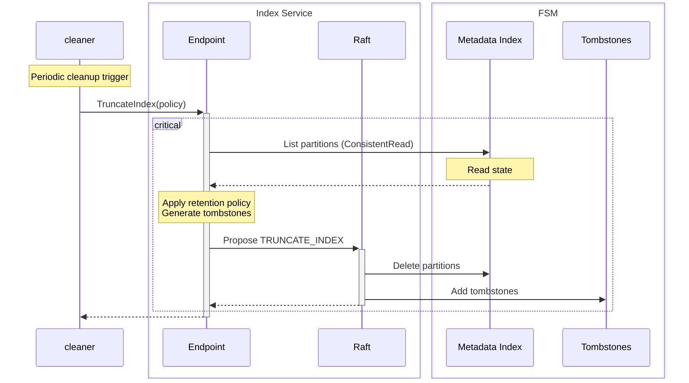

# Metadata Index

The metadata index stores metadata entries for objects located in the data store. In essence, it is a document store built on top of a key-value database.

It is implemented using BoltDB as the underlying key-value store, with Raft providing replication via consensus. BoltDB was chosen for its simplicity and efficiency in this use case – a single writer, concurrent readers, and ACID transactions. For better performance, the index database can be stored on an in-memory volume, as it's recovered from the Raft log and snapshot on startup, and durable storage is not required for the index itself.

## Metadata entries

Data objects, more widely called _blocks_ in the codebase, are stored in the data store (object storage) and are identified by a unique identifier (ULID).

A block is a collection of _datasets_ that share certain properties, such as tenant and shard identifiers, time range, creation time, and more. Simplified, a metadata entry looks like this:

```proto
struct BlockMeta {
  uint32    format
  string    id
  int32     tenant
  uint32    shard
  []Dataset datasets
  []string  string_table
}
```

```proto
struct Dataset {
  uint32   format
  int32    tenant
  int32    name
  []uint64 table_of_contents
  []int32  labels
}
```

Datasets' content is defined by the `format` field, which indicates the binary format of the dataset. The `table_of_contents` field is a list of offsets that point to data sections within the dataset, allowing for efficient access to specific parts of the data. The table of contents is specific to the dataset format.

Metadata labels allow specifying additional attributes than can be then used for filtering and querying. Labels are represented as a slice of `int32` values that refer to strings in the metadata entry's string table. The slice is a sequence of length-prefixed key-value (KV) pairs:

```
len(2) | k1 | v1 | k2 | v2 | len(3) | k1 | v3 | k2 | v4 | k3 | v5
```

Refer to the [`BlockMeta`](../../../api/metastore/v1/types.proto) protobuf definition to learn more about the metadata format.

The metadata entry is also included to the object itself, its offset is specified in the `metadata_offset` attribute. If the offset is not known, the metadata can be retrieved from the object using the footer structure:

```it-is-not-meant-to-be-a-markdown-table
Offset  | Size       | Description
--------|------------|------------------------------------------
0       | data       | Object data
--------|------------|------------------------------------------
data    | metadata   | Protobuf-encoded metadata
end-8   | be_uint32  | Size of the raw metadata
end-4   | be_uint32  | CRC32 of the raw metadata and size
```

## Structure

The index is partitioned by time – each partition covers a 6-hour window. Within each partition, data is organized by tenant and shard:

```
Partition (6h window)
├── Tenant A
│   ├── Shard 0
│   ├── Shard 1
│   └── Shard N
└── Tenant B
    ├── Shard 0
    └── Shard N
```

Metadata entries are stored in shard buckets as key-value pairs, where the key is the block ID (ULID) and the value is the serialized block metadata. The block identifier is a ULID, where the timestamp represents the block's creation time. However, blocks span data ranges defined by the actual timestamps of the data they contain (specified in the block metadata). When blocks are compacted together (merged), the output block identifier uses the timestamp of the oldest block in the input set and reflects the actual time range of the compacted data.

Every block is assigned to a shard at [data distribution](../../ingester/client/distributor/README.md) time, and this assignment never changes. The assigned shard identifier is stored in the block metadata entry and is used to locate the block within the tenant bucket.

Shard-level structures:
- To save space, strings in block metadata are deduplicated using a dictionary (`StringTable`).
- Each shard maintains a small index for efficient filtering (`ShardIndex`).
  * The index indicates the time range of the shard's data (min and max timestamps).

```
Partition
└── Tenant
    └── Shard
        ├── .index
        ├── .strings
        ├── 01JYB4J3P5YFCZ80XRG11RMNEK => Block Metadata Entry
        └── 01JYB4JNHARQZYPKR01W46EB54 => Block Metadata Entry
```

The index uses several caches for performance:
- The shard cache keeps shard indexes and string tables in memory.
- The block cache stores decoded metadata entries.

## Index Writes

Index writes are performed by the `segment-writer` service, which is responsible for writing metadata entries to the index.

The write process spans multiple components and involves Raft consensus:



A tombstone check is necessary to prevent adding metadata for blocks that have already been compacted and removed from the index. This situation can occur if the writer fails to receive a response from the index, even though the entry was already added to a compaction and processed. During compaction, source objects are not removed immediately but only after a configured delay – long enough to cover the expected retry window. Refer to the [compaction](#compaction) paragraph for more details.

### Dead Letter Queue

If block metadata cannot be added to the index by the client, the metadata may be written to a DLQ in object storage. The recovery process scans for these entries every 15 seconds and attempts to re-add them to the index. Note that use of the DLQ may result in a "stale reads" phenomenon, in which a read fails to observe the effects of a completed write. If strongly consistent (linearizable) reads are required, the client should not use the DLQ.

## Index Queries

Queries access the index through the `ConsistentRead` API, which implements the _linearizable read_ pattern. This ensures that the replica reflects the most recent state agreed upon by the Raft consensus at the moment of access, and any previous writes are visible to the read operation. Refer to the [implementation](../raftnode/node_read.go) for details. The approach enables Raft _follower_ replicas to serve queries: in practice, both the leader and followers serve queries.

Index queries are performed by the `query-frontend` service, which is responsible for locating data objects for a given query.



The `QueryService` offers two APIs: for metadata entry queries and for dataset label queries.

The first API allows querying metadata entries based on various criteria, such as tenant, shard, time range, and labels with a Prometheus-like syntax.

The second API provides a way to query dataset labels in the form of Prometheus series labels, without accessing the data objects themselves. For example, a typical query might list all dataset names or a subset of attributes.

Example query:

```go
query := MetadataQuery{
    Expr:      `{service_name="frontend"}`,
    StartTime: time.Now().Add(-time.Hour),
    EndTime:   time.Now(),
    Tenant:    []string{"tenant-1"},
    Labels:    []string{"profile_type"}
}
```

The query will return all metadata entries with datasets that match the specified criteria and will preserve the `profile_type` label, if present.

## Retention

### Compaction

Compaction is the process of merging multiple blocks into a single block to reduce the number of objects in the data store and improve query performance by consolidating data. This improves data locality and reduces the read amplification factor. Compaction is also crucial for the metadata index: without it, metastore performance quickly degrades over a short period of time (hours) and may become inoperable. Compaction is performed by the `compaction-worker` service, which is orchestrated by the Compaction Service implemented in the metastore. Refer to the [compaction documentation](../compaction/README.md) for more details.

When compacted blocks are added to the index, metadata entries of the source blocks are replaced immediately, while the data objects are removed only after a configured delay to prevent interference with queries. Tombstone entries are created in the metastore to keep track of objects that need to be removed. Eventually, tombstones are included in a compaction job, and the compaction worker removes the source objects from the data store.

### Retention Policies

Retention policies are applied in a coarse-grained manner: individual blocks are not evaluated for deletion. Instead, entire partitions are removed when required by the retention configuration. A partition is identified by a key comprising its time range, tenant ID, and shard ID.

#### Time-based Retention Policy

Currently, only a time-based retention policy is implemented, which deletes partitions older than a specified duration. Retention is based on the block creation time to support data backfilling scenarios. However, data timestamps are also respected: a block is only removed if its upper boundary has passed the retention period.

The time-based retention policies are tenant-specific and can be configured per tenant.

### Cleanup

The cleaner component, running on the Raft leader node, is responsible for enforcing the retention policies. It deletes partitions from the index and generates _tombstones_ that are handled later, during compaction.

The diagram below illustrates the cleanup process:



This is a two-phase process:
 1. The cleaner lists all partitions in the index and applies the retention policy to determine which partitions should be deleted. Unlike the `QueryService`, the cleaner can only read the local state, assuming that this is the Raft leader node: it still uses the `ConsistentRead` interface, however, it can only communicate with the local node.
 2. The cleaner proposes a Raft command to delete the partitions and generate _tombstones_ for the data objects that need to be removed. The proposal is rejected by followers if the leader has changed since the moment of the read operation. This ensures that the proposal reflects the most recent state of the index and was created by the acting leader, eliminating the possibility of conflicts.
