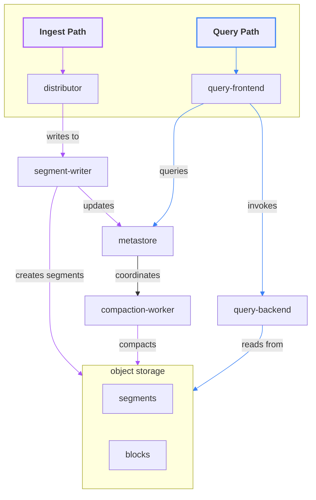

# Pyroscope v2

We're working on the next major version of **Pyroscope** – a complete architectural redesign focused on improving
scalability, performance, and cost-efficiency. The biggest change in Pyroscope v2 is how it handles storage: data
is now written directly to object storage, removing the need for local disks in ingesters. For single-node
deployments, local file systems can still be used as object storage, but this setup isn't supported in the microservice 
mode.

We've also **decoupled the write and query paths**. This means each path can scale independently, so even the heaviest
queries won't interfere with ingestion performance. The read path can now scale to hundreds of instances instantly.
Looking ahead, we're exploring a serverless query backend to make querying even more cost-effective. Compaction,
a previous bottleneck, has also been overhauled. The new design supports significantly higher throughput and
scalability, allowing hundreds of tenants to ingest thousands of profiles per second – without compromising performance.

This is made possible by a dedicated control plane that orchestrates data placement and compaction. To ensure high
availability and fault tolerance, the control plane uses Raft consensus and is the only component that requires
persistent local storage. In the future, we plan to transition this to a serverless model as well – making Pyroscope 
fully stateless and diskless.

> **Note:** This project is currently under active testing. Some features may not yet be fully implemented or stable.

## Getting started

If you want to evaluate the new version, we recommend using the Kubernetes setup. Pyroscope can be deployed as usual,
using the Helm chart and the values file located in the `tools/dev/v2` directory.

# Architecture Overview

Pyroscope is designed to be a scalable and cost-effective solution for storing and querying profiling data.
The architecture is built around the following goals:
 - High write throughput
 - Cost-effective storage
 - Scalable query performance
 - Low operational overhead

In order to achieve these goals, Pyroscope uses a distributed architecture consisting of several components that work
together to ingest, store, and query profiling data. We aim to minimize the number of stateful components and design
the data storage to operate without local disks, relying entirely on object storage.

The high-level components of the architecture include:

## Ingestion

Profiles are ingested through the Push RPC API and HTTP `/ingest` API to distributors. The write path includes
distributor and segment-writer services: both are stateless, disk-less, and scale horizontally with high efficiency.

Profile ingest requests are randomly distributed among distributors, which then route them to segment-writers
to co-locate profiles from the same application. This ensures that profiles likely to be queried
together are stored together. You can find a detailed description of the distribution algorithm in the distributor documentation.

The segment-writer service accumulates profiles in small blocks (segments) and writes them to object storage while
updating the block index with metadata of newly added objects. Each writer produces a _single object per shard_
containing data of _all tenant services_ per shard; this approach minimizes the number of write operations to the
object storage, optimizing the cost of the solution.

Ingestion clients are blocked until data is durably stored in object storage and an entry for the object is
created in the metadata index. By default, ingestion is synchronous, with median latency expected to be
less than 500ms using default settings and popular object storage providers such as Amazon S3, Google Cloud Storage, and
Azure Blob Storage.

You can learn more about the write path in the [distributor documentation](../segmentwriter/client/distributor/README.md).

## Metastore

The metastore service is responsible for maintaining the metadata index and coordinating the compaction process.
This is the only stateful component in the architecture, and it uses local disk as durable storage: even a large-scale
cluster only needs a few gigabytes of disk space for the metadata index. The metastore service uses the Raft protocol
for consensus and replication.

The metadata index includes information about data objects stored in object storage and their contents, such
as time ranges and datasets containing profiling data for particular services.

The metastore service is designed to be highly available and fault-tolerant. In a cluster of three nodes, it can
tolerate the loss of a single node, and in a cluster of five nodes, it can tolerate the loss of two nodes.

You can learn more about the metadata index in the [metastore index documentation](../metastore/index/README.md).

## Compaction

The number of objects created in storage can reach millions per hour. This can severely degrade query performance due
to high read amplification and excessive calls to object storage. Additionally, a high number of metadata entries can
degrade performance across the entire cluster, impacting the write path as well.

To ensure high query performance, data objects are compacted in the background. The compaction-worker service is
responsible for merging small segments into larger blocks, which are then written back to object storage. Compaction
workers compact data as soon as possible after it's written to object storage, with median time to the
first compaction not exceeding 15 seconds.

Compaction workers are coordinated by the metastore service, which maintains the metadata index and schedules compaction
jobs. Compaction workers are stateless and do not require any local storage.

You can learn more about the compaction process in the [compaction documentation](../metastore/compaction/README.md). 

## Querying

Profiling data is queried through the Query API available in the query-frontend service.

A regular flame graph query users see in the UI may require fetching many gigabytes of data from storage. Moreover, the
raw profiling data needs very expensive post-processing to be displayed in flame graph format. Pyroscope addresses
this challenge through adaptive data placement that minimizes the number of objects that need to be read to satisfy a
query, and high parallelism in query execution.

The query frontend is responsible for preliminary query planning and routing the query to the query backend service.
Data objects are located using the metastore service, which maintains the metadata index.

Queries are executed by the query-backend service with high parallelism. Query execution is represented as a graph
where the results of sub-queries are combined and optimized. This minimizes network overhead and enables horizontal
scalability of the read path without needing traditional disk-based solutions or even a caching layer.

Both query-frontend and query-backend are stateless services that can scale out to hundreds of instances.
In future versions, we plan to add a serverless query-backend option.
