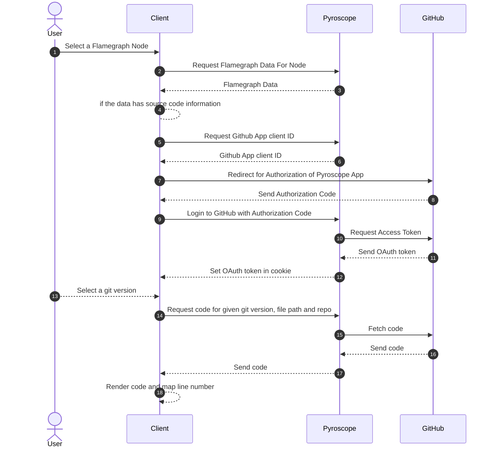

# GitHub Integration

The following diagram shows the flow of data when fetching source code from GitHub.

## GitHub App Authorization

Pyroscope uses GitHub OAuth App to fetch source code for a given git version, file path and repo. This is done by using the [GitHub OAuth App](https://docs.github.com/en/developers/apps/authorizing-oauth-apps) to get an OAuth token for the user. This token is then used to fetch the source code from GitHub.

Pyroscope supports a new API to fetch Github App client ID. This API is used to get the client ID for the GitHub OAuth App. This client ID is then used to redirect the user to GitHub to authorize Pyroscope to access the user's GitHub account.
Github will redirect the user back to the client with an authorization code. This authorization code is then used to get an OAuth token from GitHub via Pyroscope.

The OAuth token is never stored by Pyroscope. It is only stored in the user's browser as a cookie. Only Pyroscope can access this cookie as it is encrypted with a secret key that is only known to Pyroscope.

When requesting a file to Pyroscope and it returns a `401 Unauthorized` response, it means that the OAuth token has expired. At the same, time the user's browser will delete the cookie containing the OAuth token. The user will then have to log in again to GitHub to get a new OAuth token.
